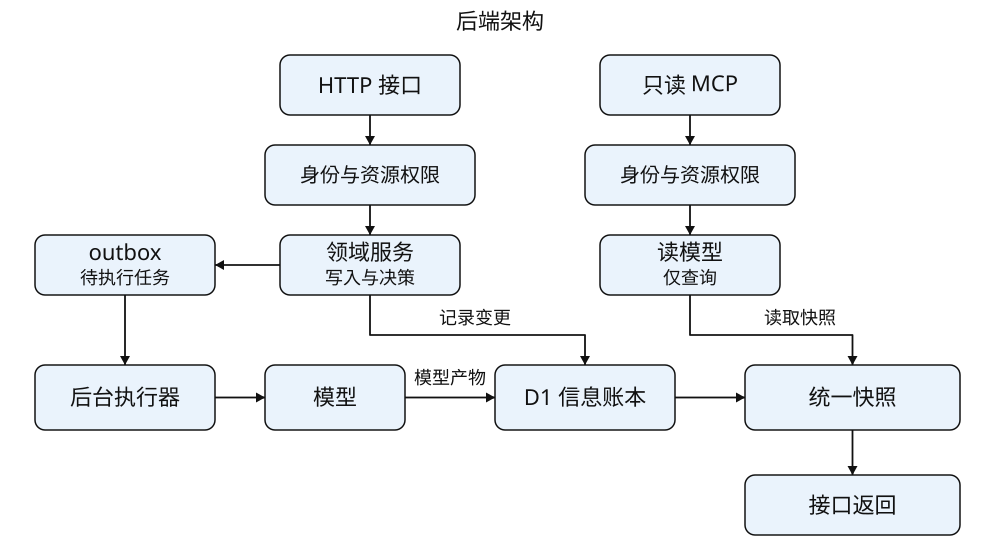
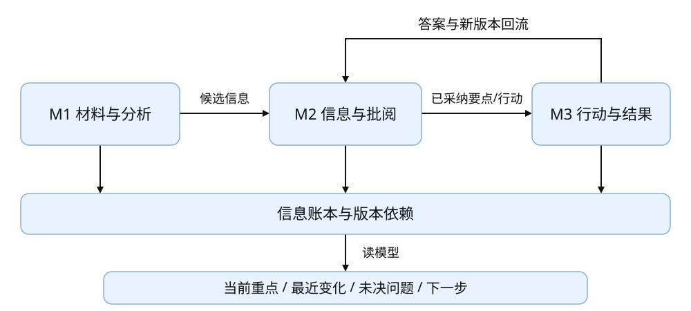
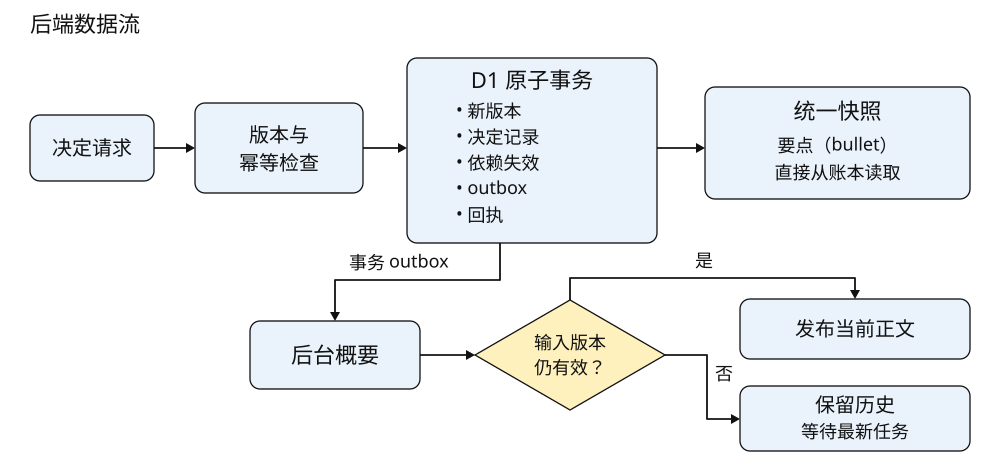
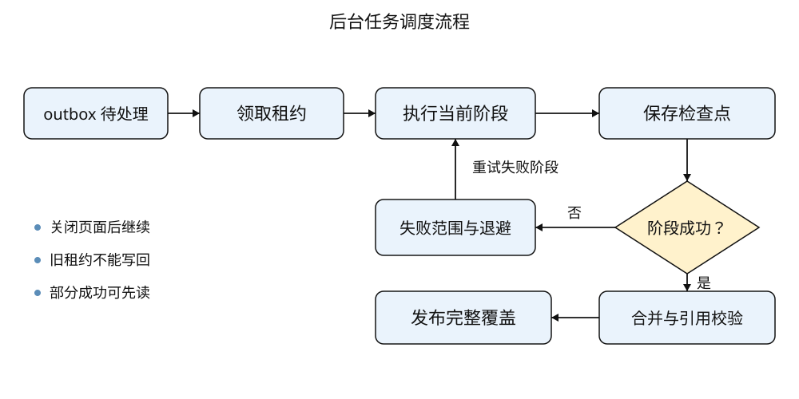
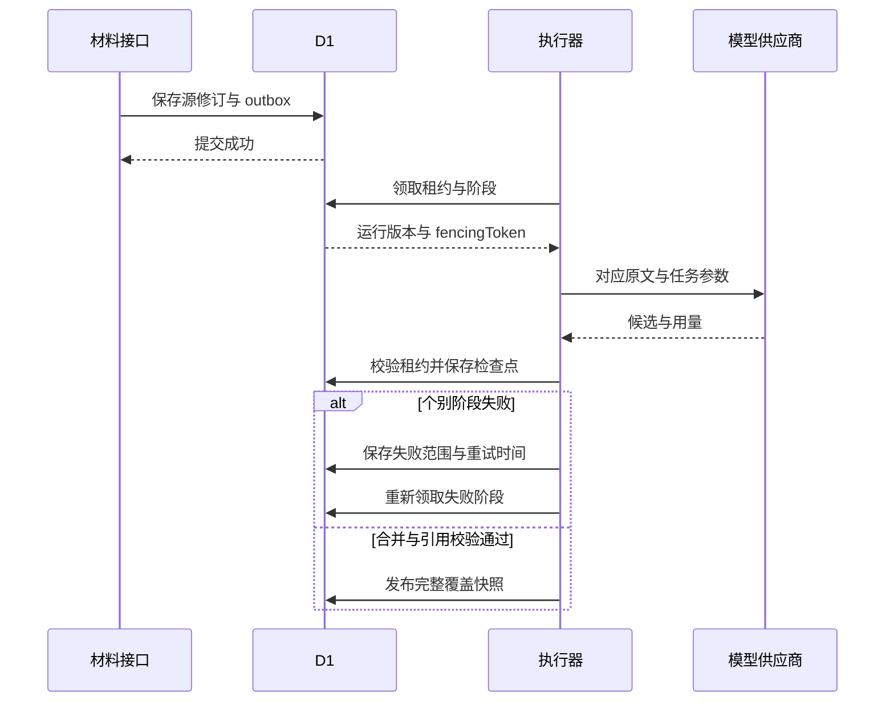
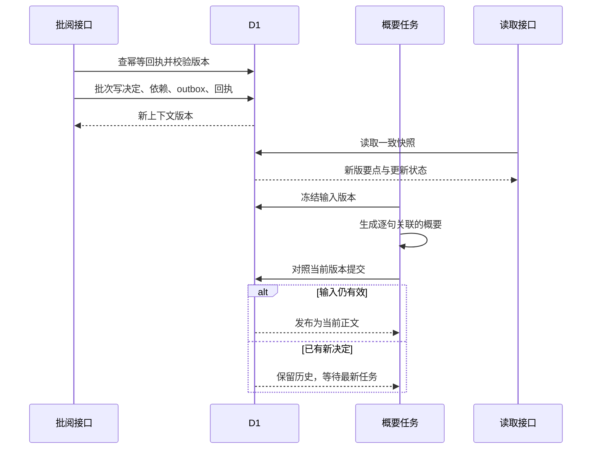
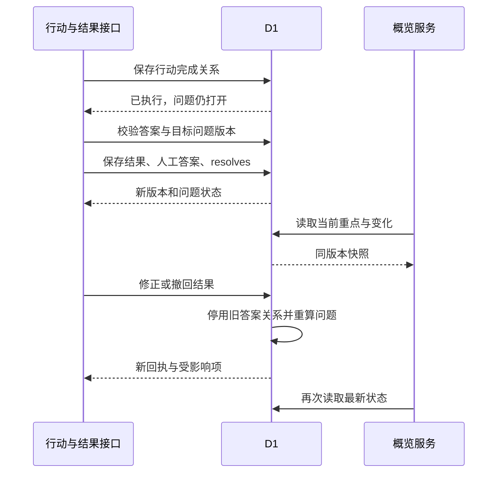

# Notique 工作流 V2 技术方案 - 后端

## 一、背景与目标

**产品需求：**Notique 工作流 V2，拟折、批阅、成稿、跟进、回顾。**前端技术方案：**[Notique 工作流 V2 技术方案 - 前端](https://mcnl4dcjt5d8.feishu.cn/docx/ZTVtdeQCHoEDGxxKfHLcZfEWnOr)

本方案用于工作流 V2 的后端实现。2026-09-29确认的产品范围为 PC，前后端联调与业务验收使用桌面和笔记本浏览器。代码基线为 main 的 c86be01。现有 claims、claim_versions、evidence_refs、verdicts、claim_relations 和异步任务为基础。本文新增的 V2 服务、表和接口属于设计目标，实施顺序与验收见第十章。

后端提供一份持续更新的信息账本。模型从材料生成完整可读草稿，用户采纳版本在同一份记录中更新状态或替换对应草稿。行动以已采纳建议为依据，执行结果作为新信息回流。概览、报告和下一次沟通都读取同一套有版本的结果。

- 每次决定保存后，可确定哪些重点、概要、行动依据和问题需要更新。
- 确认、不采纳和完成行动由普通程序执行，模型用于理解材料和生成受影响的语言内容。
- 读取页面和 MCP 都读取已有结果，生成任务有显式来源、版本与费用记录。
- 以 Eric 的房仲需求验证提取与修正质量，同时保留通用沟通类型。

| 需求来源 | 后端承接 | 验收 |
| --- | --- | --- |
| Eric 15:14–15:33，房仲信息正确性 | 保留主体、数值、时间、限定词及原文关系 | 授权样本人工标注后逐项计算准确率与召回 |
| Eric 40:58–41:51、47:34–49:03，重复处理 | 统一候选与采纳版本，部分采纳即可产出 | 一次修改贯通重点、概要和报告 |
| Eric 49:53–50:31，出处与纠正 | 精确 claimVersion 依赖及来源版本 | 更正、撤销与资料变更后的依赖一致性 |
| Eric 45:46–45:54，真实材料测试 | 分离合成流程测试和授权真实质量评估 | 保留脱敏输入、输出、人工判定与版本 |
| 会后 MCP 与费用诉求 | 已有结果的只读 MCP，后台任务独立计费 | 读操作零新增模型调用，费用有实测基线 |

会议中的具体正确率表述转写含糊，验收阈值以标注集基线和缺陷等级确定。MCP 来自会后沟通。用户明确排除 Plaud，适配基于 Notique 自有数据与成熟协议实现。

## 二、技术选型

| 技术 | 选型 | 说明 |
| --- | --- | --- |
| 服务运行 | 现有 Cloudflare Worker、vinext | HTTP 路由与后台调度分开 |
| 元数据 | D1、Drizzle | 沿用现有表和 batch 事务模式 |
| 材料存储 | R2、现有资产版本 | 原始内容不可变，版本绑定来源 |
| 任务可靠性 | 现有 outbox、租约与检查点 | 扩展阶段任务，服务端触发与恢复 |
| 领域数据 | Claim、ClaimVersion、EvidenceRef、Verdict、Relation | 保持既有信息账本作为事实来源 |
| 模型能力 | 现有 model-provider.ts 适配层 | 冻结每次任务的模型参数和提示词版本 |
| 接口契约 | 新增 lib/shared/workflow-v2.ts | 请求校验、DTO 与前端共同使用 |
| MCP | 官方 SDK 或 Sites 受支持契约 | 只读适配，实施时固定已联调的协议和依赖版本 |

D1 batch 提供批次事务语义，状态前提仍需条件更新与 guard 保证。现有 mutation_guards 模式继续用于并发检查失败时使整个批次回滚。参考 [Cloudflare D1 文档](https://developers.cloudflare.com/d1/worker-api/d1-database/)。

## 三、整体架构与分层

app/api/v1/[...segments]/route.ts 为现有业务入口。V2 新增薄路由，统一调用领域服务。V1 中的判断、完成行动、材料更新与删除也进入同一领域事务，保证所有写入都维护依赖关系。

```text
app/api/v2/[...segments]/route.ts   # 新接口入口
lib/shared/workflow-v2.ts           # DTO 与枚举
lib/domain/workflow/                # 状态规则与依赖规则
lib/server/workflow/
  workspace-service.ts             # 一致快照与概览
  decision-service.ts              # 批阅、撤销和冲突决定
  outcome-service.ts               # 答案与问题回流
  narrative-service.ts             # 有版本的概要
lib/server/db/                     # 复用并扩展现有 repository
lib/server/jobs/                   # 复用 outbox 与阶段执行
lib/server/mcp/                    # 只读适配层
db/schema.ts                       # 表结构与迁移
worker/index.ts                    # 现有服务端调度入口
```



HTTP 与 MCP 经过身份和资源权限进入服务层。业务事务写入账本与 outbox，后台任务生成候选或概要。读取端按版本组装工作台与事项首页。

原始材料、AI 候选、用户采纳版本和展示快照分层保存。展示卡可以组合多条信息，决定落在具体信息版本上。模型重新分析产生候选差异，用户已采纳内容保留，等待明确的变更决定。

## 四、后端功能模块拆分

### 4.1 模块总览

| 模块 | 接口与功能 | 模块目标 |
| --- | --- | --- |
| M1 材料与分析 | 上传提交、阶段分析、快照与概览 | 形成有覆盖范围和出处的候选 |
| M2 信息与批阅 | 确认、更正、拒绝、延期、撤销、成稿 | 用户决定原子落账并传递影响 |
| M3 行动与结果 | 行动状态、答案、问题关系、最近变化 | 结果回到信息账本 |



材料形成候选，批阅选择有效版本，已采纳行动收集结果。结果作为新版本返回账本，读取端统一生成当前重点与回顾。

### 4.2 模块详细说明

#### M1：材料与分析

**服务入口：**WorkspaceService、AnalysisService 与现有资产上传、转写、提取任务。

**处理能力：**校验材料归属与版本，保存源修订，投递一次初始分析，汇总分块覆盖，组装可读内容和候选。

**核心服务与建议位置：**workspace-service.ts、jobs/analysis-orchestrator.ts、现有 extraction 与 artifact repository。

**需要读取的数据：**材料版本、源片段、当前 contextVersion、既有采纳版本与任务检查点。

**写入的数据：**阶段产物、AI claim 版本、证据引用、卡片成员关系、依赖与快照。

**排队、空值、失败和权限表现：**任务不存在返回未生成，排队和运行返回 runId，部分失败返回成功覆盖与失败片段。任何资源访问带工作空间约束。

**模块验收点：**同材料重复 finalize 只入队一次，关闭页面后任务继续，失败分块可重试，语义合并完成前结果标为 partial。

#### M2：信息与批阅

**服务入口：**DecisionService、NarrativeService、ReportService。

**处理能力：**校验出处、成员版本和上下文版本，保存用户决定，更新精确依赖、当前要点与生成任务。

**核心服务与建议位置：**decision-service.ts、narrative-service.ts 与现有 verdict-repository、ledger-repository。

**需要读取的数据：**卡片成员、当前 claimVersion、EvidenceRef 支持状态、历史决定与下游关系。

**写入的数据：**新版本、verdict、延期状态、依赖失效、outbox、幂等回执。组合操作要么全部成功，要么返回成员冲突。

**排队、空值、失败和权限表现：**批阅保存是同步事务，概要生成是可重试后台任务。复制在前端串行提交队列中等待已提交保存及快照同步完成，再使用回执对应的最新 contextVersion 请求报告。服务端沿用版本校验和报告幂等回执，版本冲突时返回409供前端刷新。零采纳仍返回完整可读草稿，混合报告保留逐项标识。仅已确认导出为空时明确范围，主复制入口仍可用。

**模块验收点：**来源相同但语义不同的两项可独立判断，更正一项只影响真实依赖，重复提交和过期提交均有确定结果。

#### M3：行动与结果

**服务入口：**OutcomeService 与现有 buyer-journey-repository。

**处理能力：**采纳行动去重，完成、重开与取消，保存答案并建立 resolves 关系，重算问题状态和当前结果。

**核心服务与建议位置：**outcome-service.ts、buyer-journey-repository.ts、workflow-repository.ts。

**需要读取的数据：**行动 claim、完成关系、关联问题版本、既有答案与依据版本。

**写入的数据：**行动审计、结果版本、人工补充 claim、答案引用、问题关系、变更记录与受影响概要任务。

**排队、空值、失败和权限表现：**执行完成可没有答案，答案有文字或有效材料引用。问题 resolved 以有效已采纳答案为条件。源资料缺失后提示人工补充或重新关联。

**模块验收点：**完成无答案、一个答案解决多个问题、多个答案支持一个问题、直接回答而无行动、撤回答案、重开行动和已完成行动依据变化均有测试。

## 五、数据与状态管理

### 5.1 设计原则

- 稳定 claimId 表示同一事项，claimVersionId 表示具体文本与限定条件，原文段落交集只用于导航。
- 用户编辑形成 human 版本，原始材料保持可追溯。明确的新事实标为用户补充。
- 业务变更、contextVersion 递增、依赖失效、outbox 与幂等回执在同一事务提交。
- 读取快照内部一致。轮询和分页携带快照版本，过期快照重读。

### 5.2 核心实体与迁移

| 实体 | 处理方式 | 关键字段与约束 |
| --- | --- | --- |
| claims / claim_versions | 复用 | type 与现有审核、生命周期字段保留。新增 workflowRevision，文本、判断和有效关系变化时递增 |
| evidence_refs / verdicts / user_notes | 复用并补规则 | 来源版本、原话、语义支持、操作者、基准版本与新版本 |
| claim_relations | 复用 | supersedes、contradicts、resolves、informed_by 精确关联两端版本 |
| workflow_cards / card_members | 新增 | workspaceId、eventId、revision、kind、成员 claimId/versionId，卡片拆分合并保留成员判断 |
| workflow_decisions / decision_members | 新增操作信封 | idempotencyKey、before/after refs、verdictId、operation、reversalOf。决定仍落入现有 verdict 与关系 |
| workflow_mention_decisions | 新增复述选择恢复信息 | decisionId 唯一，candidateId、candidateFingerprint、afterStatus、convertedClaimId/versionId，与所属项目和沟通级联清理。原生复述审计长期保留 |
| review_deferrals / review_progress | 新增 | cardId、actorId、until、lastCardId、finishedAt。延期与阅读位置独立于审核状态 |
| derived_dependencies | 新增 | derivedType、derivedId、claimVersionId、assetVersionId、scope。建立反查索引 |
| workflow_narratives | 新增 | event/project scope、scopeKind、basedOnContextVersion、sentenceRefs、freshness、inputHash |
| workflow_snapshots | 新增 | snapshotId、workspaceId、projectId、eventId、contextVersion、sourceRevision、payload、createdAt |
| action_metadata | 新增附属信息 | claimId 唯一、basisVersionRefs、basisState。revision 取 claim 的 workflowRevision，执行状态由账本关系推导 |
| workflow_outcomes / outcome_versions | 新增 | subjectType=action/question、subjectClaimId、revision、authorId、answerClaimVersionIds、supersedesVersionId、withdrawnAt |
| workflow_changes | 新增 | mutationId、contextVersion、actorId、变更类型、影响对象，用于最近变化 |
| workspace_members / access_grants | 真实客户环境新增 | 已验证主体到工作空间与 role 的映射，MCP 授权有独立只读 scope |

幂等回执按 workspace、actor、endpointScope 和 key 唯一，至少保存90天。业务操作信封与行动唯一约束长期保留。恢复已取消行动使用 reopen，原执行与取消记录继续可查。

新表统一携带 workspaceId，并为 project/event 加归属查询索引。needsDecision 只覆盖影响已采纳内容的变化、阻塞下一步的问题和值得选择的行动，分别返回 reasonCode 与具体原因。普通草稿保留就地采纳能力，单纯待审核状态或低置信度不足以进入优先队列。按上述影响排序，同组按时间和 ID 稳定排序，首屏最多5项并返回余量。阻塞问题须说明它与当前下一步的依赖，行动选择限原话约定或直接补齐该问题的建议。用户可主动在任一草稿旁发起处理，当前卡片保持可见，待拍板计数仅统计符合上述规则的活动卡。卡片成员按 cardId+claimVersionId 唯一，行动以 claimId 唯一，结果版本按 outcomeId+revision 唯一。新表到旧实体的外键和清理规则写入迁移，删除流程按同一归属执行。

现有完成行动会创建人工完成记录并建立 resolves 关系。V2 继续以这条完成关系与行动生命周期推导执行状态，action_metadata 只保存附属信息。结果回流中的答案与完成记录分别建关系，问题查询限定目标为 open_question，避免把已完成错误视作已回答。

历史 confirmed/verified 与拒绝记录原样保留，已有完成关系可回填行动视图。旧 summary/overview 缺少精确依赖时作为旧版 AI 概要读取。迁移只补确定性映射，用户点击重新整理后才生成新的引用与候选。迁移前后比较记录数、版本指针、关系数和孤立引用。

### 5.3 决定与执行状态

| 对象 | 事件 | 状态与输出 |
| --- | --- | --- |
| pending 信息 | confirm | 证据满足该版本采纳条件后变 verified，限定表达保留 |
| pending 或 verified 信息 | edit | 生成 human 新版本，明确原文修正或用户补充，直接采纳 |
| pending 信息 | reject | 变 rejected，保存语义标识与来源修订，重算避免同源重复提出 |
| 待批卡片 | defer / restore | 原 reviewStatus 保持，延期到期或手动恢复只改变队列可见性 |
| 行动建议 | accept_action | next_action 版本 verified，一条行动出现。仅确认相关事实不会加入行动 |
| 已采纳行动 | complete / reopen / cancel | open→completed、completed/cancelled→open、open/completed→cancelled，保留事件历史 |
| 未决问题 | 已采纳答案建立 resolves | open→resolved，保留仍有效的全部 answerRefs |
| 已解决问题 | 答案撤回或替代 | 按剩余有效答案重算，无有效答案则 open |
| 已生成概要 | 依赖信息变化 | current→stale→updating→current，生成失败为 failed，旧文本留存 |
| 冲突候选 | resolve_conflict | 明确选用新版本、保留原版本或接受可并存范围，事务更新关系和依赖 |

同一原文约定可以保留 decision 与 next_action 两个语义对象，以 informed_by 关联，但展示为一张卡。主动作加入跟进只采纳 next_action，相关记录保留原状态。用户明确只想记下时选择确认记录。同一意图处理后从优先队列移除，其余独立问题按自身条件保留。拆分或合并候选时沿用稳定行动 ID，重复入口共用同一份采纳状态。

确认记录表示用户采纳该表述。材料中大约一万元被确认后仍带大约。用户核对就绪原话后，可确认结构有效且支持状态为fully_supports或unreviewed的草稿，原AI支持状态与人工判断分别保存。含糊事实继续保留限定或作为未决问题。部分支持和不支持通过修改补齐，用户自己的新信息保存为user_input，展示作者和时间。

不采纳的同源候选使用源修订与语义归并结果抑制重复。发现新的相关证据时生成变更候选并关联旧决定。跨材料语义相似由模型提出关系，最终去重或替代依据明确的 ID 和用户决定，避免字符串相同就误合并。

撤销只允许恢复仍为最新且没有后续依赖的决定。存在使用本次决定的后续内容、执行或结果时返回 dependency_conflict 和受影响列表，用户进入修正流程。撤回结果会重算它支持的问题，已执行任务保留执行历史，依赖失效改为 needs_review。

行动依据变化后，以 accepted_change 进入待拍板队列，已采纳行动显示核对依据入口。展示 basisDetails 中的采纳时表述与当前表述，每项包含 acceptedRef、acceptedText、currentRef、currentText 和 sourceStatus。来源不可访问时正文为空。用户核对后点击按当前依据保留行动，通过 accept_action 提交当前卡片与上下文版本，更新冻结依据并保留执行状态。已采纳行动可以用 edit 修正文字，历史完成记录继续关联稳定行动 ID。旧引用与关系保留在历史中，重新打开行动时解除其历史版本上的有效完成关系。

采用另一条信息替代原信息时，行动依据沿已确认的替代关系找到新信息，仍显示采纳时的原版本。连续替代可追到当前有效信息，待选择的候选、并存关系、多个替代方向和循环关系保留待核对状态。用户明确保留行动后才更新其依据引用，保存时再次校验整条替代路径。

冲突卡通过 conflicts 返回 relationId、existing 与 candidateRef，existing 包含旧表述和出处引用。待选择的新信息在复制记录中明确标识。保留原信息会将候选移出当前记录，采用新信息会替代旧信息及其有效问题答案关系，并存同时保存适用情况。recentDecisions 返回最近十次批阅的 ID、revision、operation、summary、createdAt、reverted 与 choiceMode，摘要取自当时版本。界面提供撤销上次处理与最近处理列表，撤销追加反向决定并恢复原版本、关系及卡片，历史继续保留。后续依赖通过 affectedItems 返回名称，用户在当前内容上修正。

已采纳信息可继续就地修改，包括作为替代信息或与其他信息并存的内容。修改保留原替代决定及并存适用情况，历史关系保留，当前关系指向新版本。该条已用于回答问题时，编辑区按 answerTargets 展示对应问题，用户逐项选择仍可回答或解除这条支持，再通过 factChange.questionChoices 提交精确问题版本。保留其他有效答案的问题维持已解决。行动采纳时的依据仍保留原表述，核对后才更新。原结果及其修正答案沿同一信息和问题的关系链回溯，撤回可解除修正后的支持，独立新增的答案继续有效。撤销恢复原版本和关系后，所有行动依据均回到采纳时的精确版本且出处有效时，同步解除这次变化引起的核对提示。其他依据变化或出处失效时继续提示。撤销确认只恢复采纳状态，保留原行动依据。原有依赖按决定前的关系快照识别，已有后续内容使用本次决定时，改走当前内容修正。

### 5.4 一致性、快照与来源变更

每次事务先检查 expectedContextVersion 和对象 revision，再写入全部变更。版本检查与写入同批执行，任何 guard 失败均回滚。并发请求只有一个可推进同一上下文版本，另一个返回 version_conflict。重复幂等键同请求返回原回执，不同请求返回 idempotency_conflict。幂等查询在可变版本检查之前，但在当前身份与权限验证之后。

快照通过单语句聚合或受版本保护的读取组装。多查询先后读取 contextVersion，期间有变化则重试，最多3次后返回 snapshot_busy。按稳定 ID 排序生成 snapshotId，分页沿用该快照，过期游标返回 cursor_expired。用户提交后以 minContextVersion 请求至少该版本的数据，服务端使用主库一致读取或会话书签确保下限，暂不可满足则返回503与Retry-After。快照默认保留15分钟，权限撤销或资源删除即时使相应快照失效，旧响应由前端丢弃。

替换材料产生新的 assetVersion 和 sourceRevision。旧引用保留旧版本，当前依据失效后对应结果标注 sourceStatus=stale 或 missing。移动沟通校验源和目标项目版本，并在同一数据库事务内更新归属、两侧依赖和概览。跨项目的有效关系先显示影响预览，提交后解除无效关系并形成待处理项。

正式报告中的源材料陈述必须具有当前可访问且有效的出处。出处失效时该项留在页面的待处理范围，用户重新关联依据或明确转为自己的补充后再纳入当前报告。用户补充以有效作者记录为依据。项目移动要求同时具备源和目标编辑权限。

软删除立即将材料从有效快照、搜索、导出和 MCP 排除，同时停用相关任务与缓存。恢复后重新校验依赖。永久删除按现有清理任务扩展到 R2 旧版本、派生产物、引用原话、报告与结果正文。失败保留可重试清理任务，避免只删主表却留下可访问副本。

### 5.5 数据流



业务事务同时提交版本和待处理事件，确定性要点由最新账本组装。概要后台生成时冻结依赖版本，提交前再次检查，过期结果进入历史且由最新任务继续处理。

阅读位置按 eventId 和 actorId 保存，沿用阅读权限。bookmark 只更新个人位置，finish_session 另存结束时间，允许仍有待拍板事项。当前快照、成员与卡片归属在保存时校验，个人位置变化保持业务版本及派生任务原值。

### 5.6 跨模块状态传递

最近变化按明确的时间与来源列出，首版含义为最近发生的变化。写事务将变更后的精确引用和文字冻结在 workflow_changes.changed_refs_json。后续修改保留当时版本，读取时重新核验来源可用性。旧行只有对象 ID 时显示操作名称，当前文字继续在重点区展示。项目回顾与工作台共用单语句账本读取，跨沟通的有效答案按信息 ID 去重，保留产生答案的沟通。所有模块使用 MutationReceipt 和 contextVersion。事件级卡片变化同步使项目概览失效，项目级答案引用保留产生它的沟通 ID。浏览器、报告与 MCP 共用 SnapshotService，避免分别计算三套已采纳状态。对用户展示的解释包含出处、支持情况和影响范围。

### 5.7 分析接口与记录保留

分析运行 ID 沿用 extraction_runs。WorkspaceSnapshot.analysisRunId 返回当前运行，GET /analysis-runs/:runId 将提取、核对、原文概要和全文概要映射成一份进度。revision 是根据运行、阶段与材料状态计算的52位整数比较标识，expectedRunRevision 只做相等校验，业务上下文使用 contextVersion。读取进度保持任务队列和模型调用数不变。

初始分析复用同一材料版本的已有运行。重新整理是显式操作，创建运行、原生 outbox 和提交回执在同一事务保存，重试同一请求返回同一运行。新建V2运行直接生成有精确依据的全文概要。材料仍在上传、解析或转写时返回当前处理提示。新运行发布前保留上一份成功记录的草稿，覆盖统计继续反映本次运行。已采纳内容与人工修改继续保留。

失败重试限当前材料与运行中允许重试的阶段。提取重试保留已成功的模型阶段、输出、用量和供应商请求 ID，恢复现有 outbox。原文概要与全文概要保存新任务，旧失败记录与用量审计保留。有可恢复响应时先继续读取它，已确认无效的响应使用新请求。提取重试同时核对成员权限、项目版本、材料版本、当前运行、阶段修订和并发配额。原话范围变更后通过重新整理产生新运行。

记录页显示简短进度，阶段详情按需展开。重试失败部分一次恢复可重试的失败项，重新整理保留现有记录。存在未保存输入时先保存或取消。分析和概要在等待或运行状态下每3秒读取，终态停止，关闭页面后的执行由服务端持久化队列承担。


### 5.8 材料提交与初始分析

finalizeAsset 与 finalizeTranscriptImport 在保存原始资产版本的同一事务内递增 sourceRevision，清理快照，将相关概要置为待更新，并写入 initial_analysis 任务。任务冻结提交主体、原始资产版本与源修订。重复确认已保存资产返回原版本，沿用原任务。

material-analysis.ts 合并同一沟通连续提交的材料，等待全部当前材料就绪及音频的当前转写完成。接手时校验沟通归属、项目状态、源修订、完整材料集合和任务租约。运行、原生 queue_outbox 与任务回执一起保存。已有同一输入的运行直接复用，失败和停止状态由显式恢复入口处理。

租约过期通过 fencingToken 重新领取。并发配额与材料处理中保持等待，临时交接故障最多3次尝试。上传接口短时唤醒，恢复入口和 Worker scheduled 消费持久化任务。原始材料触发一次提交，音频分块、派生转写及阅读版本沿用这次提交。sourceRevision 为0的历史沟通继续由旧扫描入口补齐。

概要生成同时返回每句的主题 key 与短标题。主题按精确 VersionRef 校验，标题一致，同一版本归属一个主题。主题字段与逐句引用一起保存在 sentence_refs_json，已有表结构继续复用。v3 提示词要求主题，v1 与 v2 的在途付费请求按冻结契约恢复。旧概要经显式更新后生成主题目录，材料提取继续复用。

初始分析和重新整理共享提取阶段，全文概要根据提取后的精确版本生成。章节、发言总结与原文要点由用户选择后各自投递，已保存阅读产物继续可读。


### 5.9 组合卡逐条处理

同组重点提供逐条处理入口。每条默认保持原样，用户选择确认、修改或不采纳。行动组使用加入跟进或不采纳。修改可归类为按原话修正或用户补充。保存只提交有明确选择的成员，最多20条，其他成员继续保留草稿。

DecisionRequest.operation=review_members 时，members.operation 使用 confirm/edit/reject/accept_action，成员仍携带精确版本。卡片、成员判断、新版本、依赖失效、概要任务和回执在同一事务保存。任一成员或组成员关系变化时整次回滚，前端保留选择和输入，展示当前版本，用户核对后重新保存。部分处理保留组合卡和剩余草稿，全部处理后转为 processed。撤销整次决定恢复对应成员和所有关联快照。


同一约定使用明确的分组，group_key 以 same_intent: 开头，包含一条 decision、一条 next_action 与 informed_by 关联。ReviewCard.sameIntent 返回当前精确 recordRef 和 actionRef，members.kind 决定每条的处理方式。界面合为一个入口，相关内容可展开查看各自状态。加入跟进只采纳行动，确认记录只采纳表述，同一意图的优先选择随之完成，独立问题继续保留。其他草稿可随后处理，复制保留两个语义对象的内容与标识。未采纳行动的依据随约定纠错更新，已采纳行动保留冻结依据并要求核对。分组、关系或成员在保存期间变化时，整次提交回滚。

用户在整理期间补充的行动与稍后模型建议若针对同一件事，ReviewCard.actionOverlap 返回人工和模型的精确版本。提取发布事务使用 action_overlap: 分组，人工成员为主，模型成员为相关内容，来源与含义均匹配才合为一张行动卡。分组键以 URI 编码的 JSON 冻结 v=1、runId、clientClaimKey、manualRef 与 modelRef。币种、小数、比较符号和英文词边界参与匹配。服务端保留两条 claim、版本和出处，待确认计数按一张卡计算。review_members 可一次采纳一条、拒绝另一条，也可逐条处理。只处理一条时卡片仍为 active，另一条继续待确认。全部处理后为 processed。撤销校验分组和未改动成员，成员或版本漂移时退回独立卡片。撤销本次修改时按决定的完整前后快照恢复原版本和原组。

模型分组复用既有复核步骤。新运行将 verification_schema_version 冻结为 claim-verification.v5，盘点与复核提示词使用 claim-extraction-prompt.v9.4，inventory_prompt_version 与 verification_prompt_version 随输入哈希冻结。旧运行继续采用各自冻结的9.2或9.3文案。same_intent_groups 最多12组，携带 group_key、record_claim_key、action_claim_key、reason 和 confidence。每组引用一条独立的新 decision 和一条新 next_action，每个成员只属于一组，置信度至少0.85。发布时按已通过材料校验的成员映射精确版本，在原提取事务保存 informed_by、workflow_cards 和 card_members。成员缺失、类型改变、分组重叠或置信度不足时保留独立草稿并保存原因。旧运行继续使用原 v4 响应及 v9.2 提示词，沿原供应商请求取回结果，成功阶段和用量保留。

同组成员涉及已采纳内容变化时，仍展示一个新旧信息核对入口，优先显示产生差异的成员。用户选择采用、保留或分别适用后，未处理成员继续保留草稿，原分组及稳定行动 ID 保持。其他差异仍按自身关系要求核对。撤销恢复成员、关系及原冲突。保存期间同组成员类型、分组标识或成员关系变化时，整次提交回滚。

### 5.10 当前会话的访问恢复

WorkspaceSnapshot.access 使用当前可信主体、成员权限与工作空间。前端收到访问失效响应后收起记录正文，并按账号、工作空间及沟通保留用户本页输入。恢复访问先重新读取当前完整快照，写操作继续校验最新成员、版本及关联。原话选录只保留材料版本与字符范围，恢复时按当前授权重建原句。账号或工作空间变化后清除上一主体输入，迟到请求保持原会话边界。

D1 每条语句最多100个绑定参数。批阅事务将访问、版本、来源和关联校验分组，每组保持在该上限内。全部校验语句放在业务写入之前，和账本、派生失效、任务及回执使用同一原子批次。任一组失败时整次回滚。20条按原话修正和后组校验失败分别验收。关系集合、批量依赖失效及撤销查询用 JSON 数组参数读取，100条答案一起重新待回答和撤销也保持每条语句在100个参数内。


### 5.11 问题调整与答案联动

未回答的问题可从调整问题修改后保存。已有答案时，重点显示对应问题，调整入口继续可用。用户逐条选择仍然回答这个问题或需要重新确认，保存问题文字和答案关联使用同一次决定。关联行动显示核对新问题提示，完成状态保留。

DecisionMember.questionChange.answerChoices 携带每条现有有效答案的精确版本及 keep/reopen 选择，最多100条。服务端核对完整答案集合、问题版本、卡片、证据和关系，任一变化使整次回滚。同组多个问题一次修改时，共享答案的去留按全部选择计算。撤销恢复问题、关系和退出记录的答案，有后续作答或依据采纳时转为当前内容修正。

保留答案创建指向新版问题的 resolves 关系，旧关系留在审计。新关系 reason.questionEdit.predecessorRelationId 保存前一关系 ID，结果修正和撤回沿同一答案与同一问题的关系链处理。原结果版本保持原引用，独立建立的其他问题关联继续有效。行动 questionRefs 按稳定问题 ID 读取当前版本，冻结依据保持原版本，用户核对后更新。

问题修改与逐条答案选择按当前主体留在本页内存，访问恢复后核对最新问题和答案再保存。新的答案出现时重新选择其适用情况。只读权限下可以复制本页输入。前端使用 QuestionEditor，后端使用 question-change.ts 与既有批阅、结果和撤销服务。无旧答案时显示短窗口，有旧答案时正文可滚动，保存入口保持可见。

### 5.12 行动替代与执行历史

行动冲突在同一弹窗显示原行动、新建议与原执行状态。用户选择继续原行动、改为跟进新行动或两项都跟进。两项都跟进时填写各自的适用情况。选择完成后一次保存，关闭未保存的选择时提供继续核对与放弃入口。正文独立滚动，保存入口固定。

改为跟进新行动时，原行动进入已替代的跟进，保留原完成状态与结果。新行动采纳自己的依据，执行状态和结果按自己的信息ID维护。原行动留下的问题答案继续有效，用户仍可在当前问题修正或撤回该结果，修正范围限原结果对应的问题。原行动完成历史继续保留。当前待办数量、项目回顾和复制记录使用当前行动。

替代决定在同一事务保存双方状态、候选依据、关系、历史快照及幂等回执。新行动的依据和双方元数据在提交时重新核对。已有的完成关系进入撤销快照，撤销恢复原行动与候选状态。执行新行动或更改原结果后，旧替代决定显示后续变化，由当前入口修正。

### 5.13 AI助手连接与只读读取

现有 Worker 暴露 POST /mcp，使用官方 @modelcontextprotocol/server 2.2.0 与 zod 4.6.5。每次请求创建独立服务，复用领域投影与资料查询。官方客户端2.2.0覆盖2026-07-28能力发现、工具发现与只读调用，并兼容2025-11-25初始化。六个工具读取已有结果，授权和限流计数属于接入数据，业务账本与模型任务保持读取语义。

Sites 负责 OAuth 和已验证身份头。应用同时核实网关主体与邮箱，通过 workspace_members 和 access_grants 检查当前绑定工作空间的成员及 mcp:read 授权。工作空间由服务器确定，工具参数使用资源 ID。明确公开的演示空间在用户开启授权时建立 viewer 成员，私有空间使用已有成员。授权期30天。已验证的AI助手可以先发现固定工具定义，发现阶段保持资料为空。读取调用在请求入口、资料查询前后检查有效授权，断开或成员撤销后拒绝读取。请求正文按16 KiB限制读取，批量消息和方法头不能替代正文中的调用权限检查。

每账号每空间每分钟60次请求，D1原子计数使多个 Worker 共用限额，旧桶随新请求清理。输入上限16 KiB，读取时限15秒，响应上限250,000字节。429附 Retry-After，超时返回504。校验请求 Host 和浏览器 Origin，生产主机使用当前站点及管理员配置的主机列表。

原文分页按稳定顺序返回片段 ID、版本、说话人、时间与字符偏移，每页最多100段与20,000字符。长片段拆页时保留 Unicode 字符边界。游标绑定内容指纹，材料或说话人更新后提示重新读取。长视图按精确 JSON 片段分页，来源过期正文为空。缺少视图时区分未生成、排队、处理中和失败。

证据优先返回所选原文，再补相邻上下文，上限6,000字符，按实际剩余内容标记裁剪。项目回顾共用有效采纳和答案规则，已解决问题与旧答案按工作台规则更新，AI建议保持草稿标记。读取函数通过 SELECT 构造结果，后台生成由网页的显式入口承接。

连接入口携带当前工作区地址，返回时恢复原事项和沟通。登录回跳保留相同地址，返回路径限定为本平台首页路由。

### 5.14 复述信息与原事项

复述信息随本次沟通读取，保留模型关联状态、本次原话及冻结的原信息版本。待核对关联展示为再次提及，阅读和混合复制即可带走。关联已经确认且原版本仍有效时，沿用原记录、行动或问题的ID，完成与答案状态继续承接。原事项修改、类型改变、被替代或不可访问时，原版本与当前内容分开显示。材料或段落不在本次授权范围内时收起对应正文。项目待办及问题按稳定ID计数，原卡片保持自身沟通归属。

用户展开本次原话后，可选择沿用原事项、作为独立信息或忽略。沿用时保持原事项ID及执行和答案状态。独立信息以本次模型提议和出处生成一条草稿，继续使用普通记录的采纳与修正入口。关联选择复用 occurrence_verdicts 和 claim_occurrences，workflow_mention_decisions 保存候选指纹与生成版本，支持撤销整次选择。撤销保留原生审计，恢复待核对关联。独立草稿已有后续处理时，在当前内容上修正。两次沟通的原材料分别控制自身显示，后续复述材料失效时原记录仍依自身出处读取。

## 六、服务端接口交互

### 6.1 调用方式

新接口前缀为 /api/v2，成功响应为 { data, request_id }，失败响应为 { error: { code, message, details }, request_id }。鉴权从可信请求上下文取得 actor 与 workspace，参数只能选择其有权限访问的项目和沟通。写接口校验 Idempotency-Key、请求体、资源归属和业务版本。

> 前后端使用同一份 API 表与 DTO 表。接口实现先提交共享类型、请求校验和契约用例，再串联页面。HTTP 202 表示任务已持久化，HTTP 200/201 的 MutationReceipt 表示业务事务已提交。

version_conflict 返回最新 contextVersion 与冲突对象，dependency_conflict 返回受影响项，cursor_expired 要求重取首页，idempotency_conflict 要求新操作使用新键。422 表示来源、答案或状态前提不满足，429 和503 返回 Retry-After。没有可访问资源统一返回404，已授权对象的删除或归档可返回410。

### 6.2 各模块接口调用明细

#### M1：工作流接口

| 用户操作 | Service 方法 | HTTP 方法 | HTTP 路径 | 请求类型 | 响应类型 |
| --- | --- | --- | --- | --- | --- |
| 打开事项首页 | getProjectOverview | GET | /projects/:projectId/overview | OverviewQuery | ProjectOverview |
| 读取沟通工作台 | getWorkspace | GET | /events/:eventId/workspace | WorkspaceQuery | WorkspaceSnapshot |
| 启动或重新整理 | startAnalysis | POST | /events/:eventId/analysis | StartAnalysisRequest | AnalysisRun |
| 查看任务进度 | getAnalysisRun | GET | /analysis-runs/:runId | 无 | AnalysisRun |
| 重试失败阶段 | retryAnalysis | POST | /analysis-runs/:runId/retry | RetryAnalysisRequest | AnalysisRun |

#### M2：工作流接口

| 用户操作 | Service 方法 | HTTP 方法 | HTTP 路径 | 请求类型 | 响应类型 |
| --- | --- | --- | --- | --- | --- |
| 批阅一条事项 | decideReviewCard | POST | /review-cards/:cardId/decisions | DecisionRequest | MutationReceipt |
| 选录原话补进重点 | addSourceHighlight | POST | /events/:eventId/highlights | SourceHighlightRequest | MutationReceipt |
| 处理再次提及的关联 | decideMention | POST | /reaffirmed-mentions/:mentionId/decisions | MentionDecisionRequest | MutationReceipt |
| 撤销最近一次批阅 | revertDecision | POST | /decisions/:decisionId/revert | RevertDecisionRequest | MutationReceipt |
| 保存阅读位置或结束本次 | saveReviewProgress | POST | /events/:eventId/review-progress | ReviewProgressRequest | ReviewProgress |
| 导出当前结果 | createReport | POST | /projects/:projectId/reports | ReportRequest | ReportSnapshot |

#### M3：工作流接口

| 用户操作 | Service 方法 | HTTP 方法 | HTTP 路径 | 请求类型 | 响应类型 |
| --- | --- | --- | --- | --- | --- |
| 完成、重开、取消行动 | transitionAction | POST | /actions/:actionId/transitions | ActionTransitionRequest | MutationReceipt |
| 补充结果并关联问题 | saveOutcome | POST | /actions/:actionId/outcomes | OutcomeRequest | MutationReceipt |
| 直接回答未决问题 | answerQuestion | POST | /questions/:questionId/answers | QuestionAnswerRequest | MutationReceipt |
| 修正或撤回结果 | correctOutcome | POST | /outcomes/:outcomeId/corrections | OutcomeCorrectionRequest | MutationReceipt |

项目、沟通、材料 CRUD 与资产内容接口沿用 V1。V1 写入通过领域服务产生同样的版本递增与依赖更新。V1 extraction/artifact 状态通过适配器映射为 AnalysisRun。最终源码中的 DTO 只定义一次，两份方案中的表由同一契约维护。

#### MCP：连接与授权

| 用户操作 | Service 方法 | HTTP 方法 | HTTP 路径 | 请求类型 | 响应类型 |
| --- | --- | --- | --- | --- | --- |
| 读取AI助手授权 | getMcpConnection | GET | /mcp-connection | 无 | McpConnectionStatus |
| 开启或断开AI助手授权 | setMcpConnection | POST | /mcp-connection | McpConnectionRequest | McpConnectionStatus |

#### 共同数据类型

| 类型 | 关键字段 | 规则 |
| --- | --- | --- |
| VersionRef | claimId、claimVersionId | 指向一条信息的精确版本 |
| WorkspaceSnapshot | access、snapshotId、contextVersion、sourceRevision、coverage、bullets、reviewCards、actions、questions、narrative、counts、nextCursor、recentDecisions?、reviewProgress?、analysisRunId?、actionHistory?、reaffirmedMentions? | 事件级一致读取快照。counts 分开返回 draftCount、needsDecisionCount、openActionCount，recentDecisions 可返回最近十次批阅的 id、revision、operation、summary、createdAt、reverted 与 choiceMode，所有集合携带同一 contextVersion access 含服务端解析的 workspaceId、actorId、canEdit，用于缓存隔离与只读展示，写入仍重新检查权限。 reviewProgress 保存当前主体的 lastCardId、finishedAt 和 remainingCount。阅读位置即时读取，个人位置变化保持业务快照稳定。 analysisRunId 返回当前 extraction_run ID，用于只读阶段进度 访问失效后前端收起正文并清理工作流快照，按账号、空间和沟通保留本页用户输入。恢复时重新获取当前快照，核对后提交。账号或空间变化清除上一主体输入，迟到回执保持原会话边界。 actionHistory 返回当前沟通已替代的行动历史，保持原行动的完成状态与结果，当前跟进、待办数量和复制记录使用 actions。 reaffirmedMentions 保留本次复述、冻结原版本和当前版本。模型关联仍为proposed，原审核与行动状态保持。存在匹配的原生确认记录、目标仍为当前采纳版本且两次出处有效时，沿用原信息、问题或行动ID。 |
| ProjectOverview | access、snapshotId、contextVersion、counts、currentBullets、recentChanges、openQuestions、nextActions、recordSummaries、nextCursor | access 与工作台沿用同一授权。currentBullets 使用当前记录规则，跨沟通答案按信息 ID 去重并保留来源 eventId。recentChanges 保存操作当时的精确版本和文字，翻页仅分页该集合，其余集合与全局计数保留。recordSummaries 含覆盖范围、计数和个人阅读位置。来源失效时历史只显示操作与核对提示。 currentBullets 中的行动另带 executionState，采纳与完成分别展示。 |
| ReviewCard | id、revision、createdAt?、kind、title、memberRefs、members、suggestedOperation、needsDecision、reasonCode、reason、disposition、sourceStatus、latestDecisionId、decisionRevision、conflicts?、sameIntent?、actionOverlap?、eventId? | kind=record/question/action/conflict。needsDecision 按本章优先规则计算，reasonCode=accepted_change/blocking_question/action_choice 或 null。disposition=active/deferred/processed，sourceStatus=ready/stale/missing。members 含 statement、reviewState、origin、supportStatus、evidenceRefIds 与 VersionRef。conflicts 含 relationId、existing 与 candidateRef，existing 包含旧表述及出处引用 createdAt 与 ID 保持同组排序稳定。 行动冲突的 conflicts 返回 existingActionState=open/completed/cancelled，用于核对原行动的执行状态。 普通已采纳成员的 answerTargets 返回它回答的全部当前问题，含 questionRef、revision 与可读取的 text，跨沟通沿同一项目校验，来源不可访问时 text 为 null。 members.kind 为 record/question/action，逐条处理按成员类型展示。 sameIntent 含 recordRef 与 actionRef，仅用于明确关联的一条约定记录和一条行动。只确认记录或加入跟进后解除该意图的优先选择，其余成员状态保留。复制继续保留两类信息及各自标识。 actionOverlap 含 manualRef 与 modelRef，指向同一行动的人工补充和模型建议的精确版本。一张卡保留两条原文，逐条决定后仍待处理未决定成员，成员版本变化时退回独立卡片。 eventId 指向卡片原归属。复述工作台沿用原卡片ID，个人阅读位置保存该原归属，写入按原资源定位。 |
| Bullet | id、text、claimRefs、reviewState、origin、sourceStatus、applicability?、conflictWith? | reviewState=draft/accepted，origin=source_statement/ai_suggestion/user_input/user_selection。用户选录保留原话，缺失或过期出处显式展示 并存答案的适用情况随要点展示与导出。conflictWith 保存仍待选择的旧信息精确版本，复制时标明新旧信息待选择。 |
| Narrative | text、sentenceRefs、basedOnContextVersion、freshness、scope | freshness=current/stale/updating/failed。scope=accepted/draft/mixed，sentenceRefs 逐句含 VersionRef 与 reviewState，混合概要逐句区分采纳状态。逐句引用全部为已采纳版本时标 accepted，混合引用标 draft。更新期间显示 updating，终态停止轮询。上一版按原版本校验出处，来源失效正文为空。sentenceRefs 可含 topic 的 key 和 title，由同一次概要生成按具体主题归并，每个精确版本只属于一个主题。记录、问题、行动和结果按主题同页呈现，组名展示一次。分组只改变阅读布局，采纳、行动执行和问题解答分别保存。上一版主题仅用于仍匹配的精确版本，当前答案通过已保存的问题关联回到原主题。 |
| DecisionRequest | operation、expectedCardRevision、expectedContextVersion、members、deferUntil? | operation=confirm/edit/reject/defer/restore/accept_action/resolve_conflict/review_members。review_members 允许成员分别 confirm/edit/reject/accept_action，未提交成员保持原样。修改必须含新文本与来源归类。最多20名成员，精确成员版本、卡片版本、归属与组关系原子校验。deferUntil 为 ISO 时间或 null。用户核对就绪原话后，可确认或采用支持度为fully_supports或unreviewed的草稿。AI支持状态与人工采纳分别保留。部分支持和不支持通过修改补齐 |
| DecisionMember | claimId、claimVersionId、operation、newText?、origin?、evidenceRefIds?、conflictChoice?、questionChange?、factChange? | questionChange 仅用于问题 edit。answerChoices 携带全部现有有效答案的 VersionRef 和 mode=keep/reopen，最多100条。keep 关联到新版问题，reopen 解除当前问题关联，共享答案保留其他问题用途。整次决定和撤销恢复原子处理。结果修正与撤回沿 reason.questionEdit.predecessorRelationId 关系链处理，同一答案、同一问题之外的独立关联保留。 factChange 仅用于普通信息 edit，questionChoices 携带当前回答的全部问题 VersionRef 和 mode=keep/reopen，最多100条。keep 使用新信息版本回答原问题，reopen 解除该条支持并按其他答案重算。已确认的替代与并存关系追加新版本关系并保留原决定及适用情况。原行动依据保持冻结，用户另行核对。结果撤回沿同一答案、同一问题的 questionEdit 与 factEdit 关系链处理。 |
| MutationReceipt | mutationId、contextVersion、changedRefs、affectedViews、refreshState | 原子提交后的回执。changedRefs 含 entityType、id、revision。refreshState=current/updating，前端按目标版本读取快照 |
| Action | id、claimRef、revision、executionState、questionRefs、basisState、basisDetails、latestOutcome、ownerHint?、dueAt? | id 等于 next_action 的 claimId，revision 映射 claims.workflowRevision。executionState=open/completed/cancelled，basisState=current/needs_review。basisDetails 包含 acceptedRef、acceptedText、currentRef、currentText、sourceStatus。不可访问来源正文为 null。依据变化以 accepted_change 计入待拍板，已采纳行动显示核对依据入口。accept_action 可显式核对已采纳行动的新依据，保留执行状态。edit 修正已采纳行动文字，完成记录按稳定行动 ID 保留。已确认的 use_candidate 替代可跨信息 ID 解析 currentRef，冻结依据在用户再次核对后更新。替代路径歧义或失效时保留 needs_review latestOutcome.freshness=current/stale，答案被替代或失效后结果作为历史展示。来源不可用时结果正文为空。 questionRefs 按稳定问题 ID 读取当前版本，冻结依据在用户核对后更新。 首次采纳从精确版本的normalized_value继承owner与合法完整日期due_at。已有metadata连空值一起保持权威。修改行动文字清空负责人和日期提示，撤销完整恢复。 |
| ActionHistoryEntry | id、claimRef、text、sourceStatus、executionState、replacementRef、replacementText、latestOutcome | 已替代行动的只读历史。text 与 replacementText 在对应来源不可访问时为 null，replacementRef 沿已确认替代链指向当前行动，无法确定时为 null。executionState 与 latestOutcome 保留原行动的执行记录，新行动按自身ID维护状态及结果。历史行动结果可以通过当前问题修正或撤回，修正范围限该结果原有的问题。 |
| LatestOutcome | id、revision、text、answerRefs、resultRefs?、updatedAt、freshness? | freshness=current/stale。text 保留结果当时的文字，answerRefs 仅含当前有效答案。相关答案变化后收起为上次结果，当前答案继续在重点中显示。原答案来源失效时正文为空。 resultRefs 仅含独立行动结果的当前精确版本，与 answerRefs 分开。结果作为用户补充进入原主题、复制和概要，修正或撤回沿原结果入口处理。与逐项答案相同的说明复用答案，独立说明不会把问题改为已回答。结果或答案失效后该结果收起为历史，当前输出使用有效信息。 |
| Question | id、claimRef、revision、resolutionState、answerRefs、latestOutcome | revision 映射 claims.workflowRevision。resolutionState=open/resolved，存在有效已采纳答案才可 resolved latestOutcome.freshness=current/stale，答案被替代或失效后结果作为历史展示。来源不可用时结果正文为空。 已有答案的问题仍可修改，逐条确认答案适用后保存新问题版本，行动完成状态保持。 |
| OutcomeRequest | expectedActionRevision、expectedContextVersion、text、evidenceRefs、resolveQuestions、answerDecisions?、completeAction | text 或有效 evidenceRefs 至少一项。resolveQuestions 逐项提供 questionId、revision、answerText，保存即明确采纳用户补充。已有答案时 answerDecisions 逐问题提供 questionId、mode=replace/coexist、priorAnswerRefs 及 coexist 时的 applicability |
| QuestionAnswerRequest | expectedQuestionRevision、expectedContextVersion、answerText、evidenceRefs、answerDecision? | 为当前问题保存人工作答并生成 outcomeId。已有答案时 answerDecision 含 mode=replace/coexist、priorAnswerRefs 及 coexist 时的 applicability，修正与撤回复用结果接口 |
| OutcomeCorrectionRequest | expectedOutcomeRevision、expectedContextVersion、operation、replacement? | operation=replace/withdraw。replacement 使用结果字段，事务重新计算受影响问题 |
| ActionTransitionRequest | expectedActionRevision、expectedContextVersion、operation | operation=complete/reopen/cancel。完成或重开只变更行动执行状态 |
| RevertDecisionRequest | expectedContextVersion、expectedDecisionRevision | 还原该决定前的版本和关系。已有后续依赖时返回受影响项，用户改走修正流程 |
| SourceHighlightRequest | expectedContextVersion、assetVersionId、ranges | ranges 为 segmentId、startOffset、endOffset 的数组，引用已有原文片段。服务端重建原话，保存已采纳的用户选录，重复选录返回既有结果。范围使用 UTF-16 半开区间，最多20段与4000代码单元，精确范围保存于版本 source_selection。原文就绪后即可选录，重复选录沿用既有信息且不重复投递概要任务 |
| ReviewProgressRequest | snapshotId、lastCardId、mode | mode=bookmark/finish_session。当前主体可以用阅读权限保存个人位置，校验快照、卡片归属与权限。结束本次允许存在待办，后续 bookmark 恢复阅读。保存位置保持采纳状态、业务版本和任务队列原值。 |
| ReviewProgress | lastCardId、finishedAt、remainingCount | remainingCount 为当前需要拍板的数量，允许大于零，普通草稿另行计数 |
| ReportRequest | expectedContextVersion、scope、eventIds、format | scope=accepted/mixed，format=markdown/plain_text。复制记录显式传 mixed，已确认导出传 accepted，混合内容逐项标明草稿并保存版本。前端等待已提交保存及显示同步后再确定 expectedContextVersion，15秒超时或切换记录结束等待，外部版本冲突后读取最新内容并提示重新复制 |
| ReportSnapshot | id、contextVersion、scope、content、createdAt | 确定性文本或 Markdown 成稿，引用、覆盖范围和未决问题随结果保存 |
| StartAnalysisRequest | sourceRevision、mode | mode=initial/reorganize。原始材料确认保存时在同一事务递增sourceRevision并保存初始分析意图，initial复用同一输入，reorganize为显式操作。派生转写与内部音频分块沿用原始提交 |
| RetryAnalysisRequest | expectedRunRevision、stageIds | 限当前运行中允许重试的失败阶段，或已成功但提示词过期的概要阶段。事务核对权限、材料、当前运行与阶段修订。过期概要从现有重点重建，保留提取阶段及旧任务审计。旧请求回执只存运行ID |
| AnalysisRun | id、revision、state、stages、coverage、inputRevision、retryable | state=queued/running/partial/succeeded/failed/cancelled。coverage为成功片段数、总片段数及未完成范围。revision为当前运行、阶段及材料状态的52位整数比较标识，只做相等校验。GET只读取进度。旧版概要阶段保持succeeded，retryable=true并标记NARRATIVE_PROMPT_OUTDATED，用户可更新全文概要。新运行发布前保留上一份成功记录，覆盖仍按本次输入计算 |
| WorkspaceQuery / OverviewQuery | cursor?、snapshotId?、limit?、minContextVersion? | limit 默认20、最大50。翻页沿用 snapshotId，失效返回409。提交后读取携带 minContextVersion=回执版本 |
| McpConnectionRequest | enabled | enabled 为 boolean。开启与断开仅改变当前已验证账号的 mcp:read 授权，参数只含 enabled。浏览器提交使用同源 POST。 |
| McpConnectionStatus | authenticated、enabled、scope、endpoint、expiresAt、accountEmail | scope=mcp:read，endpoint=/mcp。authenticated=false 时 enabled=false，accountEmail=null。开启需同时核实网关主体与邮箱、工作空间成员及独立只读授权。expiresAt 为 ISO 时间或 null，授权期30天。已授权表示读取授权，以调用方插件页确认安装状态。连接时的工具发现只返回固定名称与参数，读取记录需有有效授权。 |
| ReaffirmedMention | id、claimRef、currentRef、targetEventId、kind、statement、targetText、currentText、associationState、targetState、sourceStatus、sources | claimRef 为复述引用的冻结版本，currentRef 为当前原事项或null。kind=record/question/action。associationState=proposed/confirmed，confirmed 需匹配occurrence_verdicts与claim_occurrences。targetState=current/changed/retired/unavailable，版本或类型变化分别保留原内容与当前内容。statement、targetText、currentText 在相应出处不可读取时为null。sources 含assetVersionId、quote、sourceStatus，按本次空间、项目、沟通、材料版本及段落逐项核对，未知引用为null。待核对关联可阅读和混合复制，当前已确认的复述沿用原行动及答案，项目待办按稳定ID计数。 |
| MentionDecisionRequest | expectedContextVersion、targetRef、operation | 可选复述关联选择。targetRef 为冻结原版本，operation=confirm/reject/convert。confirm 沿用原事项的稳定ID及完成和答案状态。convert 从本次出处形成一条独立草稿，随后沿普通记录入口采纳或修正。reject 忽略此次关联。原版本或出处变化时整次回滚。 |

#### 字段约束与提交语义

原话选录每次最多20个范围、合计4,000个 UTF-16 代码单元，范围采用源片段半开区间并校验字符边界。服务端检查材料归属、可访问性、源版本和事件范围，按原文重建文本，生成 human 版本与精确引用，origin=user_selection，保存时直接采纳为用户选录原文。去重键为事件、源版本和规范化范围，沿用账本与依赖失效流程。用户后续改写走已有 edit 并明确来源归类。 精确选取范围保存在 claim_versions.normalized_value_json.source_selection，每个规范化范围生成一条原话证据。选录使用独立的 human 账本归属，保留当前 AI 运行指针，原文完成解析即可选录。重复选录返回原信息引用，业务上下文保持原版本，概要任务只在首次新增时投递。已移出记录的选录返回原处理对象，供用户核对。文本输入 trim 后校验，结果文字上限10,000字符，单条答案和修改文本上限4,000字符，单次决定成员最多20个。Action 与 Question 的 latestOutcome 使用 { id, revision, text, answerRefs, updatedAt, freshness? } 或 null，供结果修正与撤回定位。evidenceRefs 与 resolveQuestions 逐项校验归属，禁止重复 ID。日期使用 ISO 8601，用户本地时区只用于展示。空值表示未知，金额币种、时间模糊度和主体来自来源或用户补充。相对日期按沟通发生时间和已知时区解析，时区或日期不明时保留原话作为待问项。

DecisionRequest.members 为 { claimId, claimVersionId, operation, newText?, origin?, evidenceRefIds?, conflictChoice?, questionChange?, factChange? } 数组。每个成员操作应与顶层 operation 相容。conflictChoice 明确 keep_existing、use_candidate 或 coexist，引用双方版本并保存适用范围。只有执行 accept_action 才将 next_action 候选转为已采纳行动。

WorkspaceSnapshot 默认包含完整可读记录，每条保留 draft 或 accepted。主概要 scope=mixed，sentenceRefs 同时记录精确版本与采纳状态，确认少量内容时范围保持稳定。ReportRequest.scope 必填，复制记录显式使用 mixed，逐项带草稿标识。仅已确认导出使用 accepted。报告以当前有效 bullet points 确定性生成，记录覆盖范围、未决问题与版本，概要过期时仍可输出这些要点。 workflow_reports.snapshot_json 保存这些冻结信息及来源版本清单，derived_dependencies 保存反向索引。回执只引用报告 ID，导出重试重新检查权限和来源。来源索引随删除级联清理后，冻结清单仍能识别缺失材料。

结果保存即采纳用户补充。直接回答问题走 QuestionAnswerRequest，创建 subjectType=question 的结果及该问题的答案。单一关联问题在行内明确展示，用户针对它填写答案即可保存。多目标按实际填写的逐项答案提交，普通执行备注仅保存 text。目标问题已有有效答案时，前端就地显示原答案并要求选择替代或并存，提交精确 priorAnswerRefs 与模式。服务端按版本核验，遗漏选择或引用变化返回 dependency_conflict 及当前答案，用户明确决定后用新幂等键提交。行动结果走 OutcomeRequest.resolveQuestions 中每一项的 answerText 生成独立 human claim，按既有人工信息机制分配 extractionRun 归属并建立用户笔记证据，指向指定问题版本。原始文件引用作附加依据。AI 从附件拟出的答案先作为候选，用户明确采纳后进入同一事务。

## 七、任务路由与调度

### 7.1 任务路由结构

| 任务或入口 | 输入与输出 | 当前结论 |
| --- | --- | --- |
| 材料 finalize | 资产版本→源修订和分析意图 | 事务内写 outbox，重复提交复用现有运行 |
| transcribe / normalize | 音频或文档→原始片段 | 复用已有能力，保留时间、说话人与原文 |
| extract | 原文及必要上下文→结构化候选 | 短内容一次提取，长内容分块，保存覆盖索引 |
| validate / merge | 候选及对应原文→有效引用、重复与冲突建议 | 数值、主体、限定词与跨块信息共同检查 |
| project | 有效信息→重点、待批、问题与行动视图 | 确定性组装，可先发布 partial |
| narrative | 指定版本信息与原文片段→逐句有引用的概要 | 生成任务合并，发布前校验输入版本 |
| optional reading views | 用户选择的视图→章节或发言总结 | 基础时间导航确定性生成，语义视图按需 |
| MCP read | 授权请求→既有快照与片段 | 复用查询层，生成须走独立显式接口 |

### 7.2 任务执行流程



任务从持久化 outbox 进入执行器，成功阶段保存检查点，失败阶段按分类重试。合并阶段完成后才把覆盖状态置为完整，引用失效或输入已更新时停止旧任务发布。

涉及既有事项背景的输入 hash 包含所引用的当前 claimVersion 集合，避免项目已有变化但仍复用旧合并结果。阶段键包含 workspaceId、资源 ID、sourceRevision、stage、输入 hash、schemaVersion、promptVersion、modelConfigVersion。相同键只保留一个有效任务。可复用缓存同时校验权限、删除状态和来源版本，保存供应商请求 ID 与用量。

生产运行必须有服务器驱动的消费和恢复入口：优先现有队列消费者，部署环境缺少队列时通过现有 Worker 的受支持服务端定时调度消费 D1 outbox。waitUntil 只用于短时唤醒。部署验收关闭全部页面后观察任务完成及超时租约回收，浏览器轮询只读进度。

每次租约生成递增 fencingToken，检查点和终态写入都校验 owner、token 与有效租期。供应商超时先按 providerRequestId 查询运行状态，可恢复则继续。429、网络错误和5xx按指数退避加抖动，单阶段最多3次自动尝试，schema或引用错误先走一次针对性修复，仍失败标注待重试。预算与次数耗尽进入失败终态。

新修改的概要任务按 scope 合并，2秒静默窗口、10秒最大等待。任务冻结 basedOnContextVersion，写回时已过期则保留审计并调度最新版本。新材料、取消、移动、删除都递增相应源修订并阻止旧任务发布。取消后的供应商已有费用计入原任务。

### 7.3 概要执行器实现

narrative-jobs.ts 消费 workflow_outbox，同一沟通合并待执行修改，静默窗口2秒，连续修改最多等待10秒。新租约递增 fencingToken，过期任务由下一执行器领取。providerResponseId、冻结输入、模型配置、修复次数与校验后输出保存在检查点。

生成输入复用 currentRecordBullets，包含草稿、已采纳内容、当前答案、未决选择、适用范围和覆盖范围。workflow-narrative.v1 校验完整版本集合，服务端根据引用计算逐句状态。供应商返回结构错误或引用错误时修复一次，暂时失败按退避重试，单阶段最多3次自动尝试。

同一具体任务的事项、负责人和任务截止日组成一条next_action。盘点阶段保留独立命题，复核阶段可将同一任务的多个候选通过merged映射到同一最终版本，候选处置继续逐项核对。独立预算、审批条件、全局期限和另一项任务分别保存。明确负责人使用normalized_value.owner，完整日期使用due_at，缺少年份或日期依据时保留原句。

首次采纳将精确版本的负责人和合法完整日期写入action_metadata。已有metadata的字段及空值保持权威，文字修改清空旧提示，撤销恢复对应字段。字段保存、版本、依据和回执在同一事务完成，提交前核对并发修改。

概要提示词v2区分平台批阅状态与原话语气。draft表示尚未批阅，ai_suggestion表示平台候选行动，原文的明确责任、承诺、建议和条件按text保留。旧任务按冻结v1提示词续取已有响应，已发布概要通过精确inputHash关联原任务提示词版本。旧版概要标为stale并保持可读，显式更新复用analysis retry接口，从当前重点创建新的v2概要任务。GET继续只读，提取结果和旧审计保留。

需要拍板从当前未采纳AI行动与来源状态派生，历史持久卡的初始标记与虚拟卡使用同一规则。人工confirm、use_candidate和coexist在来源就绪、结构有效、精确版本匹配时接受fully_supports或unreviewed。原始AI支持状态保持，人工采纳写入review_status与verdict。预检与事务证据guard使用相同支持度集合，支持状态或来源在提交前变化时整次回滚。部分支持和不支持通过修改补齐。

源账本由单次查询冻结，发布事务再次核对原始账本、上下文、源修订和租约。旧任务保留用量审计并投递当前输入。相同创建请求沿用供应商幂等键，后台轮询读取已有响应，租约丢失后的迟到用量写入独立审计数组。概要与精确版本依赖在同一事务发布。

Worker 的 scheduled 入口消费该队列，保存接口通过短时唤醒加快首次处理。Cloudflare 的调度机制参考 [Cron Triggers](https://developers.cloudflare.com/workers/configuration/cron-triggers/)。现有 Sites 生产版本的服务端调度需在部署后关闭全部页面实测。

独立恢复由现有 GitHub Actions 每5分钟调用受保护的维护入口，并提供手动触发。WORKFLOW_RECOVERY_TOKEN 仅授权该入口，续跑已经提交的任务及材料提交时保存的分析意图。原 INTERNAL_JOB_TOKEN 继续沿用原权限。恢复调用分别消费分析、阅读产物和概要队列，队列租约继续防止重复执行。调用成功且有待续状态或本轮任务活动时，间隔12秒继续推进，每次执行最多6分钟。连续两次无本轮活动标为idle，到达时限标为pending，终态错误标为failed。一项任务失败时，继续推进其他可处理任务，结束后保留失败状态。临时失败按30秒提示最多连续重试3次。idle仅描述当前两次扫描，持久队列中的未来任务和已有租约另行观察。原生Worker定时入口与后备身份均采用commission:false消费已授权任务。调度器使用固定地址、单次并发和最小仓库读取权限，运行日志记录队列状态与计数。GitHub 定时触发可能排队，公开仓库60天无活动会停用调度，该机制是当前部署的恢复后备入口。正式运行检查调度状态与任务积压，浏览器关闭后的实际完成另行记录。[GitHub 定时工作流](https://docs.github.com/en/actions/reference/workflows-and-actions/events-that-trigger-workflows)

独立 Cloudflare 恢复 Worker 使用同一维护入口，每分钟触发一次，每次保持连接最多14分钟，容纳当前最长10分钟的转写请求。重叠调用由现有任务租约和持有者检查隔离。WORKFLOW_SCHEDULER_TOKEN 与 GitHub 的 WORKFLOW_RECOVERY_TOKEN 分开配置，两者均只授权恢复既有任务。Worker 固定目标地址，通过 global_fetch_strictly_public 按公网入口访问 Sites Worker，日志记录队列状态、计数及固定错误分类。30分钟离页观察确认停滞后启用定时器，启用后另做自然触发和长音频验收。扫描成功、任务完成、实际转写质量分别记录。14分钟预算依据 [Cloudflare 运行时限制](https://developers.cloudflare.com/workers/platform/limits/)，请求路由依据 [Cloudflare fetch 说明](https://developers.cloudflare.com/workers/runtime-apis/fetch/)。

转写结果使用 R2 条件写入创建一次。旧租约的晚返回与当前执行器发生竞争时，已有正文保持原值，当前执行器读取实际对象，重新校验格式并计算正文 hash，再用当前租约写入 D1。对象保存后 D1 临时失败，下一次恢复直接读取该结果，复用已有模型产出。条件写入参考 [R2 Workers API](https://developers.cloudflare.com/r2/api/workers/workers-api-reference/#conditional-operations)。

## 八、核心服务设计

### 8.1 跨模块服务

| 场景 | 服务 | 职责 |
| --- | --- | --- |
| 一次采纳或更正 | DecisionService | 权限、版本、出处、事务与回执 |
| 当前结果读取 | SnapshotService | 相同版本的重点、问题、行动与变更 |
| 派生结果更新 | DependencyService | 按精确版本反查并使相关输出失效 |
| 行动结果回流 | OutcomeService | 结果版本、答案确认、问题重算 |
| 重分析候选合并 | CandidateMergeService | 稳定身份映射、差异与重复建议 |
| 任务恢复与费用 | StageRunner / UsageRecorder | 检查点、租约、重试、实际用量 |
| MCP 输出 | ReadOnlyMcpAdapter | 授权、分页、字段裁剪和版本返回 |

### 8.2 关键服务处理规则

DecisionService 的事务顺序为：检查当前成员版本与上下文 → 写入新版本和 verdict → 更新当前指针与关系 → 递增 contextVersion → 写依赖失效和 workflow_changes → 写概要 outbox → 保存回执。初次投递失败由 outbox 恢复，已提交业务结果仍可读取。

现有 verdicts 的 claimId+baseVersionId+action 唯一索引需随 V2 迁移调整为操作成员唯一约束，新增 workflowDecisionId/memberId 关联。V1 也走操作信封与 mutation_replays。这样撤销后再次确认拥有独立审计，网络重试仍返回原结果。旧审计记录保留原 ID 和时间。

OutcomeService 为结果保存不可变版本。修正追加 outcomeVersion，撤回停用该版本产生的答案关系，重算所有目标问题。多个有效答案指向同一问题时保持 resolved。用户补充已有答案的问题时，replace 停用指定旧答案对该问题的支持关系，coexist 保存明确的并存范围与原答案。问题与 priorAnswerRefs 在同一事务校验，其他问题的有效关系保留。模型从新材料发现矛盾时建立待批冲突，当前已采纳答案保持原版本，等待用户选择。

当前系统行动以 next_action claim 表示。accept_action 只推进该 claim 的采纳状态，action_metadata 通过唯一 claimId 补全一次。来源变化后设置 basisState=needs_review，保留用户采纳时的内容和执行历史。用户选择保留或调整时生成新的明确决定。

#### MCP 适配

MCP 用于让用户自己的 AI 助手读取 Notique 中已有材料和结果。协议负责上下文与工具交换，模型计算仍由调用方应用或 Notique 的生成服务承担。参考 [MCP 官方架构](https://modelcontextprotocol.io/docs/learn/architecture)。只读工具复用 SnapshotService 与 EvidenceRepository，避免额外读取全文生成另一套结论。

| 工具 | 输入与上限 | 返回与复用 |
| --- | --- | --- |
| list_projects | limit默认20，最大50，cursor | 有权限的事项与更新时间 |
| list_records | project_id、limit≤50、cursor | 沟通列表与状态 |
| get_project_brief | project_id | 当前已采纳重点、问题、行动与版本 |
| get_record_views | record_id、views | 已有概要及草稿/已采纳、新鲜度、覆盖范围 |
| get_record_excerpt | record_id、cursor | 每次最多100段、20,000字符，含下一页与来源 ID |
| get_evidence | evidence_id | 单条证据与最多6,000字符上下文 |

沿用 docs/MCP_STRATEGY.md 的只读阶段。部署在现有 Sites 时使用其当前受支持的协议入口和身份网关，正式平台独立部署时选择官方 SDK 与已验证客户端兼容版本。两种部署共用领域查询层。只读工具缺少视图时返回未生成，付费生成使用网页的显式操作。

Sites 身份网关当前转发新版协议正文和版本头，路由头由入口适配。适配层从带有效新版协议声明的请求正文补齐缺失的 Mcp-Method，以及六个只读工具对应的 Mcp-Name。已提供的请求头保留，正文、协议版本和请求头之间的冲突交由官方 SDK 校验。身份认证、只读授权和成员权限在每次数据读取前后检查。协议错误日志只记录固定方法、版本和错误码。

接入前完成 subject→workspace_members 的映射，工具参数中的 workspaceId 不能选择任意空间。授权范围为读取资料与已生成结果，令牌撤销后拒绝新调用，输出使用资源 ID 与可解析的应用链接。连接状态、授权范围和断开连接在前端连接页展示，已有套餐并不承诺覆盖所有第三方推理费用。

## 九、关键交互流程时序

### 9.1 材料分析与阶段恢复



提交材料与 outbox 在同一业务操作中落库，后台按阶段保存产物。部分失败只重试对应阶段，合并与引用校验完成后发布完整覆盖快照。

### 9.2 批阅与派生更新



业务事务同步更新采纳版本与依赖。读取端立即得到新版要点，概要异步生成。生成完成时与当前上下文比较，旧任务结果无法成为当前正文。

### 9.3 结果回流与纠正



完成行动与回答问题各有独立状态。结果保存形成答案与 resolves 关系，修改或撤回结果后重新计算问题和概要，项目概览读取更新后的同一版本。

## 十、非功能性考虑

### 10.1 性能

- 优先减少各阅读视图重复读全文。事实提取、待批和要点共享结构化产物，语义判断仍获取必要原文上下文。
- 先完成主闭环，再比较现状与分阶段方案。短、中、长材料分别覆盖，使用相同模型配置与输入修订。
- 记录转写、提取、校验、概要、按需视图的 input/output/cached token、供应商实际费用、重试与时延。
- 普通程序负责计数、状态、过滤、定位和 bullet points。批阅同步请求的模型调用为零，受影响概要的后台生成单独计费。所有只读请求均为零新增模型调用。

评估集先建立30份脱敏或授权材料，房仲、项目沟通、咨询或个人事务各10份，覆盖短中长内容。人工标注关键信息、出处、限定词、问题和行动，固定基线版本后分别计算提取精确率、召回率、引用支持率和用户修改量。质量下降时定位错例再调整，降本比例由实测给出。

初始预算沿用当前生产配置，保留 high/high 事实推理与100 MiB音频上限。新任务记录冻结配置、预计阶段数和预算上限。提速或降低 reasoning 的方案作为独立对照，通过质量评估后再切换。

### 10.2 错误处理

| 检查面 | 验收用例 | 通过条件 |
| --- | --- | --- |
| 事务与重试 | 响应丢失后原键重试，两个设备同时更改 | 一份回执、一份有效决定，冲突无部分写入 |
| 版本与来源 | 改金额、替换资料、移动沟通、删除来源 | 精确依赖失效，快照与导出使用有效版本并标明来源状态 |
| 后台恢复 | 消费者退出、租约过期、供应商超时、全部关闭页面 | 任务可恢复，旧执行器无法覆盖新结果 |
| 部分覆盖 | 长文中一个分块失败 | 部分结果可读，未完成范围明确，重试限失败阶段 |
| 人工决定保护 | 重分析已修改或拒绝的内容 | 原采纳版本保留，新候选显式展示差异 |
| 行动与答案 | 重复采纳、完成无答案、结果撤回、矛盾答案 | 去重、执行与解决分开、问题状态正确 |
| 权限 | 跨空间猜 ID、旧授权、删除后旧链接、MCP分页 | 只返回当前授权范围与可访问内容 |
| 历史迁移 | 旧确认、拒绝、完成关系和旧概要 | 记录与关系保留，旧概要标明版本来源 |

实施分五个可验收阶段。第一阶段建立共享契约、版本依赖、迁移与一条纠错链路。第二阶段接入同页记录、就地拍板、原话选录、部分采纳退出和确定性复制。第三阶段完成行动答案回流及撤销。第四阶段调整模型任务共享并做同期资料对照。第五阶段接入只读 MCP、授权真实试用和组件验收。前三阶段完成后才判断核心闭环已实现。

每阶段先跑针对状态转换与事务的测试。发布前执行 npm run typecheck、npm run lint、npm test，并运行前端列出的三条实际操作路径。代码测试通过、模型质量达标和用户能独立使用分别留证。工程测试结果只覆盖对应工程性质。

迁移采用增量建表与回填，先在备份副本验证，再灰度开启 V2 读取。写入口先统一到领域服务，V2 展示开关可关闭回到兼容读取。上线后已有 V2 写入时，回退必须保留新字段与审计，避免回滚 schema。发布使用唯一 main，同一源码 SHA 推送 GitHub 并发布到已有 Sites 项目，部署完成后核对 SHA 和三条主路径。

### 10.3 权限控制

- 主体身份来自可信网关或平台登录，逐资源验证工作空间成员关系与 viewer/editor/owner 权限。
- 演示空间与真实客户空间分别配置。成员映射、授权撤销和跨租户测试通过后开放真实客户资料。
- 模型输入中的文件内容作为资料处理，工具与写操作按服务端权限和明确操作执行。
- 日志记录 requestId、runId、资源 ID、错误分类、用量和时延。访问令牌与材料正文留在受控存储，缓存和导出沿用相同访问权限。

产品审阅已逐项检查七个断点、Eric 的六类要求及遗漏恢复。此次修订将三类工作收在一份记录中，区分草稿和需要拍板的事项，保持部分采纳后的完整输出，并简化单目标答案回流。方案中已有对应处理与验收路径，模型准确率、实际使用完成率和后续复用价值通过样本与用户操作记录确认。

WorkspaceSnapshot.access 由服务端返回 workspaceId、actorId 和 canEdit。前端按主体与空间隔离快照缓存，只读时保留记录、出处与复制入口。所有保存请求在服务端再次校验权限。

Bullet.applicability 为并存答案的适用说明，来源是用户明确选择时保存的关系范围。页面和导出一起展示，避免两个不同条件下的答案看起来互相矛盾。

稍后处理与恢复仅更新个人延期和卡片修订，校验当前上下文但保留业务 contextVersion。此类操作返回 refreshState=current，正文和概要继续使用原有版本。
