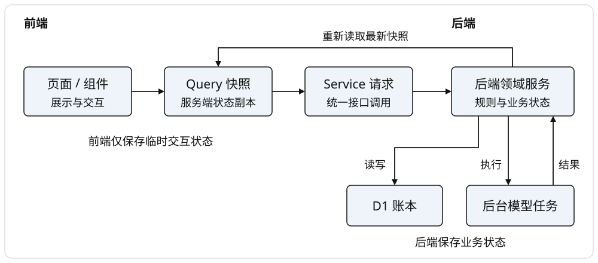
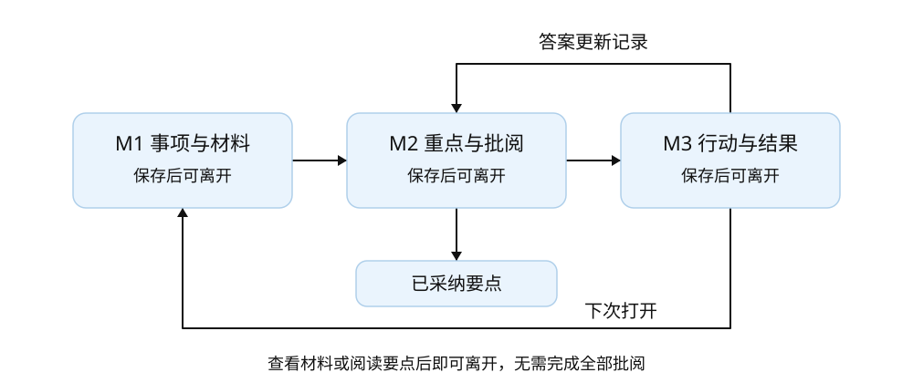
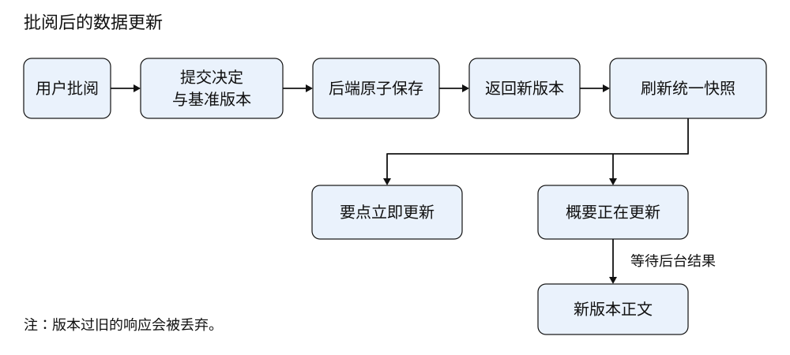
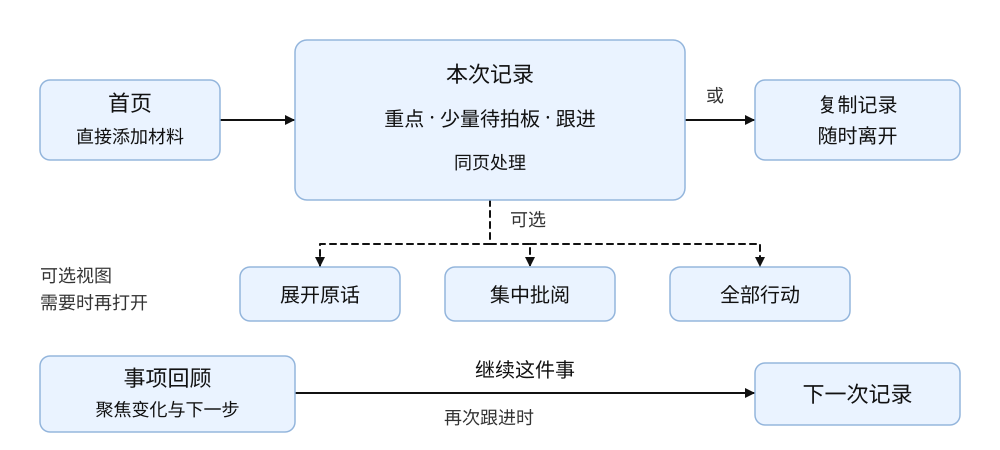
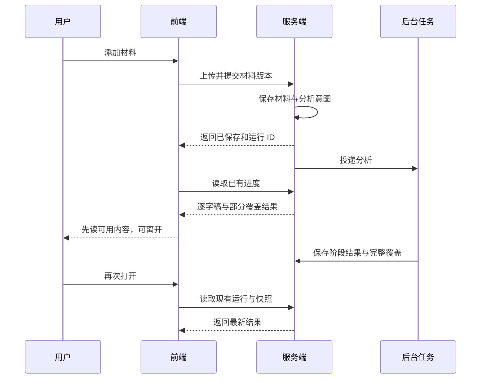
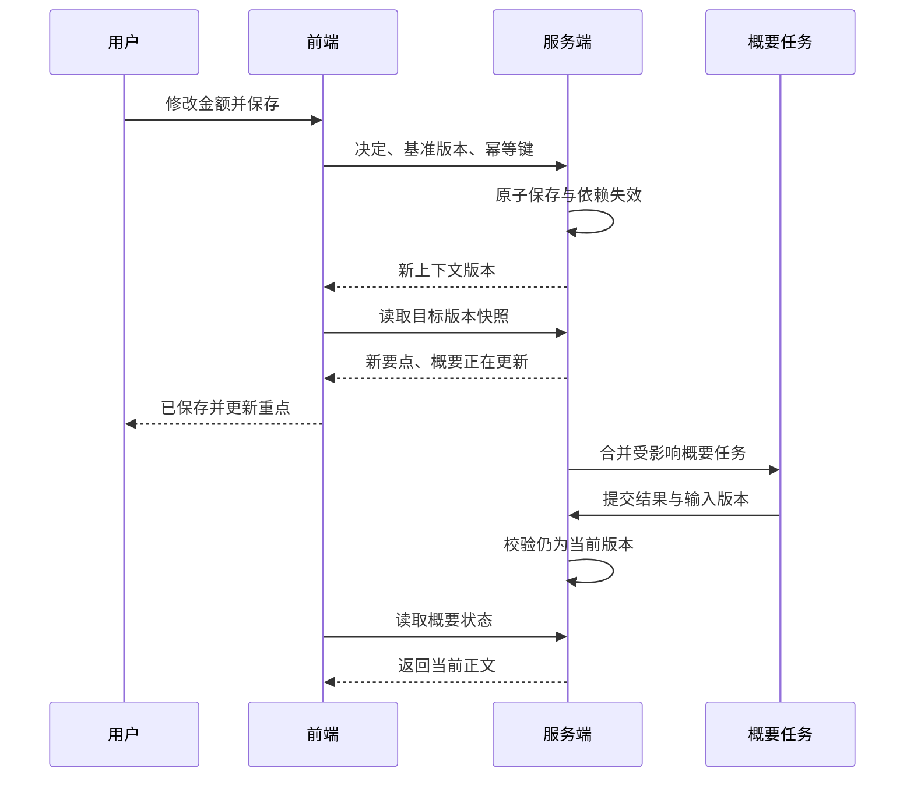
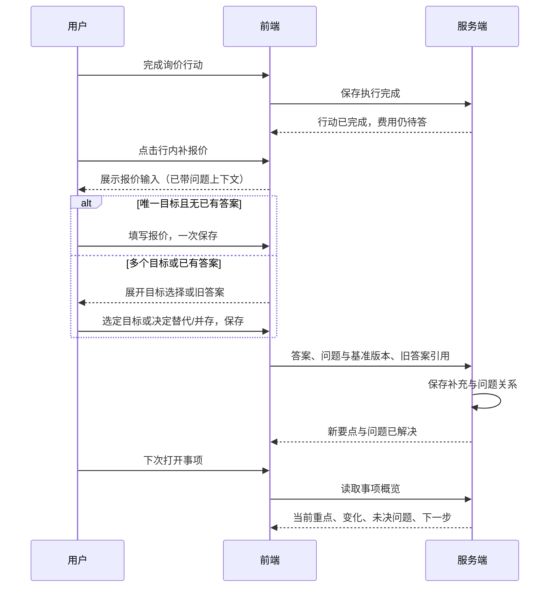

# Notique 工作流 V2 技术方案 - 前端

## 一、背景与目标

**产品需求：**Notique 工作流 V2，拟折、批阅、成稿、跟进、回顾。**后端技术方案：**[Notique 工作流 V2 技术方案 - 后端](https://mcnl4dcjt5d8.feishu.cn/docx/EXW8dZmgxoE8VHxWub9cu3qGnpe)

本方案用于工作流 V2 的前端实现。代码基线为 main 的 c86be01，现有系统已具备材料上传、阅读视图、信息核对和行动完成能力。本文中的 V2 页面、接口和状态规则为待实现规范。前后端共同以第六章契约为准。

用户放入材料后直接拿到一份可读、可复制的记录。重点、需要拍板的事项和跟进放在同一页，用户在内容旁确认、改一句或补一个结果，同一份 bullet points 随之更新。下次打开从当前重点、最近变化和下一步继续。阅读、部分采纳、完整跟进都是有效出口。

- 目标一：让用户知道现在看什么、批准什么、处理后得到什么。
- 目标二：把修改后的信息传到要点、概要、行动依据和下次回顾。
- 目标三：用一套通用流程覆盖销售、咨询、项目沟通和个人事务，先用房仲材料检验质量。
- 目标四：把官网已核实的视觉结构落实到实际业务组件与完整交互状态。

| Eric 的要求 | 会议依据 | 本方案承接 | 验收依据 |
| --- | --- | --- | --- |
| 房仲重点提取要准确 | 15:14–15:33 | 保留主体、金额、时间和限定词，重要事项可回听 | 标注样本逐项核对准确率和召回 |
| 实际使用要简单 | 20:13–20:41、44:27–44:36 | 先看重点，依据按需展开，处理一项即可退出 | 首次使用者独立完成三条主路径 |
| 概要之后再核对显得重复 | 40:58–41:51、47:34–49:03 | 一份重点按采纳状态更新，修改只保存一次 | 页面刷新与重开仍显示新版本 |
| 要有出处，纠正后结果跟着变 | 49:53–50:31 | 原话定位、精确引用和版本失效提示 | 改错后检查所有受影响输出 |
| PM 明确方案，交给团队实现 | 25:11–25:36、36:37–36:45、46:30–46:42 | 组件、状态、接口、验收逐项定义 | 前后端按同一契约联调 |
| 使用真实输入输出检验 | 45:46–45:54、47:15–47:19 | 合成样本先验流程，授权真实样本再验质量 | 分别记录流程实测与模型评估 |

会议记录没有提出 MCP。MCP 来自会后的沟通，按后端方案作为既有结果的只读出口。用户已明确排除 Plaud 接入。当前七个断点来自代码和截图检查，业务流程的完整点击验收安排在实现后，验收记录分别标注代码确认、实操结果和产品假设。

## 二、技术选型

| 技术 | 选型 | 说明 |
| --- | --- | --- |
| 应用框架 | React 19、Next 16、vinext、Vite 8 | 沿用 package.json 与 lockfile 的现有版本 |
| 开发语言 | TypeScript 5.9 | 共享接口类型和状态枚举 |
| 服务端数据 | TanStack Query 5 | 按 workspace、project、event、snapshot 缓存 |
| 交互基础 | 现有 Radix UI、Lucide | 复用焦点、键盘、弹窗和图标能力 |
| 设计组件 | app/components/notique-ui.tsx | 扩展现有 NqButton、NqSurface、NqStatus，建立业务组件 |
| 样式 | app/globals.css 与统一 token | 对照官网 DOM、CSS 和计算样式，分组件替换历史覆盖 |
| 浏览器验证 | 现有 Playwright | 验证 PC 真实操作、刷新、重开、键盘与并发 |
| 前后端契约 | 新增 lib/shared/workflow-v2.ts | 与后端同一类型来源，接口请求在服务端再次校验 |

官网使用 Nuxt/Vue，本项目使用 React。复用公开样式、布局约定和组件结构，在现有交互基础上实现对应组件。已观察的官网页面和资源记录在 DESIGN_SYSTEM.md，登录后未核实的状态逐项补齐采样。

## 三、整体架构与分层

当前 app/page.tsx 同时承担布局、材料处理、阅读、核对和行动。V2 从该入口渐进拆出工作台，保留材料与音频能力，通过 Service 访问后端统一快照。以下路径除标明现有外均为新增或拆分目标。

```text
app/
  page.tsx                         # 现有入口和兼容路由
  components/notique-ui.tsx         # 现有基础组件
  features/workflow/
    components/                    # 重点、折子、行动、证据抽屉
    pages/                         # 事项首页、沟通工作台
    hooks/                         # Query 与提交状态
    services/workflow-service.ts    # V2 请求封装
    state/                         # 仅页面临时状态
  design-system/page.tsx            # 现有视觉库
lib/shared/workflow-v2.ts           # 唯一 DTO 与枚举定义
app/api-client.ts                  # 接入现有请求基础能力
tests/e2e/workflow-v2.spec.ts        # 三条完整路径
```



页面负责用户交互，Query 负责服务端快照，Service 负责请求与回执。事实、判断和行动的最终状态由后端保存，模型任务在服务器继续执行。

前端本地处理展开、筛选、编辑草稿、播放定位和显示排序。后端完成状态转换、版本、引用、计数与成稿。模型处理原文理解、关系建议及确有需要的语言组织。切换标签、刷新和读取状态均使用已有结果。

## 四、前端功能模块拆分

### 4.1 模块总览

| 模块 | 页面与功能 | 模块目标 |
| --- | --- | --- |
| M1 事项与材料 | 事项首页、沟通创建、上传、处理进度、重新打开 | 材料保存后可离开，回来接着看 |
| M2 重点与批阅 | 本次重点、待批事项、来源抽屉、版本反馈、导出 | 处理一次就更新一份结果 |
| M3 行动与结果 | 行动、结果补充、未决问题、最近变化 | 把执行后的信息带回下一次沟通 |



M1 产生可读内容，M2 形成已采纳重点与行动，M3 将新答案带回 M2 并更新 M1 的事项首页。每个模块都有保存后离开的出口。

### 4.2 模块详细说明

#### M1：事项与材料

**页面入口或路由：**首页、事项首页及沟通工作台。沿用 project 和 event 参数。

**用户能够完成的功能：**

- 首页直接添加材料，上传音频、文字、图片及 PDF，录音入口沿用现有能力。首次使用采用自动标题，得到内容后再改名或归档。已有事项中使用继续这件事新增沟通。首页标题固定说明输入与结果，使用说明以添加材料、按需确认、跟进补结果三个步骤呈现。
- 保存材料后先看已有逐字稿，看到成功范围与失败阶段。
- 选择继续处理或稍后回来，打开既有事项时先看当前状态。

**页面组件与建议位置：**ProjectOverviewPage、RecordHeader、MaterialList、AnalysisProgress 放在 features/workflow。上传与播放器从现有组件迁移。

**需要读取的数据：**ProjectOverview、WorkspaceSnapshot、AnalysisRun、材料版本及服务端容量配置。

**用户操作后提交的数据：**沿用 V1 项目、沟通和材料创建契约。界面依次创建自动命名项目与沟通，保存每步返回的 ID 和幂等键，失败从已保存步骤继续。材料提交成功后服务端投递一次初始分析，重新整理和失败重试分别走 V2 显式接口。

**Loading、Empty、Error 和只读表现：**首次读取显示结构占位，空事项给出添加材料入口。部分结果显示覆盖范围。上传失败保留文件选择和可重试提示，权限变化后仍可查看获准的已存内容。

**模块验收点：**上传中断、服务端已保存但回执丢失、解析部分失败、关闭页面后任务继续、跨设备重开各执行一次。材料容量以服务端返回为准，当前线上音频上限为 100 MiB。

#### M2：重点与批阅

**页面入口或路由：**默认沟通记录页，重点与需要拍板的卡片就地关联。集中批阅作为辅助视图，依据在抽屉展开。

**用户能够完成的功能：**

- 先读完整可用记录，草稿与已采纳逐项标明。只把影响已采纳信息、阻塞下一步及值得选择的行动列为需要拍板，首屏最多5条并显示余量，可以为零。普通草稿保留就地确认入口。
- 每张卡只有一个明确主动作，例如确认金额、采用新预算或加入跟进，旁边写明更新去向。改一下就地编辑，不采纳、稍后和历史放在更多菜单。
- 点击出处跳到原话或音频。发现遗漏可选中原话并补进重点，保存为用户选录原文。处理任意数量后都可直接离开，结束本次为可选操作。
- 从原文补充入口打开 PC 选录窗口。左侧拖选原文或用键盘选录整段，右侧预览保存内容。保存失败保留选择，遇到版本变化后重新核对原文，再保存。关闭未保存选择时可继续或放弃。原文读取复用材料与逐字稿接口，按当前源版本筛选。
- 主入口复制记录带走当前完整内容，草稿逐项带标识。点击后显示正在同步记录，等待本页已提交的保存及显示同步完成，再按最新回执版本自动复制。保存失败或等待超过15秒时提示重试，输入继续保留。切换记录或账号后结束本次复制。外部更新造成版本冲突时读取最新记录，用户核对后重新复制。仅已确认作为次级导出选项，用户从零次批阅开始就能得到有用结果。剪贴板成功写入后显示已复制，浏览器限制复制时展开可选择的正文。导航中的项目名称负责定位，需要拍板与待跟进数量显示在对应内容区域。

一项具体任务连同原文明确的负责人和任务期限形成一个行动入口，独立预算、审批条件、全局期限和另一项任务各自保留。负责人和日期作为该任务的属性展示，来源未知的字段留空。原文已指派的责任按原句呈现，原文确实提出建议时保留建议语气。草稿标签表示平台尚未批阅，AI来源表示提取或生成途径。

完整记录按具体主题分组，同一件事的记录、待回答问题、行动和结果放在同组。每组只显示一次主题标题，组内操作仍按信息性质提供。需要拍板范围保持重要事项的优先顺序。用户可以阅读、部分采纳、直接回答问题或补行动结果，处理后的版本在原主题位置继续呈现。

上一版概要保持可读。提示词升级后显示更新全文概要入口，从现有重点生成当前版本，原材料的提取结果继续复用。新概要生成期间保留上一版正文和版本提示。

来源就绪的未采纳AI行动进入需要拍板，同一张独立卡或分组只计一次。采纳、明确结束一次意图选择或稍后处理后按当前状态更新数量。普通草稿有原话时保留就地确认入口，用户核对后可以采纳支持度尚未检查的内容。系统分别显示AI支持状态与用户采纳状态。

**页面组件与建议位置：**BulletList、ReviewCard、ReviewQueue、EvidenceDrawer、SummaryFreshness、ReviewFooter、ReportDialog。

**需要读取的数据：**ReviewCard 成员的 VersionRef、Bullet、Narrative、计数、来源状态、历史决定与受影响项。

**用户操作后提交的数据：**DecisionRequest 或 SourceHighlightRequest 与幂等键。组合卡逐成员提交明确选择，修改保存直接产生已采纳版本。原话选录由服务端根据源版本与范围重建文本。

**Loading、Empty、Error 和只读表现：**当前记录的其他写操作在保存完成并读取新版后恢复，阅读与查看原话保持可用。未保存输入先保存或取消再切换重点范围。需要拍板为零时显示当前没有需要你决定的事项，记录仍可阅读与复制。已采纳为空时保留完整初稿。全文概要按需展开。概要过期隐藏旧正文的默认展示，提供查看上一版和重试。更新期间每3秒读取一次快照，进入终态后停止轮询。上一版按它引用的原版本校验出处，失效正文为空。只读用户可查看出处与状态。

**模块验收点：**含可能、大约等限定词的内容确认后保留原意。断网重试只生成一次决定。修改后要点立即更新，概要显示更新进度。待批量大于零时能保存并退出。

#### M3：行动与结果

**页面入口或路由：**默认记录页的跟进区、事项首页的下一步与未决问题，完整行动列表为辅助视图。

**用户能够完成的功能：**

- 将同一条建议加入行动，从任一入口看到一致状态。原重点显示查看跟进，页头保留跟进事项入口，点击后定位并聚焦对应行动。项目回顾的继续跟进直接定位行动操作区。负责人和完整日期有依据时在行动与项目回顾展示。
- 完成、重开或取消行动，按需要补充执行结果与答案。未决问题也可直接回答，保存后进入同一套更新流程。
- 点击具体问题的补答案，输入后一次保存。行动只有一个关联问题时就地带出该问题，用户填写针对它的答案。普通结果默认一个主要输入框，补充说明按需展开，修正结果时恢复已有说明。存在多个目标或已有答案时才展开选择，明确替代或并存。
- 从事项首页查看最新重点、最近变化、剩余问题，再新增下一次沟通。项目入口直接打开回顾，整个项目标签在分析尚未完成时也可读取已有内容。点击相关沟通或去补答案，直接回到对应记录与信息位置。

**页面组件与建议位置：**ActionList、ActionRow、OutcomeEditor、OutcomeImpact、OpenQuestions、RecentChanges。结果编辑器绑定当前行，唯一目标就地显示。OutcomeImpact 在多目标或已有答案时展开，显示目标与旧答案。

**需要读取的数据：**Action、Question、最新结果版本、原始依据版本及依据变更提示。负责人和时间有来源时展示，未知时留空。

**用户操作后提交的数据：**ActionTransitionRequest、OutcomeRequest、QuestionAnswerRequest、OutcomeCorrectionRequest。保存结果可同时完成行动，但问题解决需要逐项答案。

**Loading、Empty、Error 和只读表现：**没有行动时保留记录并隐藏空清单。完成采用一键操作，补结果是同一行的可选入口，例如已完成 · 可补报价。问题有答案后自然退出未决列表。来源变化显示待调整提示。保存失败保留当前编辑内容，刷新结果可回查已保存版本。

**模块验收点：**同一建议重复采纳仍只有一条行动。跟进区标题为跟进事项，数量显示待跟进条数，已完成行动保留执行历史。完成行动后问题仍可未解决。补充报价后金额要点与问题状态更新。撤回唯一答案后问题重新打开，重新打开页面仍能读到同一状态。

## 五、页面状态管理

### 5.1 设计原则

- 服务端状态使用统一快照，临时交互状态放在组件或页面 reducer。
- 判断状态、内容新鲜度和任务进度分别展示，避免一个已完成标签混用。
- 用户提交成功后按回执的 contextVersion 刷新，旧响应按版本丢弃。
- 草稿编辑留在当前会话，敏感正文保持内存态。离开有未保存编辑时给出保存或放弃选择。已保存位置跨设备恢复。

### 5.2 事项首页状态

| 临时状态 | 用途 |
| --- | --- |
| selectedProjectId | URL 指定事项，切换时清理旧事件的选择态 |
| overviewFilter | 筛选当前重点、变化、问题或行动 |
| createRecordDraft | 新增沟通的标题与材料选择 |
| serverSnapshot | Query 中的 ProjectOverview，保存时校验 contextVersion |

### 5.3 沟通工作台状态

| 临时状态 | 用途 |
| --- | --- |
| activeTab | highlights 为完整记录页，review/actions 为可选聚焦视图，写入 URL |
| selectedCardId、evidenceRefId | 定位折子与出处，支持直接链接 |
| queueFilter、expandedGroups | 只影响展示，needsDecisionCount 与 draftCount 分别由服务端返回 |
| playbackPosition | 单一播放器当前时间，证据定位复用同一实例 |
| analysisRun | 轮询当前运行，终态停止轮询 |

行动依据变化后，以 accepted_change 进入待拍板队列，已采纳行动显示核对依据入口。展示 basisDetails 中的采纳时表述与当前表述，每项包含 acceptedRef、acceptedText、currentRef、currentText 和 sourceStatus。来源不可访问时正文为空。用户核对后点击按当前依据保留行动，通过 accept_action 提交当前卡片与上下文版本，更新冻结依据并保留执行状态。已采纳行动可以用 edit 修正文字，历史完成记录继续关联稳定行动 ID。旧引用与关系保留在历史中，重新打开行动时解除其历史版本上的有效完成关系。

采用另一条信息替代原信息时，行动依据沿已确认的替代关系找到新信息，仍显示采纳时的原版本。连续替代可追到当前有效信息，待选择的候选、并存关系、多个替代方向和循环关系保留待核对状态。用户明确保留行动后才更新其依据引用，保存时再次校验整条替代路径。

冲突卡通过 conflicts 返回 relationId、existing 与 candidateRef，existing 包含旧表述和出处引用。待选择的新信息在复制记录中明确标识。保留原信息会将候选移出当前记录，采用新信息会替代旧信息及其有效问题答案关系，并存同时保存适用情况。recentDecisions 返回最近十次批阅的 ID、revision、operation、summary、createdAt、reverted 与 choiceMode，摘要取自当时版本。界面提供撤销上次处理与最近处理列表，撤销追加反向决定并恢复原版本、关系及卡片，历史继续保留。后续依赖通过 affectedItems 返回名称，用户在当前内容上修正。

已采纳信息可继续就地修改，包括作为替代信息或与其他信息并存的内容。修改保留原替代决定及并存适用情况，历史关系保留，当前关系指向新版本。该条已用于回答问题时，编辑区按 answerTargets 展示对应问题，用户逐项选择仍可回答或解除这条支持，再通过 factChange.questionChoices 提交精确问题版本。保留其他有效答案的问题维持已解决。行动采纳时的依据仍保留原表述，核对后才更新。原结果及其修正答案沿同一信息和问题的关系链回溯，撤回可解除修正后的支持，独立新增的答案继续有效。撤销恢复原版本和关系后，所有行动依据均回到采纳时的精确版本且出处有效时，同步解除这次变化引起的核对提示。其他依据变化或出处失效时继续提示。撤销确认只恢复采纳状态，保留原行动依据。原有依赖按决定前的关系快照识别，已有后续内容使用本次决定时，改走当前内容修正。

阅读位置优先保存鼠标或键盘明确定位的内容，再按滚动位置保存。首次重新打开提供回到上次位置，结束本次保存时间和当前待办数量。继续处理恢复阅读，待办保持原状态。需要拍板筛选先显示五项，继续展开时每次增加五项，完整记录仍可直接复制。

### 5.4 批阅与行动编辑状态

| 临时状态 | 用途 |
| --- | --- |
| editDraft、baseRefs | 输入内容和开始编辑时的原版本 |
| mutationKey、submitState | 同次重试复用幂等键，idle/saving/saved/error |
| deferUntil | 稍后处理时间，可为空表示手动恢复 |
| outcomeDraft、selectedQuestions | 答案与当前行绑定的目标，无旧答案的单目标输入后一次保存，多目标或已有答案时展开选择 |
| conflictDiff | 409 后并列显示当前版本和本人编辑，选择重做决定 |
| refreshTargetVersion | 等待最新快照时显示正在同步，避免旧响应覆盖已保存结果 |

### 5.5 数据流



一次批阅先由服务端原子保存，再返回目标版本。前端刷新本次重点、待批、行动和事项首页。要点可立即成稿，概要异步更新并携带它所依据的版本。

已确认与已完成状态使用服务端回执后更新。提交中的文字输入和按钮反馈可立即显示，网络错误保留输入。同一个事件的写请求在前端串行发送，来自另一个标签页或设备的竞争由服务端版本检查处理。

### 5.6 跨组件状态传递

工作台通过 WorkflowProvider 传递选中项、播放器控制和 evidence drawer 开关。Query key 使用 workspaceId、projectId、eventId 和快照类型。业务组件接收 ID 与明确回调，避免从 app/page.tsx 传入另一份事实副本。焦点回到触发控件，卡片处理后移动到下一项，列表滚动位置按 lastCardId 恢复。

同一份记录保持稳定。确认一条只更新该条状态，修改以新版本替换对应旧条，其余草稿保持可见。主概要使用 mixed 范围，逐句标明采纳状态，未决冲突以待决问题呈现。用户主动筛选仅已确认时才收窄内容，退出筛选恢复完整记录。

稍后处理保存在服务端，默认移出优先队列。到期或用户手动恢复时重新出现。新材料导致原卡语义变化时建立有新依据的变更卡，原来的延期和不采纳历史仍可查。

### 5.7 分析接口与记录保留

分析运行 ID 沿用 extraction_runs。WorkspaceSnapshot.analysisRunId 返回当前运行，GET /analysis-runs/:runId 将提取、核对、原文概要和全文概要映射成一份进度。revision 是根据运行、阶段与材料状态计算的52位整数比较标识，expectedRunRevision 只做相等校验，业务上下文使用 contextVersion。读取进度保持任务队列和模型调用数不变。

初始分析复用同一材料版本的已有运行。重新整理是显式操作，创建运行、原生 outbox 和提交回执在同一事务保存，重试同一请求返回同一运行。新建V2运行直接生成有精确依据的全文概要。材料仍在上传、解析或转写时返回当前处理提示。新运行发布前保留上一份成功记录的草稿，覆盖统计继续反映本次运行。已采纳内容与人工修改继续保留。

失败重试限当前材料与运行中允许重试的阶段。提取重试保留已成功的模型阶段、输出、用量和供应商请求 ID，恢复现有 outbox。原文概要与全文概要保存新任务，旧失败记录与用量审计保留。有可恢复响应时先继续读取它，已确认无效的响应使用新请求。提取重试同时核对成员权限、项目版本、材料版本、当前运行、阶段修订和并发配额。原话范围变更后通过重新整理产生新运行。

记录页显示简短进度，阶段详情按需展开。重试失败部分一次恢复可重试的失败项，重新整理保留现有记录。存在未保存输入时先保存或取消。分析和概要在等待或运行状态下每3秒读取，终态停止，关闭页面后的执行由服务端持久化队列承担。

服务端保存后先短时唤醒任务，另由现有 GitHub Actions 每5分钟调用受保护的恢复入口，续跑已提交任务和材料提交意图。页面关闭后，用户重开读取同一任务的最新状态。定时触发可能排队，界面继续显示真实等待、处理及失败状态，重试沿用原任务和幂等规则。该后备恢复路径的关闭页面实测与工程测试分别记录。


### 5.8 上传后继续处理与按需阅读

上传确认成功后，服务端保存初始分析意图。前端初始触发通过 V2 initial 入口复用同一材料版本，显式重新整理使用 reorganize。沟通查询返回 sourceRevision，新运行等待时保留上一份成功记录及已采纳内容。

原文可以直接阅读。章节、发言总结、原文要点及原文概要分别提供生成入口，点击后提交所选视图。失败阅读任务显示对应入口，打开和刷新页面只读取状态。仅在已有阅读任务运行时轮询，按原文时间形成的章节导航直接可用。

记录页将处理反馈和撤销入口放在保存之后出现，常驻说明保持简短，重点靠前展示。

查看原文先显示原始文本、时间、说话人与播放入口。更多阅读方式按需展开，批阅和跟进沿用本次重点中的入口。


### 5.9 组合卡逐条处理

同组重点提供逐条处理入口。每条默认保持原样，用户选择确认、修改或不采纳。行动组使用加入跟进或不采纳。修改可归类为按原话修正或用户补充。保存只提交有明确选择的成员，最多20条，其他成员继续保留草稿。

DecisionRequest.operation=review_members 时，members.operation 使用 confirm/edit/reject/accept_action，成员仍携带精确版本。卡片、成员判断、新版本、依赖失效、概要任务和回执在同一事务保存。任一成员或组成员关系变化时整次回滚，前端保留选择和输入，展示当前版本，用户核对后重新保存。部分处理保留组合卡和剩余草稿，全部处理后转为 processed。撤销整次决定恢复对应成员和所有关联快照。


同一约定使用明确的分组，group_key 以 same_intent: 开头，包含一条 decision、一条 next_action 与 informed_by 关联。ReviewCard.sameIntent 返回当前精确 recordRef 和 actionRef，members.kind 决定每条的处理方式。界面合为一个入口，相关内容可展开查看各自状态。加入跟进只采纳行动，确认记录只采纳表述，同一意图的优先选择随之完成，独立问题继续保留。其他草稿可随后处理，复制保留两个语义对象的内容与标识。未采纳行动的依据随约定纠错更新，已采纳行动保留冻结依据并要求核对。分组、关系或成员在保存期间变化时，整次提交回滚。

用户在整理期间补充的行动与稍后模型建议若针对同一件事，ReviewCard.actionOverlap 返回人工和模型的精确版本。记录中合为一项待确认，展开显示两条原文及出处。用户可保留自己的行动、采用模型建议，或逐条选择分别跟进。选择通过 review_members 一次保存两条决定，撤销时校验分组与成员版本。只处理一条时另一条仍待确认，完成后两个语义对象及各自决定保留，复制记录仍标明来源。成员版本变化时退回独立卡片，避免自动合并用户决定。

模型分组复用既有复核步骤。新运行将 verification_schema_version 冻结为 claim-verification.v5，盘点与复核提示词使用 claim-extraction-prompt.v9.4，inventory_prompt_version 与 verification_prompt_version 随输入哈希冻结。旧运行继续采用各自冻结的9.2或9.3文案。same_intent_groups 最多12组，携带 group_key、record_claim_key、action_claim_key、reason 和 confidence。每组引用一条独立的新 decision 和一条新 next_action，每个成员只属于一组，置信度至少0.85。发布时按已通过材料校验的成员映射精确版本，在原提取事务保存 informed_by、workflow_cards 和 card_members。成员缺失、类型改变、分组重叠或置信度不足时保留独立草稿并保存原因。旧运行继续使用原 v4 响应及 v9.2 提示词，沿原供应商请求取回结果，成功阶段和用量保留。

同组成员涉及已采纳内容变化时，仍展示一个新旧信息核对入口，优先显示产生差异的成员。用户选择采用、保留或分别适用后，未处理成员继续保留草稿，原分组及稳定行动 ID 保持。其他差异仍按自身关系要求核对。撤销恢复成员、关系及原冲突。保存期间同组成员类型、分组标识或成员关系变化时，整次提交回滚。

### 5.10 当前会话的访问恢复

401、403、404或410出现后，记录页收起正文、出处及已打开的原文面板，清理工作流快照缓存。保留用户亲手输入的修改、问题答案、执行备注、适用情况、逐条处理选择和原话选录范围。恢复数据按账号、工作空间及沟通隔离，保存在当前页面内存，刷新或关闭前提示未保存。原文选录保留材料版本与字符范围，恢复访问后重新读取原文。

恢复读取会先获取当前授权和完整快照。可继续处理的内容自动回到原位置，用户核对当前版本后再保存。只读权限下仍可复制自己的输入，重新取得编辑权限后可以继续保存。原目标已被移除或关联已变化时，输入留在可复制区域，放弃需要明确确认。账号或工作空间变化时清除上一主体的输入。旧请求的迟到回执保持原会话边界。

页面显示保存完成时，同步移除未保存离开检查。恢复访问与内容并发变化使用各自的提示文字。


### 5.11 问题调整与答案联动

未回答的问题可从调整问题修改后保存。已有答案时，重点显示对应问题，调整入口继续可用。用户逐条选择仍然回答这个问题或需要重新确认，保存问题文字和答案关联使用同一次决定。关联行动显示核对新问题提示，完成状态保留。

DecisionMember.questionChange.answerChoices 携带每条现有有效答案的精确版本及 keep/reopen 选择，最多100条。服务端核对完整答案集合、问题版本、卡片、证据和关系，任一变化使整次回滚。同组多个问题一次修改时，共享答案的去留按全部选择计算。撤销恢复问题、关系和退出记录的答案，有后续作答或依据采纳时转为当前内容修正。

保留答案创建指向新版问题的 resolves 关系，旧关系留在审计。新关系 reason.questionEdit.predecessorRelationId 保存前一关系 ID，结果修正和撤回沿同一答案与同一问题的关系链处理。原结果版本保持原引用，独立建立的其他问题关联继续有效。行动 questionRefs 按稳定问题 ID 读取当前版本，冻结依据保持原版本，用户核对后更新。

问题修改与逐条答案选择按当前主体留在本页内存，访问恢复后核对最新问题和答案再保存。新的答案出现时重新选择其适用情况。只读权限下可以复制本页输入。前端使用 QuestionEditor，后端使用 question-change.ts 与既有批阅、结果和撤销服务。无旧答案时显示短窗口，有旧答案时正文可滚动，保存入口保持可见。

### 5.12 行动替代与执行历史

行动冲突在同一弹窗显示原行动、新建议与原执行状态。用户选择继续原行动、改为跟进新行动或两项都跟进。两项都跟进时填写各自的适用情况。选择完成后一次保存，关闭未保存的选择时提供继续核对与放弃入口。正文独立滚动，保存入口固定。

改为跟进新行动时，原行动进入已替代的跟进，保留原完成状态与结果。新行动采纳自己的依据，执行状态和结果按自己的信息ID维护。原行动留下的问题答案继续有效，用户仍可在当前问题修正或撤回该结果，修正范围限原结果对应的问题。原行动完成历史继续保留。当前待办数量、项目回顾和复制记录使用当前行动。

替代决定在同一事务保存双方状态、候选依据、关系、历史快照及幂等回执。新行动的依据和双方元数据在提交时重新核对。已有的完成关系进入撤销快照，撤销恢复原行动与候选状态。执行新行动或更改原结果后，旧替代决定显示后续变化，由当前入口修正。

### 5.13 AI助手连接与授权

连接入口放在工作区侧栏，独立页面为 /connections。页面先展示当前账号和只读范围，用户开启授权后，再到自己的 AI 助手安装 Notique 连接。已授权与已安装分别表述，安装状态以调用方插件页为准。

匿名访问使用现有 chatGPTSignInPath 发起顶层登录，完成后回到 /connections。本地预览显示登录说明。授权期30天，断开后拒绝新的读取。页面重新获得焦点时核对状态，定时刷新在可见页面进行。

保存失败或回执丢失时清除旧授权状态，提示重新读取。已保存的授权通过读取恢复。成员权限变化时展示访问提示，工作区继续承接采纳和改错。进入连接页前检查未保存输入，原有编辑内容保留在页面。

页面复用 NqButton、NqSurface、NqStatus 及工作台的字体、容器、边框和间距。连接地址放在展开说明中，复制仅在有效授权下可用。AI助手的推理费用按其服务计费。

连接入口携带当前工作区地址，返回时恢复原事项和沟通。登录回跳保留相同地址，返回路径限定为本平台首页路由。

### 5.14 复述信息与原事项

复述信息随本次沟通读取，保留模型关联状态、本次原话及冻结的原信息版本。待核对关联展示为再次提及，阅读和混合复制即可带走。关联已经确认且原版本仍有效时，沿用原记录、行动或问题的ID，完成与答案状态继续承接。原事项修改、类型改变、被替代或不可访问时，原版本与当前内容分开显示。材料或段落不在本次授权范围内时收起对应正文。项目待办及问题按稳定ID计数，原卡片保持自身沟通归属。

用户展开本次原话后，可选择沿用原事项、作为独立信息或忽略。沿用时保持原事项ID及执行和答案状态。独立信息以本次模型提议和出处生成一条草稿，继续使用普通记录的采纳与修正入口。关联选择复用 occurrence_verdicts 和 claim_occurrences，workflow_mention_decisions 保存候选指纹与生成版本，支持撤销整次选择。撤销保留原生审计，恢复待核对关联。独立草稿已有后续处理时，在当前内容上修正。两次沟通的原材料分别控制自身显示，后续复述材料失效时原记录仍依自身出处读取。

## 六、服务端接口交互

### 6.1 调用方式

新工作流接口统一使用 /api/v2。现有项目与材料 CRUD、上传和证据读取继续调用 /api/v1，经共享领域服务同步更新 V2 读模型。成功响应沿用 { data, request_id }，错误响应沿用 { error: { code, message, details }, request_id }。Service 解包后返回下表类型。

所有写请求携带 Idempotency-Key。同一次提交遇到超时沿用原键和原请求体，用户调整内容后生成新键。服务端成功回执表示业务数据已提交，后续概要更新由 refreshState 表达。提交可影响多条信息时，同时校验对象版本和 expectedContextVersion。

> 接口字段以 lib/shared/workflow-v2.ts 为共同定义。实现时先落类型、运行时校验和契约用例，再接页面。现有 V1 写入口也要触发同一套依赖更新，否则旧页面仍会留下旧概要。

| 状态码 | 含义 | 页面处理 |
| --- | --- | --- |
| 200 / 201 | 读取或业务提交成功 | 按回执更新到目标版本 |
| 202 | 分析任务已持久化入队 | 读取 runId 并展示阶段进度 |
| 400 / 422 | 字段或业务前提不满足 | 保留输入，定位字段或缺失出处 |
| 401 / 403 | 登录失效或权限不足 | 保存当前会话草稿，提示重新登录或只读 |
| 404 / 410 | 无可访问资源或资源已归档删除 | 返回事项列表，避免继续提交旧对象 |
| 409 | 版本变化、游标过期或幂等键冲突 | 按 error.code 区分，重取数据后让用户处理差异 |
| 429 / 503 | 限流或临时不可用 | 遵守 Retry-After，提供当前请求的重试 |

### 6.2 各模块接口调用明细

#### M1：工作流接口

| 用户操作 | Service 方法 | HTTP 方法 | HTTP 路径 | 请求类型 | 响应类型 |
| --- | --- | --- | --- | --- | --- |
| 打开事项首页 | getProjectOverview | GET | /projects/:projectId/overview | OverviewQuery | ProjectOverview |
| 读取沟通工作台 | getWorkspace | GET | /events/:eventId/workspace | WorkspaceQuery | WorkspaceSnapshot |
| 启动或重新整理 | startAnalysis | POST | /events/:eventId/analysis | StartAnalysisRequest | AnalysisRun |
| 查看任务进度 | getAnalysisRun | GET | /analysis-runs/:runId | 无 | AnalysisRun |
| 重试失败阶段 | retryAnalysis | POST | /analysis-runs/:runId/retry | RetryAnalysisRequest | AnalysisRun |

#### M2：工作流接口

| 用户操作 | Service 方法 | HTTP 方法 | HTTP 路径 | 请求类型 | 响应类型 |
| --- | --- | --- | --- | --- | --- |
| 批阅一条事项 | decideReviewCard | POST | /review-cards/:cardId/decisions | DecisionRequest | MutationReceipt |
| 选录原话补进重点 | addSourceHighlight | POST | /events/:eventId/highlights | SourceHighlightRequest | MutationReceipt |
| 处理再次提及的关联 | decideMention | POST | /reaffirmed-mentions/:mentionId/decisions | MentionDecisionRequest | MutationReceipt |
| 撤销最近一次批阅 | revertDecision | POST | /decisions/:decisionId/revert | RevertDecisionRequest | MutationReceipt |
| 保存阅读位置或结束本次 | saveReviewProgress | POST | /events/:eventId/review-progress | ReviewProgressRequest | ReviewProgress |
| 导出当前结果 | createReport | POST | /projects/:projectId/reports | ReportRequest | ReportSnapshot |

#### M3：工作流接口

| 用户操作 | Service 方法 | HTTP 方法 | HTTP 路径 | 请求类型 | 响应类型 |
| --- | --- | --- | --- | --- | --- |
| 完成、重开、取消行动 | transitionAction | POST | /actions/:actionId/transitions | ActionTransitionRequest | MutationReceipt |
| 补充结果并关联问题 | saveOutcome | POST | /actions/:actionId/outcomes | OutcomeRequest | MutationReceipt |
| 直接回答未决问题 | answerQuestion | POST | /questions/:questionId/answers | QuestionAnswerRequest | MutationReceipt |
| 修正或撤回结果 | correctOutcome | POST | /outcomes/:outcomeId/corrections | OutcomeCorrectionRequest | MutationReceipt |

材料复用接口：POST /api/v1/events/:eventId/assets、PUT /api/v1/assets/:assetId/content、POST /api/v1/assets/:assetId/finalize。原文通过 GET /api/v1/events/:eventId/transcript-segments，证据通过 GET /api/v1/assets/:assetId/evidence-view 及现有 evidence-refs/context 读取。导出生成本地可下载内容，发送或共享由用户另行发起。 复制当前沟通时显式传入当前 eventId，事项级导出才使用全部沟通范围。复制回执过期后保留用户当前选择，重新读取再生成当前版本。

#### MCP：连接与授权

| 用户操作 | Service 方法 | HTTP 方法 | HTTP 路径 | 请求类型 | 响应类型 |
| --- | --- | --- | --- | --- | --- |
| 读取AI助手授权 | getMcpConnection | GET | /mcp-connection | 无 | McpConnectionStatus |
| 开启或断开AI助手授权 | setMcpConnection | POST | /mcp-connection | McpConnectionRequest | McpConnectionStatus |

#### 共同数据类型

| 类型 | 关键字段 | 规则 |
| --- | --- | --- |
| VersionRef | claimId、claimVersionId | 指向一条信息的精确版本 |
| WorkspaceSnapshot | access、snapshotId、contextVersion、sourceRevision、coverage、bullets、reviewCards、actions、questions、narrative、counts、nextCursor、recentDecisions?、reviewProgress?、analysisRunId?、actionHistory?、reaffirmedMentions? | 事件级一致读取快照。counts 分开返回 draftCount、needsDecisionCount、openActionCount，recentDecisions 可返回最近十次批阅的 id、revision、operation、summary、createdAt、reverted 与 choiceMode，所有集合携带同一 contextVersion access 含服务端解析的 workspaceId、actorId、canEdit，用于缓存隔离与只读展示，写入仍重新检查权限。 reviewProgress 保存当前主体的 lastCardId、finishedAt 和 remainingCount。阅读位置即时读取，个人位置变化保持业务快照稳定。 analysisRunId 返回当前 extraction_run ID，用于只读阶段进度 访问失效后前端收起正文并清理工作流快照，按账号、空间和沟通保留本页用户输入。恢复时重新获取当前快照，核对后提交。账号或空间变化清除上一主体输入，迟到回执保持原会话边界。 actionHistory 返回当前沟通已替代的行动历史，保持原行动的完成状态与结果，当前跟进、待办数量和复制记录使用 actions。 reaffirmedMentions 保留本次复述、冻结原版本和当前版本。模型关联仍为proposed，原审核与行动状态保持。存在匹配的原生确认记录、目标仍为当前采纳版本且两次出处有效时，沿用原信息、问题或行动ID。 |
| ProjectOverview | access、snapshotId、contextVersion、counts、currentBullets、recentChanges、openQuestions、nextActions、recordSummaries、nextCursor | access 与工作台沿用同一授权。currentBullets 使用当前记录规则，跨沟通答案按信息 ID 去重并保留来源 eventId。recentChanges 保存操作当时的精确版本和文字，翻页仅分页该集合，其余集合与全局计数保留。recordSummaries 含覆盖范围、计数和个人阅读位置。来源失效时历史只显示操作与核对提示。 currentBullets 中的行动另带 executionState，采纳与完成分别展示。 |
| ReviewCard | id、revision、createdAt?、kind、title、memberRefs、members、suggestedOperation、needsDecision、reasonCode、reason、disposition、sourceStatus、latestDecisionId、decisionRevision、conflicts?、sameIntent?、actionOverlap?、eventId? | kind=record/question/action/conflict。needsDecision 按本章优先规则计算，reasonCode=accepted_change/blocking_question/action_choice 或 null。disposition=active/deferred/processed，sourceStatus=ready/stale/missing。members 含 statement、reviewState、origin、supportStatus、evidenceRefIds 与 VersionRef。conflicts 含 relationId、existing 与 candidateRef，existing 包含旧表述及出处引用 createdAt 与 ID 保持同组排序稳定。 行动冲突的 conflicts 返回 existingActionState=open/completed/cancelled，用于核对原行动的执行状态。 普通已采纳成员的 answerTargets 返回它回答的全部当前问题，含 questionRef、revision 与可读取的 text，跨沟通沿同一项目校验，来源不可访问时 text 为 null。 members.kind 为 record/question/action，逐条处理按成员类型展示。 sameIntent 含 recordRef 与 actionRef，仅用于明确关联的一条约定记录和一条行动。只确认记录或加入跟进后解除该意图的优先选择，其余成员状态保留。复制继续保留两类信息及各自标识。 actionOverlap 含 manualRef 与 modelRef，指向同一行动的人工补充和模型建议的精确版本。一张卡保留两条原文，逐条决定后仍待处理未决定成员，成员版本变化时退回独立卡片。 eventId 指向卡片原归属。复述工作台沿用原卡片ID，个人阅读位置保存该原归属，写入按原资源定位。 |
| Bullet | id、text、claimRefs、reviewState、origin、sourceStatus、applicability?、conflictWith? | reviewState=draft/accepted，origin=source_statement/ai_suggestion/user_input/user_selection。用户选录保留原话，缺失或过期出处显式展示 并存答案的适用情况随要点展示与导出。conflictWith 保存仍待选择的旧信息精确版本，复制时标明新旧信息待选择。 |
| Narrative | text、sentenceRefs、basedOnContextVersion、freshness、scope | freshness=current/stale/updating/failed。scope=accepted/draft/mixed，sentenceRefs 逐句含 VersionRef 与 reviewState，混合概要逐句区分采纳状态。逐句引用全部为已采纳版本时标 accepted，混合引用标 draft。更新期间显示 updating，终态停止轮询。上一版按原版本校验出处，来源失效正文为空。sentenceRefs 可含 topic 的 key 和 title，由同一次概要生成按具体主题归并，每个精确版本只属于一个主题。记录、问题、行动和结果按主题同页呈现，组名展示一次。分组只改变阅读布局，采纳、行动执行和问题解答分别保存。上一版主题仅用于仍匹配的精确版本，当前答案通过已保存的问题关联回到原主题。 |
| DecisionRequest | operation、expectedCardRevision、expectedContextVersion、members、deferUntil? | operation=confirm/edit/reject/defer/restore/accept_action/resolve_conflict/review_members。review_members 允许成员分别 confirm/edit/reject/accept_action，未提交成员保持原样。修改必须含新文本与来源归类。最多20名成员，精确成员版本、卡片版本、归属与组关系原子校验。deferUntil 为 ISO 时间或 null。用户核对就绪原话后，可确认或采用支持度为fully_supports或unreviewed的草稿。AI支持状态与人工采纳分别保留。部分支持和不支持通过修改补齐 |
| DecisionMember | claimId、claimVersionId、operation、newText?、origin?、evidenceRefIds?、conflictChoice?、questionChange?、factChange? | questionChange 仅用于问题 edit。answerChoices 携带全部现有有效答案的 VersionRef 和 mode=keep/reopen，最多100条。keep 关联到新版问题，reopen 解除当前问题关联，共享答案保留其他问题用途。整次决定和撤销恢复原子处理。结果修正与撤回沿 reason.questionEdit.predecessorRelationId 关系链处理，同一答案、同一问题之外的独立关联保留。 factChange 仅用于普通信息 edit，questionChoices 携带当前回答的全部问题 VersionRef 和 mode=keep/reopen，最多100条。keep 使用新信息版本回答原问题，reopen 解除该条支持并按其他答案重算。已确认的替代与并存关系追加新版本关系并保留原决定及适用情况。原行动依据保持冻结，用户另行核对。结果撤回沿同一答案、同一问题的 questionEdit 与 factEdit 关系链处理。 |
| MutationReceipt | mutationId、contextVersion、changedRefs、affectedViews、refreshState | 原子提交后的回执。changedRefs 含 entityType、id、revision。refreshState=current/updating，前端按目标版本读取快照 |
| Action | id、claimRef、revision、executionState、questionRefs、basisState、basisDetails、latestOutcome、ownerHint?、dueAt? | id 等于 next_action 的 claimId，revision 映射 claims.workflowRevision。executionState=open/completed/cancelled，basisState=current/needs_review。basisDetails 包含 acceptedRef、acceptedText、currentRef、currentText、sourceStatus。不可访问来源正文为 null。依据变化以 accepted_change 计入待拍板，已采纳行动显示核对依据入口。accept_action 可显式核对已采纳行动的新依据，保留执行状态。edit 修正已采纳行动文字，完成记录按稳定行动 ID 保留。已确认的 use_candidate 替代可跨信息 ID 解析 currentRef，冻结依据在用户再次核对后更新。替代路径歧义或失效时保留 needs_review latestOutcome.freshness=current/stale，答案被替代或失效后结果作为历史展示。来源不可用时结果正文为空。 questionRefs 按稳定问题 ID 读取当前版本，冻结依据在用户核对后更新。 首次采纳从精确版本的normalized_value继承owner与合法完整日期due_at。已有metadata连空值一起保持权威。修改行动文字清空负责人和日期提示，撤销完整恢复。 |
| ActionHistoryEntry | id、claimRef、text、sourceStatus、executionState、replacementRef、replacementText、latestOutcome | 已替代行动的只读历史。text 与 replacementText 在对应来源不可访问时为 null，replacementRef 沿已确认替代链指向当前行动，无法确定时为 null。executionState 与 latestOutcome 保留原行动的执行记录，新行动按自身ID维护状态及结果。历史行动结果可以通过当前问题修正或撤回，修正范围限该结果原有的问题。 |
| LatestOutcome | id、revision、text、answerRefs、resultRefs?、updatedAt、freshness? | freshness=current/stale。text 保留结果当时的文字，answerRefs 仅含当前有效答案。相关答案变化后收起为上次结果，当前答案继续在重点中显示。原答案来源失效时正文为空。 resultRefs 仅含独立行动结果的当前精确版本，与 answerRefs 分开。结果作为用户补充进入原主题、复制和概要，修正或撤回沿原结果入口处理。与逐项答案相同的说明复用答案，独立说明不会把问题改为已回答。结果或答案失效后该结果收起为历史，当前输出使用有效信息。 |
| Question | id、claimRef、revision、resolutionState、answerRefs、latestOutcome | revision 映射 claims.workflowRevision。resolutionState=open/resolved，存在有效已采纳答案才可 resolved latestOutcome.freshness=current/stale，答案被替代或失效后结果作为历史展示。来源不可用时结果正文为空。 已有答案的问题仍可修改，逐条确认答案适用后保存新问题版本，行动完成状态保持。 |
| OutcomeRequest | expectedActionRevision、expectedContextVersion、text、evidenceRefs、resolveQuestions、answerDecisions?、completeAction | text 或有效 evidenceRefs 至少一项。resolveQuestions 逐项提供 questionId、revision、answerText，保存即明确采纳用户补充。已有答案时 answerDecisions 逐问题提供 questionId、mode=replace/coexist、priorAnswerRefs 及 coexist 时的 applicability |
| QuestionAnswerRequest | expectedQuestionRevision、expectedContextVersion、answerText、evidenceRefs、answerDecision? | 为当前问题保存人工作答并生成 outcomeId。已有答案时 answerDecision 含 mode=replace/coexist、priorAnswerRefs 及 coexist 时的 applicability，修正与撤回复用结果接口 |
| OutcomeCorrectionRequest | expectedOutcomeRevision、expectedContextVersion、operation、replacement? | operation=replace/withdraw。replacement 使用结果字段，事务重新计算受影响问题 |
| ActionTransitionRequest | expectedActionRevision、expectedContextVersion、operation | operation=complete/reopen/cancel。完成或重开只变更行动执行状态 |
| RevertDecisionRequest | expectedContextVersion、expectedDecisionRevision | 还原该决定前的版本和关系。已有后续依赖时返回受影响项，用户改走修正流程 |
| SourceHighlightRequest | expectedContextVersion、assetVersionId、ranges | ranges 为 segmentId、startOffset、endOffset 的数组，引用已有原文片段。服务端重建原话，保存已采纳的用户选录，重复选录返回既有结果。范围使用 UTF-16 半开区间，最多20段与4000代码单元，精确范围保存于版本 source_selection。原文就绪后即可选录，重复选录沿用既有信息且不重复投递概要任务 |
| ReviewProgressRequest | snapshotId、lastCardId、mode | mode=bookmark/finish_session。当前主体可以用阅读权限保存个人位置，校验快照、卡片归属与权限。结束本次允许存在待办，后续 bookmark 恢复阅读。保存位置保持采纳状态、业务版本和任务队列原值。 |
| ReviewProgress | lastCardId、finishedAt、remainingCount | remainingCount 为当前需要拍板的数量，允许大于零，普通草稿另行计数 |
| ReportRequest | expectedContextVersion、scope、eventIds、format | scope=accepted/mixed，format=markdown/plain_text。复制记录显式传 mixed，已确认导出传 accepted，混合内容逐项标明草稿并保存版本。前端等待已提交保存及显示同步后再确定 expectedContextVersion，15秒超时或切换记录结束等待，外部版本冲突后读取最新内容并提示重新复制 |
| ReportSnapshot | id、contextVersion、scope、content、createdAt | 确定性文本或 Markdown 成稿，引用、覆盖范围和未决问题随结果保存 |
| StartAnalysisRequest | sourceRevision、mode | mode=initial/reorganize。原始材料确认保存时在同一事务递增sourceRevision并保存初始分析意图，initial复用同一输入，reorganize为显式操作。派生转写与内部音频分块沿用原始提交 |
| RetryAnalysisRequest | expectedRunRevision、stageIds | 限当前运行中允许重试的失败阶段，或已成功但提示词过期的概要阶段。事务核对权限、材料、当前运行与阶段修订。过期概要从现有重点重建，保留提取阶段及旧任务审计。旧请求回执只存运行ID |
| AnalysisRun | id、revision、state、stages、coverage、inputRevision、retryable | state=queued/running/partial/succeeded/failed/cancelled。coverage为成功片段数、总片段数及未完成范围。revision为当前运行、阶段及材料状态的52位整数比较标识，只做相等校验。GET只读取进度。旧版概要阶段保持succeeded，retryable=true并标记NARRATIVE_PROMPT_OUTDATED，用户可更新全文概要。新运行发布前保留上一份成功记录，覆盖仍按本次输入计算 |
| WorkspaceQuery / OverviewQuery | cursor?、snapshotId?、limit?、minContextVersion? | limit 默认20、最大50。翻页沿用 snapshotId，失效返回409。提交后读取携带 minContextVersion=回执版本 |
| McpConnectionRequest | enabled | enabled 为 boolean。开启与断开仅改变当前已验证账号的 mcp:read 授权，参数只含 enabled。浏览器提交使用同源 POST。 |
| McpConnectionStatus | authenticated、enabled、scope、endpoint、expiresAt、accountEmail | scope=mcp:read，endpoint=/mcp。authenticated=false 时 enabled=false，accountEmail=null。开启需同时核实网关主体与邮箱、工作空间成员及独立只读授权。expiresAt 为 ISO 时间或 null，授权期30天。已授权表示读取授权，以调用方插件页确认安装状态。连接时的工具发现只返回固定名称与参数，读取记录需有有效授权。 |
| ReaffirmedMention | id、claimRef、currentRef、targetEventId、kind、statement、targetText、currentText、associationState、targetState、sourceStatus、sources | claimRef 为复述引用的冻结版本，currentRef 为当前原事项或null。kind=record/question/action。associationState=proposed/confirmed，confirmed 需匹配occurrence_verdicts与claim_occurrences。targetState=current/changed/retired/unavailable，版本或类型变化分别保留原内容与当前内容。statement、targetText、currentText 在相应出处不可读取时为null。sources 含assetVersionId、quote、sourceStatus，按本次空间、项目、沟通、材料版本及段落逐项核对，未知引用为null。待核对关联可阅读和混合复制，当前已确认的复述沿用原行动及答案，项目待办按稳定ID计数。 |
| MentionDecisionRequest | expectedContextVersion、targetRef、operation | 可选复述关联选择。targetRef 为冻结原版本，operation=confirm/reject/convert。confirm 沿用原事项的稳定ID及完成和答案状态。convert 从本次出处形成一条独立草稿，随后沿普通记录入口采纳或修正。reject 忽略此次关联。原版本或出处变化时整次回滚。 |

## 七、路由设计

### 7.1 路由结构

| 路由或入口 | 页面 | 当前结论 |
| --- | --- | --- |
| / | 首页 | 直接添加材料，已有事项可继续这件事 |
| /?project=:id | 事项首页 | 默认当前重点、最近变化、未决问题、下一步 |
| /?project=:id&event=:id&view=simple&workspaceTab=overview | 项目回顾 | 刷新保持整个项目，相关沟通直接定位信息 |
| /?project=:id&event=:id&tab=highlights | 沟通记录 | 重点、需要拍板、跟进在同一页，默认入口 |
| /?project=:id&event=:id&tab=review&card=:id | 集中批阅 | 可选聚焦视图，可定位具体卡片，失效时回记录页 |
| /?project=:id&event=:id&tab=actions&action=:id | 全部行动 | 可选聚焦视图，同一行动使用唯一 ID |
| /?project=:id&event=:id&tab=highlights&evidence=:id | 依据抽屉 | 授权读取后定位，关闭恢复原标签 |
| /design-system | 前端视觉库 | 展示全部基础组件和业务状态 |

已有 view=simple 与 readingTab 链接继续解析。readable 打开原文面板，旧核对详情映射到依据抽屉，旧待确认映射到待批事项。保留 project/event 的资源校验，URL 中的选择与服务器归属不一致时显示资源不可用。

### 7.2 页面导航流程



首页添加材料后直接进入一份记录，重点、拍板和跟进在同页完成。原文、集中批阅与全部行动按需展开。再次打开事项可继续这件事，新增下一次沟通。浏览器返回恢复原位置。

## 八、核心组件设计

### 8.1 跨页面组件

| 场景 | 建议组件 | 职责 |
| --- | --- | --- |
| 当前状态阅读 | BulletList / NarrativePanel | 要点状态与概要新鲜度分开显示 |
| 逐项批阅 | ReviewCard / ReviewQueue | 显示判断对象、操作后果、依据与进度 |
| 原话追溯 | EvidenceDrawer / AudioPlayer | 展示源版本、时间戳、原文与用户补充标签 |
| 跟进与答案 | ActionRow / OutcomeEditor | 分开记录执行结果和问题答案 |
| 再次打开 | ProjectOverview / RecentChanges | 跨记录合并当前状态，变化保留来源 |
| 保存反馈 | MutationFeedback / ConflictDialog | 保存、同步、失败及并发差异 |
| 通用状态 | EmptyState / PartialState / ReadOnlyBanner | 文案说明当前可做的下一步 |

### 8.2 Notique 基础组件选型

| 组件 | 复用方式 | 状态验收 |
| --- | --- | --- |
| 按钮 | 复用 NqButton，官网主按钮黑色与6px圆角 | default/hover/focus/disabled/loading |
| 标签页 | Radix Tabs 对照官网下划线与间距 | selected/keyboard/overflow |
| 弹窗与抽屉 | 现有 Modal/Radix Dialog，官网8px圆角 | 焦点锁定、Esc、返回触发点、笔记本窗口内完整显示 |
| 卡片与分隔 | NqSurface，白底与浅灰边框 | 普通、选中、已处理、需要更新 |
| 状态与计数 | NqStatus，保留文字与语义颜色 | 草稿、已采纳、稍后、处理失败 |
| 表单 | 统一输入框与错误提示 | placeholder/focus/error/readonly |
| 阅读与音频 | 复用现有播放器并统一控件 | 加载、无音频、时间定位、长内容虚拟列表 |

已核实资源包括 entry.BCNbfqNB.css、BaseDialog.CXMeE5hw.css、FirstProjectPage.CzmkR8DO.css 与对应公开脚本。正式实施逐组件记录来源 URL、DOM 结构、计算样式、尺寸及截图，移除 .interface-refresh 中对应旧覆盖后再验收。颜色、圆角和间距由 token 管理。官网资源变化时保留采样日期与资源 hash。

视觉库每个组件展示上述全状态和一段业务示例。根据2026-09-29的产品范围调整，本期专注 PC，验收尺寸为1920×1080、1440×900和1366×768。自动化业务回归覆盖后两种尺寸，宽屏另做布局截图检查。交互以鼠标和键盘为主，原文按需展开，弹窗在笔记本窗口内可完整操作。新手测试中若用户仍需来回对照两栏才能理解，回到组件与信息层级调整。

## 九、关键交互流程时序

### 9.1 材料进入与首次可用结果



材料提交成功后服务端持久化分析任务。逐字稿或部分要点可用时先展示，进度明确标明尚未覆盖的部分。退出页面后任务按服务端调度继续。

### 9.2 批阅与自动成稿



用户修改一项信息，服务端保存新版本、决定和依赖失效。前端读取新版 bullet points，概要显示正在更新。模型完成后仅在输入版本仍然匹配时发布正文。

### 9.3 行动结果与再次打开



行动完成只更新执行状态。用户在已知问题旁补答案，一次保存就更新要点。多个目标或已有答案时才展开选择。再次打开从服务端恢复最近变化和下一步。

## 十、非功能性考虑

### 10.1 性能

- 首屏读取聚合快照，逐字稿与证据按需分页。默认每页20项，最大50项，长列表虚拟化。
- 运行中的任务先每2秒轮询，30秒后放缓至5秒，后台标签页15秒一次，终态停止。重开页面读取现有 runId。
- 连续批阅逐条保存，概要更新采用2秒合并窗口，最长等待10秒。确定性 bullet points 随事务结果可用。
- 目标交互响应在200毫秒内出现视觉反馈。网络与模型耗时单独采集，以同一设备和网络的基线对比作为验收依据。

性能评估记录首次可用结果时间、完整处理时间、每阶段 token、失败重试与用户操作量。确认、不采纳和完成的同步请求模型调用数应为零，受影响概要的后台生成单独计费。读取和切标签均为零新增模型调用。页面运行不会决定服务端任务是否继续。

### 10.2 错误处理

| 断点 | 具体验收操作 | 通过条件 |
| --- | --- | --- |
| 不知道先看什么 | 首次进入一份未处理沟通 | 用户能读到重点并直接复制完整记录，建立内容前的必填命名步骤为零 |
| 不知道批准什么 | 分别确认记录和加入行动 | 结果去向不同，限定词与建议来源清楚 |
| 改了但概要没变 | 更正金额并刷新、重开，制造生成失败 | 新版要点出现，旧概要有版本提示与恢复入口 |
| 重复处理 | 两入口采纳同一建议，模拟超时重试 | 只产生一个行动和一份决定，同一约定的记录与行动共用一张决策卡 |
| 被迫审完全部 | 只处理两项后结束并重开 | 记录完整保留，其他草稿仍可复制，余项可继续，普通草稿数量与待拍板数量分开 |
| 完成后没有答案 | 完成询价但无报价，再补充报价 | 执行和问题状态分开，补充后更新关联重点 |
| 下次接不上 | 再加一份有变更的沟通 | 看见差异和待决冲突，已采纳旧结论有历史 |

三条端到端路径分别为直接复制后离开、纠错后重开、行动到答案再到新沟通。额外覆盖选录遗漏原话、零待拍板、只确认一条、同意图去重和多答案冲突。正常确认、加入跟进、完成为一次点击，修改和单目标补答案为一次保存，这些计数排除输入文字与自愿查看出处。异常路径加入刷新、断网重试、双标签并发、来源失效和只读访问。测试记录保留步骤、截图、版本号与结果。2026-09-29 的实现走查已覆盖两种 PC 尺寸的阅读、纠错、跟进及结果回流。工程回归、浏览器操作、模型质量和首次使用者试用分别记录。首次使用者的独立完成率仍按试用验收。

用户验证安排5名未参与实现的试用者，其中至少2名房仲或销售、2名通用沟通场景用户。先用可交互原型检验同页操作，再让用户在实现版本独立完成三条主路径。记录首份可用结果耗时、页面切换次数、重复判断次数和求助位置，观察能否区分草稿与已采纳。用同类材料与旧版对照，并在下一次相关沟通时检查能否接着使用。发现同一处反复卡住时回修流程再测。人数与场景为本版测试设计，结果待实施后采集。

### 10.3 权限控制

- 按后端返回的能力展示查看、编辑和导出。服务端逐资源鉴权，界面禁用只是交互反馈。
- 公开演示工作空间使用示例或脱敏材料。真实客户试用以前后端成员权限和数据隔离验收通过为入口。
- 依据、报告和项目链接都经过资源授权。用户录入的新答案保留作者与时间，敏感输入不写浏览器持久缓存或前端日志。

实施依赖顺序：同页流程原型检验 → 共享契约与后端版本机制 → 稳定记录和就地拍板 → 结果回流 → 同期资料的性能对照 → 组件状态与用户试用验收。前端各阶段都随对应后端能力联调。发布沿用 main 与现有 Sites 项目，同一提交通过工程检查和业务流程验证后上线。

WorkspaceSnapshot.access 由服务端返回 workspaceId、actorId 和 canEdit。前端按主体与空间隔离快照缓存，只读时保留记录、出处与复制入口。所有保存请求在服务端再次校验权限。

Bullet.applicability 为并存答案的适用说明，来源是用户明确选择时保存的关系范围。页面和导出一起展示，避免两个不同条件下的答案看起来互相矛盾。

稍后处理与恢复仅更新个人延期和卡片修订，校验当前上下文但保留业务 contextVersion。此类操作返回 refreshState=current，正文和概要继续使用原有版本。
