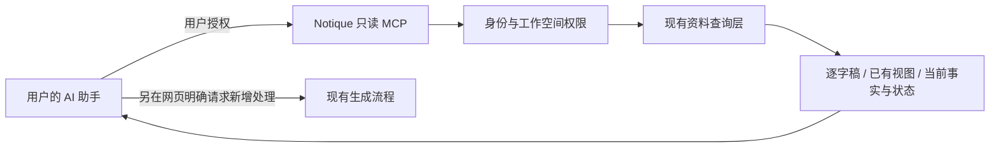

# Notique MCP 接入与降本方案

状态：2026-09-30，六个只读工具和 /connections 授权页已发布，安装后的实际助手工具列表已发现六工具。行动、问题及结果状态补全已随生产版本发布；本次 evidenceRefIds 链路修复等待同源发布，工程回归与真实个人账号验收分开记录。个人账号尚待确认并授权，个人资料读取、撤销后的实际拒绝和零新增模型任务尚未判为通过。具体接口以两份工作流 V2 技术方案和共享契约为准。

## 推荐决策

采用成熟协议和官方接入方式，复用本项目已有资料层。先让用户自己的 AI 助手读取 Notique 中已有的结果，把只读连接和收费的生成任务分开。

产品约束（用户最新明确要求）：Plaud 是竞争对手，不接入其 MCP、API 或数据服务。此前提出的 Plaud 导入建议撤回；竞品协议研究不构成采用其服务的建议。

MCP 是上下文和工具交换协议，不提供免费模型。给同一串模型调用套 MCP 不会自动减少 token。用户在自己的助手里提问时，推理由该助手执行，仍受其套餐、额度和规则约束；Notique 继续承担存储、检索和自身后台生成的成本。[MCP 官方架构](https://modelcontextprotocol.io/docs/learn/architecture)

## 两条独立路径

| 路径 | 谁提供模型计算 | 可减少的重复工作 | 限制 | 建议 |
| --- | --- | --- | --- | --- |
| Notique → 用户的 AI 助手 | 用户所选助手 | 不为每个临时问题在 Notique 再跑全文分析 | 需要用户连接账户；网页自动生成不会凭空转移到助手 | 优先实现只读 Notique MCP |
| Notique 自有生成流程优化 | 现有模型供应商 | 缓存、按需视图、精简重复上下文、局部重算 | 必须验证质量；仍有 API 成本 | 和 MCP 分开测量、逐步实施 |

## 与当前代码的衔接

现有流程包含转写，以及章节、发言总结、要点、总览等阅读视图和事实提取/核查。视图类型与版本在 `lib/domain/event-ai-artifacts.ts`；模型调用在 `lib/server/ai/model-provider.ts`。不同输入、缓存、重试会改变调用量，不能把阶段数当固定账单。

第一阶段六个只读工具如下，正式站验收单独记录。当前不提供日期范围、关键词或全文搜索参数；助手可组合列表、视图及原文分页进行筛选。

| 工具 | 输入约束 | 返回内容 | 复用位置 |
| --- | --- | --- | --- |
| `list_projects` | limit 默认 20，最大 50；游标 | 项目 ID、名称、更新时间、项目上下文版本 | 已授权项目查询 |
| `list_records` | project_id；limit ≤ 50；游标 | 记录 ID、标题、发生时间、来源修订、已有分析状态 | `loadWorkflowLedger` 中的事件与任务 |
| `get_record_excerpt` | record_id；片段游标；最多 100 段、20,000 字符 | 原文片段、说话人、时间、来源 ID、下一页 | 现有 transcript-segments 查询 |
| `get_record_views` | record_id；views 默认 record；limit ≤ 50；游标 | 当前条目及草稿/采纳、行动执行、问题答案、最近结果和精确引用；指定视图返回已有生成状态与版本 | `projectWorkspace`、已有阅读产物查询 |
| `get_evidence` | evidence_id；单段上下文上限 | 出处、相关原文、可定位的引用 | `evidence-repository.ts` |
| `get_project_brief` | project_id；limit ≤ 50；游标 | 已采纳事实、行动及问题；保留已完成/已取消行动、已回答问题和最近结果；草稿明确标记，已替换行动标历史 | `projectOverview` 计数、`projectWorkspace` 状态 |

搜索能力可在第二阶段增加：先实现有权限约束的标题/内容搜索，限制结果片段及数量，再视需求决定是否需要向量库。不要为了 MCP 先引入一套新的 agent 框架。

按资源返回项目 `contextVersion`、记录 `sourceRevision`、精确 claim/version 引用或阅读产物版本；时间字段沿用该资源已有字段，不保证每种结果都有 `updated_at`。分页按稳定顺序，状态、结果或来源变化后旧游标失效。空结果、未生成、处理中、失败要区分；读取不得触发 retry/create run、自动转写或重新生成。返回出处链接前验证当前应用可解析该链接；首版使用资源 ID、版本 ID 与片段 ID。模型生成内容明确标为草稿，不能冒充用户确认。

### 状态与关联的读取约定

`get_record_views` 的 record 和 `get_project_brief` 共用已有工作区权威投影。页面展示时可以用答案替换问题，MCP 必须保留问题条目和答案关系；项目读取不能只返回待执行行动，否则完成或取消后的行动会消失。

| 字段/条目 | 含义 |
| --- | --- |
| `reviewState` | `draft` 或 `accepted`，仅表示是否采纳。草稿行动不含执行状态，也不因读取而变成待办。 |
| `executionState` | 已采纳行动的 `open`、`completed`、`cancelled`；执行完成不等于问题已回答。 |
| `resolutionState` | 问题的 `open` 或 `resolved`；直接回答无需先创建或完成行动。问题也保留自身 `reviewState`。 |
| `claimRef` / `claimRefs`、`revision` | 条目精确版本与当前工作流修订。依据的 `acceptedRef` 和 `currentRef` 分别保留，`basisState` 单独标明需复核。 |
| `evidenceRefIds` | 项目/记录条目当前精确 claim/version 对应、权限内、结构有效且 ready 的原始出处 ID，可直接作为 `get_evidence` 的 `evidence_id`。失效来源或只有 user_note 的用户补充返回空数组，不伪造原文出处，也不混入旧版本证据。 |
| `questionRefs` / `answerRefs` | 行动关联的问题及问题当前有效答案的精确版本；多问题结果按各问题的 `answerRefs` 区分。 |
| `answerToQuestionRefs` / `resultForActionRefs` | 答案或结果条目的反向精确关联。项目去重仍保留跨记录的全部关联，`eventId` 指向条目原属记录。 |
| `latestOutcome` | 已保存最近结果的 ID、修订、文字、更新时间、答案/结果引用及 `freshness`。`stale` 表示旧结果，不能当作当前答案；未保存结果为 null。 |
| `kind: action_history` | `lifecycleState: superseded` 的已替换行动，保留执行状态、原版本、替代版本和已有结果，不能作为当前待跟进事项。 |

来源失效时收起相应正文，保留状态和版本标识；最近结果沿用工作区的来源检查与新鲜度判断，不从文字或条目缺席推断状态。读取只做授权范围内的查询和纯投影，不写入工作区快照、行动、答案或任何模型任务。每次调用仍在读取前后校验授权、到期、撤销及成员权限。

`summary.freshness` 与原始出处是否可读是两项判断：概要因上下文变化而 stale，但句子仍引用当前精确版本、出处仍 ready 时，`evidenceRefIds` 可以有值；句子引用旧版本时保留原有历史正文及 stale 标记，当前出处 ID 返回空数组，不能把新版本证据挂到旧句子。多个引用只汇总其中符合当前版本及可用性规则的原始出处，不表示整句已由用户确认。各次读取在本次授权账本上预建版本与出处索引，无新增查询或跨请求缓存。

每页条目正文预算24,000字符。超长状态/关联条目以 `format: json_fragment`、`fragmentOf: entry`、`partIndex`、`partCount` 返回，合并同一条目的 `content` 后解析为完整 JSON；其他已生成阅读视图的 JSON 分片合并后得到视图内容。使用 `nextCursor` 继续读取，不能把单个分片当作完整结果。

## 实现选型

本原型已托管于 Sites，适合复用其 MCP 接入和托管鉴权，路由在现有 Worker 内薄封装上述资料查询。按 Sites 当前受支持的 MCP 契约实现发现和工具调用，并与目标客户端做协议兼容验证。运行时信任的身份只能来自受控网关；不能信任浏览器自己发送的身份头。

若正式 Notique 平台另有后端，采用 Cloudflare 官方 stateless MCP handler 和官方 MCP SDK，在其现有登录系统上映射用户权限。Cloudflare 的官方文档提供服务器及客户端接入方式；具体依赖在实施时固定经过联调的版本，不手写协议、不依赖过时教程里的框架 API。[Cloudflare MCP 文档](https://developers.cloudflare.com/agents/model-context-protocol/)、[MCP 工具集成](https://developers.cloudflare.com/agents/tools/mcp/)

## 上线前必须解决的真实边界

当前 `lib/server/http/context.ts` 的 public 模式刻意把访问者放进一个演示工作空间。即使切换到身份网关，workspaceId 仍来自单个环境绑定。这不是多租户客户权限模型。不能原样把私有客户记录开放为 MCP。

1. 建立已验证用户 → 工作空间成员关系；每个资源查询同时限制 workspace_id，并校验项目/记录归属。身份、工作空间不能由工具参数自由指定。
2. MCP 使用独立的只读授权范围；拒绝未经授权的调用、跨空间 ID、已撤销授权、已删除记录。工具发现中不返回客户内容。
3. 限制输入大小、分页数量、输出长度、超时和请求频率；日志只记请求与资源标识，不记逐字稿和访问令牌。客户资料作为数据，不当作工具指令。
4. 若未来让助手写回更正，另设写权限和审阅流程；本次只读范围不含确认事实、删除记录或启动付费任务。

## 验收与费用验证

- 工具发现及列表不产生模型调用；连续读取同一记录也不新增分析任务。
- A 用户不能读取 B 工作空间，即使知道资源 ID；撤销连接后立即按授权失效策略拒绝。
- 逐字稿分页无遗漏/重复，出处能回到原始片段；缺失结果不会触发隐藏重算。
- 当前版本、草稿/采纳、行动完成/取消、问题开放/已回答分别核对；多问题答案与行动结果按精确引用关联。修正或撤回结果、替换答案、来源失效和历史行动均与网页权威投影一致。
- 同一批授权样本分别运行现状、复用本平台已有结果、按需分析，比较输入/输出 token、重试、供应商费用、等待时间、正确率/召回与修改量。将成本拆成转写、首次生成、重试、后续问答及第三方套餐。
- 只有测得真实基线后才承诺降本比例。MCP 接入成功不等于成本下降，也不等于正式多租户上线。

交付顺序：完成权限映射和只读契约 → 目标助手联调 → 验证无隐藏生成 → 小范围授权用户测试 → 验证本平台的纠错与结果更新流程。现有网页的自动分析和人工确认逻辑保持原状，后续产品简化需单独验证。

## 本地实现与发布验收

实现使用官方 SDK 2.2.0、独立请求处理、Sites 身份网关和既有成员账本。/connections 使用现有平台登录入口，授权期30天，撤销、到期和成员权限变化均由服务器核实。每账号每空间每分钟60次，输入16 KiB，读取15秒，输出250,000字节。业务数据读取与接入计数分开验证。

平台连接沿用当前 Site 的 App 与插件，发布带 mcp capability 的同一 main 源码后获取正式连接资料。用户安装后以真实只读调用验收身份、资源范围、撤销与零新增模型任务。本地测试身份用于工程验证，平台登录与真实助手连接以线上结果为准。

连接页有两步：先核对当前账号并点击“开启只读授权”，再在助手中安装 Notique；账号授权与插件安装是不同状态。有效授权期30天，点击“断开授权”撤销该账号读取权限，助手侧安装单独在其插件页管理。“通过连接地址接入”仅在有效授权下允许复制地址。当前没有分助手安装状态卡片、三个配套 Skill 或推荐任务按钮，这些仍属后续交付。

### 已知遗漏与材料覆盖

get_record_views的coverage表示原文范围处理状态。存在当前材料的已知遗漏或容量提示时，同时返回qualityFlags，含inventoryLimitReached、finalClaimLimitReached和followUpOmitted三个布尔值，omittedCandidateCount单独给出0至200条已知遗漏数量。record视图按分页返回omitted_candidate条目，retentionState为not_retained，带analysisRunId、eventId与text。claimRefs和evidenceRefIds为空，助手将它解释为未保留候选，再按需回读原文。summary视图只返回标志，正文从record视图按需读取。提示更新使分页游标失效，当前权限和源修订校验沿用AnalysisRun服务。
