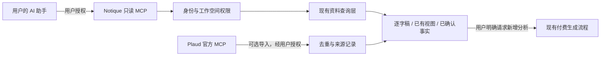

# Notique MCP 接入与降本方案

状态：研究与实施设计，2026-09-28。尚未增加 MCP 端点、连接第三方账户或调整线上模型流程。

## 推荐决策

采用成熟协议和官方接入方式，复用本项目已有资料层。先让用户自己的 AI 助手读取 Notique 中已有的结果；若目标用户已经有 Plaud 资料，再增加 Plaud 导入。把只读连接和收费的生成任务分开。

MCP 是上下文和工具交换协议，不提供免费模型。给同一串模型调用套 MCP 不会自动减少 token。用户在自己的助手里提问时，推理由该助手执行，仍受其套餐、额度和规则约束；Notique 继续承担存储、检索和自身后台生成的成本。[MCP 官方架构](https://modelcontextprotocol.io/docs/learn/architecture)

## 三条路径的取舍

| 路径 | 谁提供模型计算 | 可减少的重复工作 | 限制 | 建议 |
| --- | --- | --- | --- | --- |
| Notique → 用户的 AI 助手 | 用户所选助手 | 不为每个临时问题在 Notique 再跑全文分析 | 需要用户连接账户；网页自动生成不会凭空转移到助手 | 优先实现只读 Notique MCP |
| Plaud → Notique | Plaud 生成已有资料；Notique 负责新增领域分析 | 对已有转录和摘要跳过重复生成 | 只适用于拥有对应资料及权限的用户；不是通用转写服务 | 用官方 MCP / API 做可选导入 |
| Notique 自有生成流程优化 | 现有模型供应商 | 缓存、按需视图、精简重复上下文、局部重算 | 必须验证质量；仍有 API 成本 | 和 MCP 分开测量、逐步实施 |

Plaud 官方 MCP 能读取录音、逐字稿和已有摘要，但不能录音、修改内容或启动新转写/摘要生成。接入地址为 `https://mcp.plaud.ai/mcp`，使用 OAuth；它要求云同步和现成资料。它不是“把 Notique 的任意音频交给 Plaud 免费处理”的接口。[Plaud 官方说明](https://support.plaud.ai/hc/en-us/articles/57751078986265-Plaud-MCP)、[开发者参考](https://docs.plaud.ai/plaud-mcp-cli/mcp)

## 与当前代码的衔接

现有流程包含转写，以及章节、发言总结、要点、总览等阅读视图和事实提取/核查。视图类型与版本在 `lib/domain/event-ai-artifacts.ts`；模型调用在 `lib/server/ai/model-provider.ts`。不同输入、缓存、重试会改变调用量，不能把阶段数当固定账单。

第一阶段只读工具建议如下。名称和上限为拟定契约，不是已经上线的接口。

| 工具 | 输入约束 | 返回内容 | 复用位置 |
| --- | --- | --- | --- |
| `list_projects` | limit 默认 20，最大 50；游标 | 项目 ID、名称、更新时间 | `lib/server/db/core-repository.ts` |
| `list_records` | project_id；limit ≤ 50；游标 | 记录 ID、标题、资料类型、状态 | 同上，事件查询 |
| `get_record_excerpt` | record_id；片段游标；最多 100 段、20,000 字符 | 原文片段、说话人、时间、来源 ID、下一页 | 现有 transcript-segments 查询 |
| `get_record_views` | record_id；显式选择视图 | 已生成视图、版本、生成时间、来源引用；不存在则返回未生成 | `event-ai-artifact-repository.ts` |
| `get_evidence` | evidence_id；单段上下文上限 | 出处、相关原文、可定位的引用 | `evidence-repository.ts` |
| `get_project_brief` | project_id | 已确认事实、行动及证据引用；草稿单独标明 | `ledger-repository.ts` |

搜索能力可在第二阶段增加：先实现有权限约束的标题/内容搜索，限制结果片段及数量，再视需求决定是否需要向量库。不要为了 MCP 先引入一套新的 agent 框架。

所有结果带资源版本及 `updated_at`，分页按稳定顺序。空结果、未生成、处理中、失败要区分；读取不得触发 retry/create run、自动转写或重新生成。返回出处链接前验证当前应用可解析该链接；首版可使用资源 ID + 片段 ID。模型生成内容明确标为草稿，不能冒充用户确认。

## 实现选型

本原型已托管于 Sites，适合复用其 MCP 接入和托管鉴权，路由在现有 Worker 内薄封装上述资料查询。按 Sites 当前受支持的 MCP 契约实现发现和工具调用，并与目标客户端做协议兼容验证。运行时信任的身份只能来自受控网关；不能信任浏览器自己发送的身份头。

若正式 Notique 平台另有后端，采用 Cloudflare 官方 stateless MCP handler 和官方 MCP SDK，在其现有登录系统上映射用户权限。Cloudflare 的官方文档提供服务器及客户端接入方式；具体依赖在实施时固定经过联调的版本，不手写协议、不依赖过时教程里的框架 API。[Cloudflare MCP 文档](https://developers.cloudflare.com/agents/model-context-protocol/)、[MCP 工具集成](https://developers.cloudflare.com/agents/tools/mcp/)

## 上线前必须解决的真实边界

当前 `lib/server/http/context.ts` 的 public 模式刻意把访问者放进一个演示工作空间。即使切换到身份网关，workspaceId 仍来自单个环境绑定。这不是多租户客户权限模型。不能原样把私有客户记录开放为 MCP。

1. 建立已验证用户 → 工作空间成员关系；每个资源查询同时限制 workspace_id，并校验项目/记录归属。身份、工作空间不能由工具参数自由指定。
2. MCP 使用独立的只读授权范围；拒绝未经授权的调用、跨空间 ID、已撤销授权、已删除记录。工具发现中不返回客户内容。
3. 限制输入大小、分页数量、输出长度、超时和请求频率；日志只记请求与资源标识，不记逐字稿和访问令牌。客户资料作为数据，不当作工具指令。
4. Plaud 导入保存供应商、外部记录 ID、内容版本/摘要哈希及原始时间。按连接账户 + 外部记录 ID + 版本去重；凭据保存在服务端，授权撤销后停止访问。音频临时链接不作为永久证据。
5. 单独做 `import_existing` 服务路径：不能直接调用目前会自动排入生成任务的导入入口，否则导入已有结果仍会重复付费。保留原文和供应商摘要，供应商摘要不能直接进入“已确认事实”。
6. 若未来让助手写回更正，另设写权限和审阅流程；本次只读范围不含确认事实、删除记录或启动付费任务。

## 验收与费用验证

- 工具发现及列表不产生模型调用；连续读取同一记录也不新增分析任务。
- A 用户不能读取 B 工作空间，即使知道资源 ID；撤销连接后立即按授权失效策略拒绝。
- 逐字稿分页无遗漏/重复，出处能回到原始片段；缺失结果不会触发隐藏重算。
- 相同外部记录重复导入不重复计费；升级版本不覆盖人工修正。
- 同一批授权样本分别运行现状、复用已有结果、按需分析，比较输入/输出 token、重试、供应商费用、等待时间、正确率/召回与修改量。将成本拆成转写、首次生成、重试、后续问答及第三方套餐。
- 只有测得真实基线后才承诺降本比例。MCP 接入成功不等于成本下降，也不等于正式多租户上线。

交付顺序：完成权限映射和只读契约 → 目标助手联调 → 验证无隐藏生成 → 小范围授权用户测试 → 按需求决定 Plaud 导入。现有网页的自动分析和人工确认逻辑保持原状，后续产品简化需单独验证。
