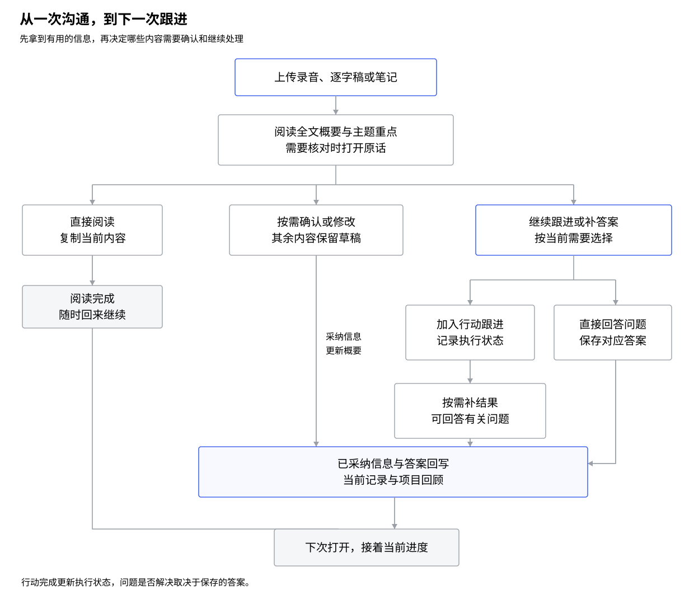
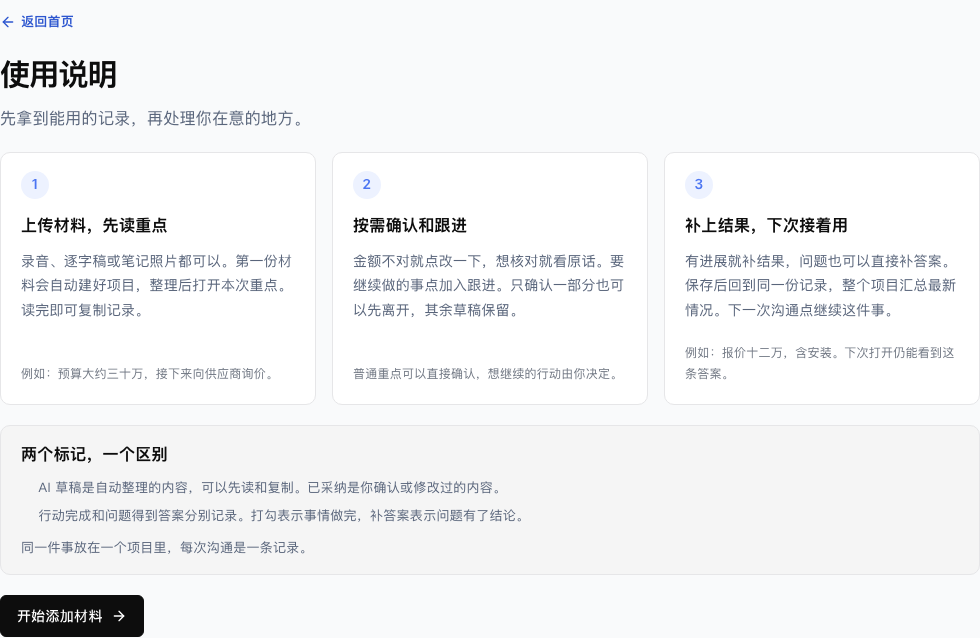
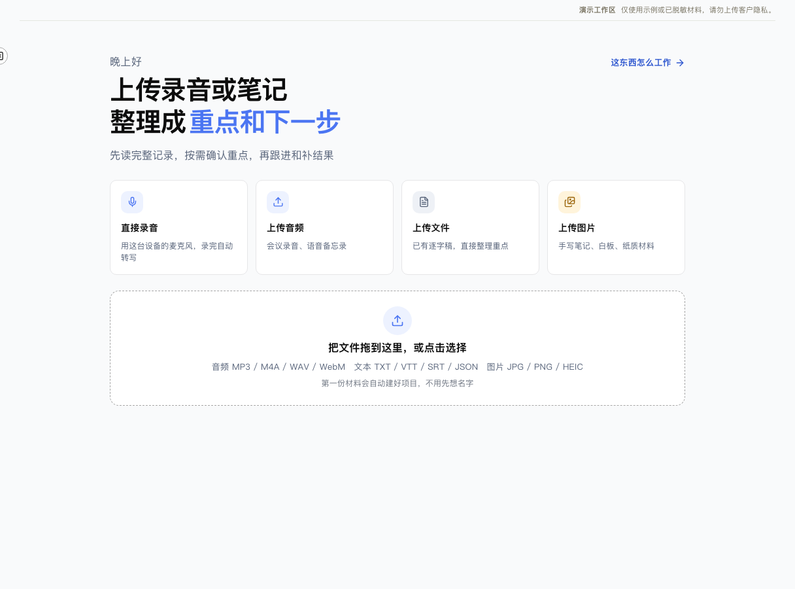
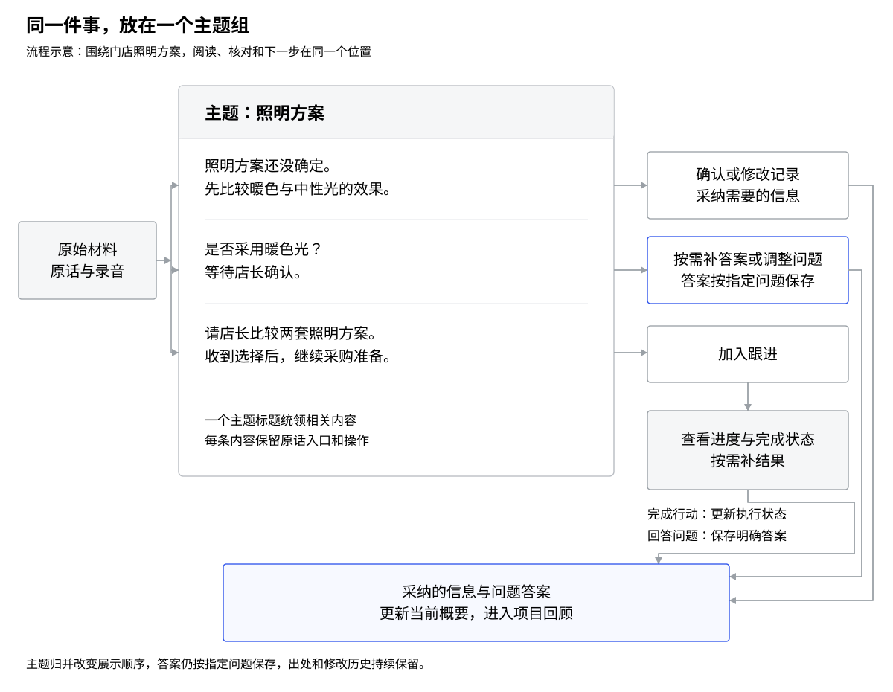
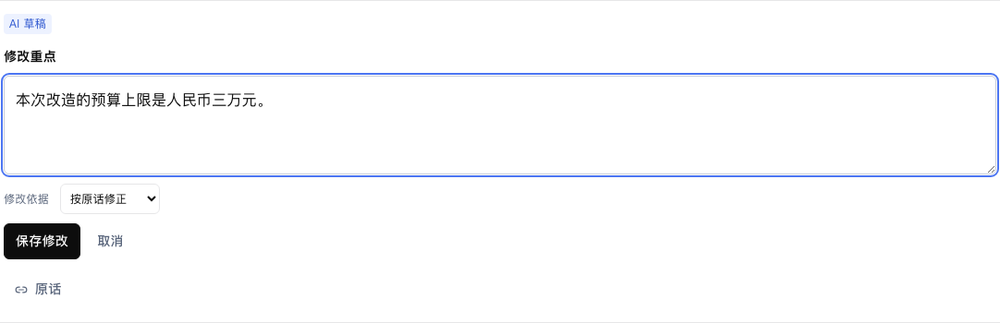
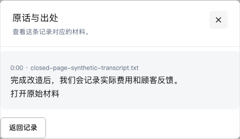
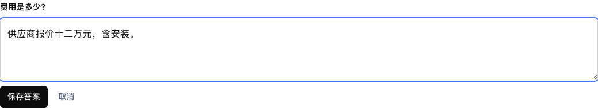
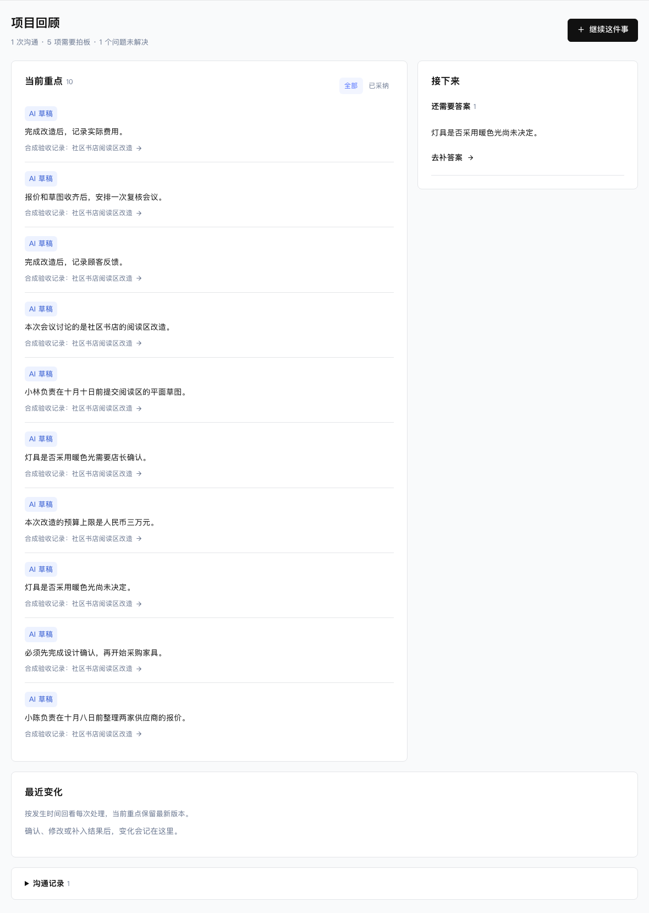
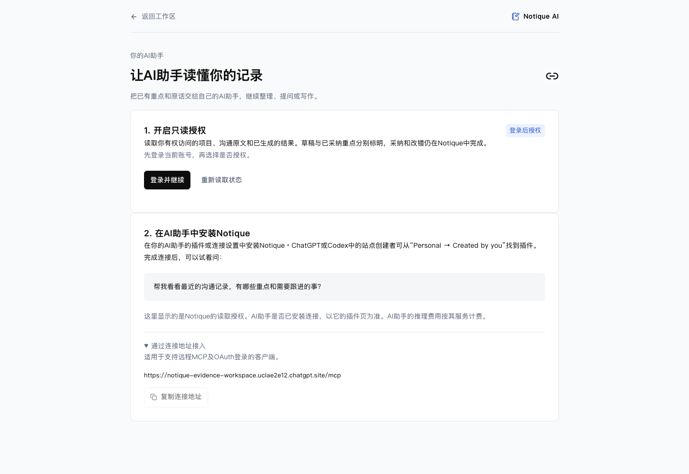
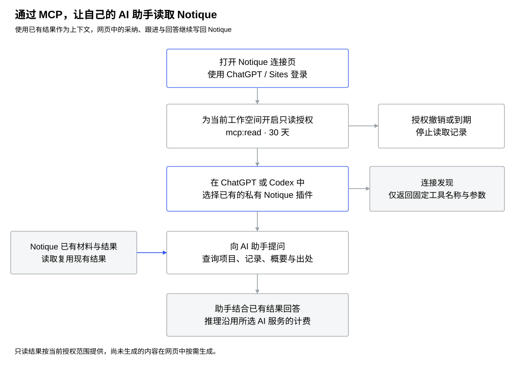

# Notique 工作流 V2 PRD

## Intro & Goal

### What are we building?

1. **一份可以直接使用的记录**：用户放入录音、文字或笔记，先拿到全文概要和 bullet points。阅读与复制就是完整的使用路径，重要内容再按需确认。
2. **按主题组织同一件事**：把同一件事的记录、问题、行动和结果放在一个主题下。用户顺着事情看，处理入口跟着当前内容走。
3. **由用户拍板并形成闭环**：用户确认或修改关键信息，选择要跟进的行动。执行后的结果和新答案回到当前记录与整个项目，下次从最新情况继续。
4. **把已有记录交给自己的 AI 助手**：通过 MCP 连接 ChatGPT、Codex 或支持远程 MCP 与 OAuth 的客户端。助手读取已经保存的项目、重点和出处，继续提问、整理或写作。

### Why build it?

1. **录音留下了，事情还要重新理一遍**：用户想知道说了什么、哪些信息重要、下一步做什么。先给一份可读记录，减少从逐字稿重新整理的时间。
2. **同一件事散在不同位置**：记录、待确认、行动各放一处，会让用户来回寻找。按主题放在一起，让一句信息、一个疑问和后续行动接得上。
3. **摘要有用，但重要决定需要用户掌握**：金额、期限、承诺与未确定的事要能回到原话核对。用户只处理在意的几条，保存一次后更新同一份记录。
4. **做完事情后，新信息需要留下来**：打勾表示行动完成，答案表示问题已经得到回应。分别保存这两种进展，把结果带回项目，下一次沟通才有可用的上下文。

## Requirement Detail

### User Interaction & Design

<table>
<colgroup><col width="110"><col width="170"><col width="640"></colgroup>
<thead><tr><th>场景 Scenes</th><th>交互 Interactions</th><th>预期设计 Expected Design</th></tr></thead>
<tbody>
<tr>
<td rowspan="1" valign="top"><strong>使用流程</strong></td>
<td valign="top">从材料到下一次沟通</td><td valign="top"><ol>
<li>首次进入显示“上传录音或笔记，整理成重点和下一步”。用户从录音、音频、文件、图片四个入口添加材料。</li>
<li>材料保存后，先阅读概要和本次重点。直接复制离开、确认少量内容后离开、继续跟进并补结果，都是有效出口。</li>
<li>需要处理时，在对应内容旁确认、修改或加入跟进。原话按需展开，保存后仍停留在当前记录。</li>
<li>有新结果时，在行动旁补结果，或直接回答问题。当前重点与项目回顾更新，下次从当前情况继续。</li>
</ol>

流程图1 用户主流程

图1 三个步骤的使用说明

</td></tr>
<tr>
<td rowspan="2" valign="top"><strong>添加材料</strong></td>
<td valign="top">首次上传与自动建好记录</td><td valign="top"><ol>
<li>点击“上传音频”“上传文件”或“上传图片”，选择已有材料。已有逐字稿可以直接整理重点，录音先转成逐字稿。</li>
<li>第一份材料自动建好项目和记录。用户得到内容后再修改名称，后续材料可以继续加入当前记录。</li>
<li>上传中显示进度，保存成功后显示整理状态。上传失败保留所选材料与重试入口，从已经保存的步骤继续。</li>
<li>音频支持 MP3、M4A、WAV、WebM 等页面列出的格式，文本支持 TXT、VTT、SRT、JSON。容量按服务器返回的上限显示，当前线上音频上限为 100 MiB。</li>
</ol>

图1 首页添加材料入口

</td></tr>
<tr>
<td valign="top">查看处理进度与失败部分</td><td valign="top"><ol>
<li>保存材料后可以先看原文，记录页显示当前整理阶段。点击“查看整理进度”展开详情。</li>
<li>已得到的内容保持可读。部分材料处理失败时，显示成功范围、失败部分和“重试失败部分”。</li>
<li>重新整理使用当前材料生成新的草稿，用户已经采纳和修改的内容继续保留。相同操作重试沿用已保存的处理记录。</li>
<li>关闭页面后的任务由服务端继续处理，重新打开后读取同一任务的最新状态。验收使用自然后台调度完成的任务。</li>
</ol>
</td></tr>
<tr>
<td rowspan="5" valign="top"><strong>记录页</strong></td>
<td valign="top">按主题归并内容</td><td valign="top"><ol>
<li>本次重点按事情组织，例如“预算”“供应商报价”“灯光选择”。同一主题的记录、问题、行动建议和已经加入的跟进放在一起。</li>
<li>主题标题负责说明这组内容讲什么。同一组里先看到当前信息，再看到仍未确定的事和下一步，页面保持连续阅读。</li>
<li>整理时按内容形成主题，同一件事的记录、问题和行动使用同一主题。旧记录点击“更新全文概要”后得到主题，暂时没有主题的内容继续可读。</li>
<li>分组改变阅读位置，各条信息的采纳、问题的答案和行动的执行状态分别保存。组内原话入口保留，用户可以逐条处理。</li>
<li>本轮主题归并已在本地 PC 页面实现，截图使用隔离合成案例。最终线上发布后，按同一案例核对再更新本文。</li>
</ol>

流程图2 主题归并与信息回流

图1 同一主题的记录、问题与行动，本地实现

图2 新答案回到原主题，本地实现

</td></tr>
<tr>
<td valign="top">阅读与复制当前记录</td><td valign="top"><ol>
<li>点击“查看全文概要”展开概要，再向下阅读主题重点。草稿、已采纳和用户补充的来源及状态按当前内容显示。</li>
<li>点击“复制记录”带走当前完整记录，草稿与已采纳内容分别标明。用户从零次确认开始就能得到可用内容。</li>
<li>仅需要经过确认的内容时，打开记录的更多操作，选择“仅导出已采纳内容”。</li>
<li>实际复制成功后显示“已复制”。浏览器限制剪贴板时，展开可以选中的正文，用户手动复制。</li>
</ol>

图1 全文概要

</td></tr>
<tr>
<td valign="top">确认与修改重要信息</td><td valign="top"><ol>
<li>在信息旁点击“确认这条”，把当前表述采纳进记录。原文中的“大约”“可能”“尚待确认”等限定词继续保留。</li>
<li>点击“改一下”，在当前位置修改并保存。按原话改错与补充自己的新信息分别说明来源，保存后的新表述直接成为已采纳内容。</li>
<li>保存成功后，本次重点显示新内容，受影响的全文概要显示更新状态。概要完成后使用最新内容。</li>
<li>有未保存输入时，切换范围或离开先选择保存或放弃。保存尚未同步完成时，原话仍可阅读，下一次写入在新版返回后继续。</li>
</ol>

图1 待采纳记录与确认入口

图2 在当前位置修改重点

</td></tr>
<tr>
<td valign="top">查看原话与录音位置</td><td valign="top"><ol>
<li>在内容旁点击“原话”，打开“原话与出处”。显示相关原句、说话人、时间和对应材料。</li>
<li>有录音时，点击对应时间点播放该位置，播放器沿用同一条录音。文字、图片或 PDF 按材料类型显示对应出处。</li>
<li>点击“返回记录”，回到刚才处理的位置。原话查看保持阅读动作，当前采纳状态保持原样。</li>
<li>发现遗漏时，点击“从原文补充”，选择有效原文，预览后保存为用户选录内容，继续保留原文出处。</li>
</ol>

图1 原话与出处

</td></tr>
<tr>
<td valign="top">新旧信息与处理历史</td><td valign="top"><ol>
<li>新信息影响已采纳内容时，把原表述与新表述放在同一处核对。用户选择保留原信息、采用新信息，或说明分别适用的情况。</li>
<li>选择完成后，当前重点使用对应版本，相关概要更新。同一行动继续沿用原来的跟进记录，依据变化时显示核对入口。</li>
<li>在“最近处理”中查看刚才的选择。可以撤销的操作提供“撤销”，恢复处理前的内容与关联。</li>
<li>有后续结果使用这次选择时，显示受影响的内容，用户在当前内容上修正。历史保留当时的表述与处理时间。</li>
</ol>
</td></tr>
<tr>
<td rowspan="4" valign="top"><strong>跟进与答案</strong></td>
<td valign="top">把行动建议加入跟进</td><td valign="top"><ol>
<li>主题中的行动建议使用“加入跟进”。点击后，同一件事出现可执行的跟进，原建议提供查看对应跟进的入口。</li>
<li>原话明确的负责人和日期作为该行动的属性显示。例如“小陈在十月八日前整理两家报价”，任务、负责人和期限放在同一个入口。</li>
<li>只确认相关记录，表示采纳这段表述。加入跟进表示准备执行该行动，两种操作各有自己的结果。</li>
<li>同一建议从不同入口采纳，仍回到同一条行动。已有行动按当前状态显示，相关原话和采纳时的依据可以查看。</li>
</ol>

图1 行动建议的加入跟进入口

</td></tr>
<tr>
<td valign="top">完成行动与补回结果</td><td valign="top"><ol>
<li>做完行动后，在对应行动旁打勾。页面显示已完成，执行历史继续保留。</li>
<li>有报价、日期、反馈或其他新信息时，点击“补结果”。普通结果默认一个主要输入框，补充说明按需展开。</li>
<li>输入后保存，结果作为可复制的要点，回到原主题、全文概要和项目回顾。针对明确的问题保存答案时，对应问题状态更新。需要同时完成行动时，明确选择完成该行动。</li>
<li>行动完成表示事情已做。关联问题是否得到答案，按保存的有效答案判断。只打勾后仍没有答案的问题，继续等待回答。</li>
</ol>

图1 行动已完成，问题仍可补答案，本地实现

图2 普通结果的一个主要输入框，隔离合成案例

图3 独立行动的结果回到原主题，本地实现

</td></tr>
<tr>
<td valign="top">直接回答问题</td><td valign="top"><ol>
<li>在主题中的未决问题旁点击“补答案”。输入针对这个问题的回答，一次保存。</li>
<li>单个问题直接带出问题文字。有多个目标或已经存在答案时，展开目标与旧答案，选择补充或替代。</li>
<li>答案保存后，当前主题显示新信息，有有效答案的问题退出未决列表。用户可以先回答问题，也可以先完成行动。</li>
<li>例如“是否采用暖色光尚未决定”，补充“店长确认采用暖色光”后，该问题有了答案。这个答案与供应商报价是否完成分别显示。</li>
</ol>

图1 直接补答案，一个主要输入框，本地实现

</td></tr>
<tr>
<td valign="top">修正、撤回与重新跟进</td><td valign="top"><ol>
<li>在已保存结果的操作中选择“修正结果”，编辑已有文字与说明，保存为新的结果版本。</li>
<li>撤回结果后，重算它支持的问题。还有其他有效答案时保留已解决状态，唯一答案被撤回后重新列为未决。</li>
<li>已经完成或取消的行动可以重新跟进。用户回到同一条行动继续处理，原执行结果保留在历史中。</li>
<li>依据发生变化时，显示采纳时的表述与当前表述。核对后按当前依据继续跟进，已有完成记录仍可查看。</li>
</ol>

图1 新答案回到原主题，本地实现

</td></tr>
<tr>
<td rowspan="2" valign="top"><strong>项目页</strong></td>
<td valign="top">查看当前情况与下一步</td><td valign="top"><ol>
<li>点击“整个项目”，进入项目回顾。先看当前重点，再看最近变化、未决问题和待跟进事项。</li>
<li>本次采纳、改错和新答案进入项目的当前情况。最近变化保留发生时的表述与时间，帮助用户知道这次新增了什么。</li>
<li>点击“继续跟进”，直接定位对应记录的行动操作区。点击问题的“去补答案”，回到对应问题位置。</li>
<li>点击“继续这件事”新增下一次沟通。项目沿用已采纳信息、新答案和未完成的跟进，新的材料继续形成下一轮记录。</li>
</ol>

图1 合成项目的当前回顾

</td></tr>
<tr>
<td valign="top">稍后回来与部分处理</td><td valign="top"><ol>
<li>用户处理任意数量后可以离开。需要拍板为零时，记录仍能阅读和复制。</li>
<li>点击“结束本次”保存当前阅读位置、时间和仍待处理的数量。其余草稿、问题和行动继续保留自己的状态。</li>
<li>重新打开时提供“回到上次位置”。从主题继续处理，已保存的输入、采纳状态和结果以最新版本显示。</li>
<li>“需要拍板”优先呈现影响已采纳内容、阻塞下一步或需要选择的行动。首批显示五项，用户再按需展开，普通草稿保留就地处理入口。</li>
</ol>
</td></tr>
<tr>
<td rowspan="3" valign="top"><strong>AI 助手连接</strong></td>
<td valign="top">开启 Notique 只读授权</td><td valign="top"><ol>
<li>从工作区打开 AI 助手连接页，地址为 https://notique-evidence-workspace.uclae2e12.chatgpt.site/connections。</li>
<li>点击“登录并继续”，使用当前 Sites / ChatGPT 账号登录。回到连接页后，核对当前账号，再选择是否开启读取授权。</li>
<li>点击“开启只读授权”，允许自己的 AI 助手读取有权访问的项目、原文和已生成结果。页面显示已授权和到期日期，授权有效期为三十天。</li>
<li>Notique 的读取授权与助手是否安装插件分别显示。需要停止读取时，回到此页点击“断开授权”。</li>
</ol>

图1 MCP 连接页，未登录状态

</td></tr>
<tr>
<td valign="top">在 ChatGPT 或 Codex 中使用</td><td valign="top"><ol>
<li>在 AI 助手的插件或连接设置中安装 Notique。当前站点创建者可以从“Personal → Created by you”找到已有的私有站点插件。</li>
<li>连接时按客户端页面完成 Sites OAuth 登录。使用与 Notique 授权相同的账号，选择 Notique 连接后开始提问。</li>
<li>可以问“帮我看看最近的沟通记录，有哪些重点和需要跟进的事”。助手先找到项目与记录，再读取需要的重点和原话。</li>
<li>在 Notique 中确认、改错和补结果后，再向助手询问当前情况。助手读取最新已保存版本，草稿、已采纳和概要更新状态分别保留。</li>
</ol>

流程图3 MCP 使用流程

图1 MCP 连接页，未登录状态

</td></tr>
<tr>
<td valign="top">其他 MCP 客户端与读取范围</td><td valign="top"><ol>
<li>支持远程 MCP 与 OAuth 的客户端，可以展开“通过连接地址接入”，复制 https://notique-evidence-workspace.uclae2e12.chatgpt.site/mcp，按客户端连接流程完成授权。</li>
<li>列项目与记录使用 list_projects 和 list_records。读取项目当前情况使用 get_project_brief，读取记录及已生成视图使用 get_record_views。</li>
<li>需要核对原话时，使用 get_record_excerpt 读取原始材料，使用 get_evidence 读取单条出处。长内容按工具返回的游标继续读取。</li>
<li>连接发现返回固定工具名称与参数。实际读取资料需要有效的工作空间授权，撤销或到期后再次读取需要重新授权。未生成的视图显示当前尚未生成。</li>
<li>MCP 让已有结果进入自己的助手，日常读取复用已保存内容。Notique 的整理仍由现有模型服务提供，助手的推理费用按它的服务计费。</li>
</ol>

图1 MCP 连接页，未登录状态

</td></tr>
<tr>
<td rowspan="1" valign="top"><strong>PC 设计</strong></td>
<td valign="top">页面风格与操作方式</td><td valign="top"><ol>
<li>PC 是本版本的使用范围，按桌面和笔记本验证。基础组件沿用 Notique 的侧边导航、蓝色主按钮、浅色内容面、标签页、菜单和弹窗样式。</li>
<li>首页强调添加材料，记录页强调当前主题内容，项目页强调最新情况。每一处主动作说明用户会得到什么。</li>
<li>记录、问题和行动通过主题位置和对应操作说明作用。草稿、已采纳、用户补充用于表达内容来源及状态。</li>
<li>默认连续阅读，原话与进度按需展开。鼠标与键盘都能使用菜单、弹窗、输入和定位入口，打开弹窗后焦点进入，关闭后回到原入口。</li>
</ol>

图1 首页添加材料入口

图2 三个步骤的使用说明

</td></tr>
<tr>
<td rowspan="2" valign="top"><strong>产品验收</strong></td>
<td valign="top">完整主路径与交付依据</td><td valign="top"><ol>
<li>直接带走记录：添加材料、读到概要与主题重点、复制离开，过程中可以保持零次采纳。</li>
<li>部分采纳：核对原话、改正一处重要信息、保存并离开，重新打开仍看到新版本与其他未处理内容。</li>
<li>结果闭环：加入跟进、完成行动、补结果或直接回答问题，当前记录与项目回顾显示最新信息，下一次沟通可以继续。</li>
<li>接入验收：真实账号开启授权，在真实 AI 客户端发现六个工具并读取自己的记录，再撤销授权确认新的读取被拒绝。</li>
<li>质量验收：五位首次使用者都能独立阅读和复制，至少四位能完成纠错和结果回流。使用三十份脱敏或授权材料逐项核对重要事实、出处与遗漏。工程检查、专家走查、真实用户试用和模型质量分别记录。</li>
</ol>
</td></tr>
<tr>
<td valign="top">当前验证进度</td><td valign="top"><ol>
<li>本文是产品实现与验收规范。功能截图取自实际 PC 浏览器，截图使用隔离合成材料，图注明确对应状态。</li>
<li>记录阅读、复制、改错、原话、行动与答案的工程路径已有回归。主题归并已有本地 PC 实操，当前等待完整发布检查。独立行动结果进入原主题、复制记录与概要的路径已完成本地实现，桌面和笔记本实际操作已通过，线上验收随后更新。</li>
<li>线上合成材料已经完成完整整理，人工恢复可以续跑同一任务。关闭页面后的自然后台调度，继续以实际自然完成的结果验收。</li>
<li>MCP 工具发现、授权前后读取和撤销后的读取已有客户端测试。用户本人授权后的真实助手调用继续验收。</li>
<li>当前尚没有可安排的五位试用用户与三十份授权材料。首次用户完成率和整体模型准确性在取得这些结果后记录。</li>
</ol>
</td></tr>
</tbody></table>

格式参照：[Notique 1.5 PRD](https://mcnl4dcjt5d8.feishu.cn/wiki/X6RhwmB4qivYfHkg5sdc9qnlnIh)，原文修订 52。
飞书版本：[Notique 工作流 V2 PRD](https://mcnl4dcjt5d8.feishu.cn/docx/Fn9Bd9OULoYmnqxYumSciOeEnXf)，修订 51。
