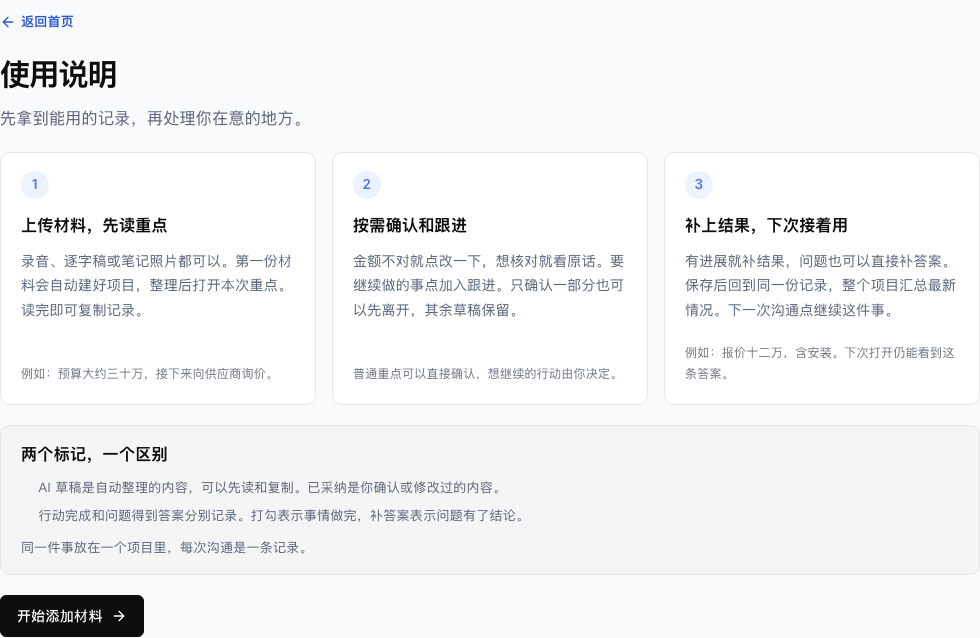

# 产品易用性复核

日期：2026-09-29，PC 范围。起始代码：045cc66171d326bf278614a8bbf289af266a9481。

## 一、产品判断

当前最有价值的体验是一份可以直接使用、按需纠正、随着跟进更新的记录。用户先得到内容，批阅用于重要决定，结果继续回到这份记录。

三条主路径已有实现与浏览器验证。此次修正了入口说明、跟进定位、结果填写、复制反馈及连续保存的断点。日常流程比改动前更直接。整体达到成熟产品水平仍需要首次整理速度、离页恢复和真实用户试用的证据。

本轮采用 Product-Manager-Skills 的用户任务、客户旅程、竞争对比与验证实验方法。竞争判断依据官方文档，本站交互判断依据实际浏览器操作。界面变短证明信息量减少，理解成本是否下降还需首次使用者验证。

## 二、用户真正要完成的事

当一段重要沟通结束时，用户希望迅速知道说了什么、哪些信息有用、下一步做什么。再次回来时，希望知道最新结果和仍需处理的事。

| 使用情境 | 用户想得到的结果 | 产品的自然出口 |
| --- | --- | --- |
| 只想记住本次沟通 | 一份可读、可复制的记录 | 直接阅读或复制离开 |
| 少量关键内容需要核对 | 正确金额、约定或选择 | 确认或修改相关几条后离开 |
| 某件事会继续推进 | 下一步及执行后的答案 | 加入跟进、补结果，下次接着用 |

同一套流程适用于工作项目和个人重要事务。行业特定词汇留在材料里，界面使用材料、重点、原话、跟进和答案等通用词。

## 三、默认循环与用户旅程

添加材料 → 读到重点 → 按需核对或修改 → 有事就加入跟进 → 补结果 → 记录更新 → 从整个项目继续下一次沟通。

| 阶段 | 用户看到什么 | 最小操作 | 完成后的可见结果 |
| --- | --- | --- | --- |
| 开始 | 固定标题说明输入和结果，直接添加材料 | 选择材料 | 自动创建记录，显示保存与整理进度 |
| 读懂 | 完整重点，AI 草稿与已采纳逐项标记 | 阅读，按需复制 | 零次确认也能带走完整内容 |
| 核对 | 要点旁的确认、改一下、原话 | 普通确认一次点击，修改一次保存 | 对应要点与版本更新，概要按进度更新 |
| 决定下一步 | 建议旁的加入跟进 | 一次点击 | 同一事项出现在跟进区，原重点提供查看跟进 |
| 带回结果 | 当前行动或问题的结果入口 | 单目标答案一次保存 | 当前答案回到重点，问题状态更新 |
| 再次回来 | 整个项目中的当前重点、变化、下一步 | 继续跟进或继续这件事 | 前者定位行动，后者新增下一次沟通 |

数量表示当前位置的需要拍板或待跟进事项。导航负责找项目。已完成行动仍可有未解决问题，答案也可以在行动完成前直接补充。

## 四、实际发现与本轮改进

| 实际发现 | 用户容易卡在哪里 | 已实现的改进 | 验证证据 |
| --- | --- | --- | --- |
| 首页标题轮换抽象价值词，说明包含八步及内部处理机制 | 不容易马上说出产品能做什么 | 固定说明输入与结果，使用说明收敛为三个用户步骤 | 两种 PC 尺寸实际打开首页及说明 |
| 加入跟进后需要继续向下寻找操作区 | 点完不知道去哪里继续 | 原重点显示查看跟进，页头保留跟进入口，点击定位并聚焦行动 | 从正文、页头和项目回顾分别定位 |
| 项目回顾的继续跟进定位原重点 | 回来后仍需找一次操作 | 直接定位对应行动与补结果按钮 | 保存答案后进入项目回顾，再回到同一行动 |
| 单目标结果默认两个输入框 | 不知道答案和说明如何分工 | 默认一个主要输入框，补充说明按需展开，修正时恢复已有说明 | 一个框保存答案，额外说明保存及恢复 |
| 切换筛选可能藏起正在编辑的内容 | 以为输入丢了 | 未保存时提示先保存或取消，保持当前输入 | 修改重点后切换需要拍板，输入仍在 |
| 一条保存未返回就处理另一条，可能使用旧版本 | 快速操作出现已有新变化错误 | 记录内的其他写入等新版返回后恢复，阅读原话继续可用 | 延迟真实保存回执，验证下个写入等待及原话可读 |
| 剪贴板被浏览器限制时仍提示已复制 | 以为内容已经带走 | 实际成功才提示已复制，失败展开可选择的全文 | 模拟剪贴板拒绝，仍能取用完整草稿 |
| 导航旧待确认数与正文需要拍板数不同 | 以为所有内容都必须审完 | 移除导航及项目列表旧计数，保留正文的实际任务数量 | 项目仍可定位，正文批阅与跟进计数继续独立 |
| 行动未展示已有负责人和期限 | 无法快速判断谁来做、何时做 | 有依据时在行动和项目回顾显示 | 合成样例小陈、2026-10-02 两处一致 |

## 五、原七个问题的承接

| 问题 | 当前产品处理方式 | 本轮验证或剩余证据 |
| --- | --- | --- |
| 不知道先做什么 | 材料入口直接，先读与复制，三个步骤说明 | 页面走查通过，首次使用者的独立完成仍待验证 |
| 不知道批准什么 | 确认记录与加入跟进使用不同动作，结果去向可见 | 保存和回流浏览器路径已验证 |
| 修改后概要仍旧 | 要点同步更新，派生概要按精确版本后台更新 | 工程回归覆盖失效、重试及版本，完整生成仍取决于模型处理 |
| 待批和行动重复 | 同一意图计一次，采纳后回到同一行动 | 既有同意图、复述、撤销与行动选择回归 |
| 被迫审完全部 | 普通草稿可读可复制，部分确认后保留其余内容 | 零确认复制、部分处理与重开路径已验证 |
| 完成后答案没回来 | 完成与答案分别保存，结果更新重点和问题 | 本轮答案已解决、行动仍未完成的路径验证通过 |
| 下次无法接着用 | 项目回顾聚合当前信息，直接定位跟进 | 本轮从项目返回同一行动验证通过 |

Eric 的需求映射沿用前后端规范中已记录的会议时间点。本轮原始会议文件在之前提供的路径不可用，因此以下是规范中的会议摘录与实现对照。

- 20:13–20:41 的易用要求：先得到记录，批阅按需进行。
- 40:58–41:51、47:34–49:03 对重复整理与核对的疑问：普通内容可直接取用，重点与决定共用一份内容。
- 44:27–44:36 对左右来回的意见：原话按需打开，修改与结果在当前位置处理。
- 49:53–50:31 对出处和修改后更新的要求：保留原始依据，保存后对应要点更新，派生概要显示更新状态。
- 15:14–15:33 的信息准确性：证据与人工纠错路径具备，整体质量要按独立标注样本评估。

## 六、成熟产品参照

| 产品与官方依据 | 对易用性的启示 | Notique 当前判断 |
| --- | --- | --- |
| [Granola 的增强笔记](https://docs.granola.ai/help-center/taking-notes/ai-enhanced-notes)自动生成，可编辑并查看来源 | 有用内容先出现，核对按需进入 | 阅读、纠错、出处路径具备，首次整理速度有差距 |
| [Notion 的 AI 会议笔记](https://www.notion.com/help/ai-meeting-notes)生成摘要，通过引用查看原话 | 一份笔记承接摘要和证据 | 重点与原话已关联，需首次使用者验证入口是否容易发现 |
| [Otter 的行动项](https://help.otter.ai/hc/en-us/articles/25983095114519-Action-Items-Overview)支持跨会议查看、编辑及返回来源 | 下一步可回到来源，也要能再次找到 | 项目下一步与原行动位置已连接，负责人及日期按已有依据展示 |
| [Otter 的文件导入](https://help.otter.ai/hc/en-us/articles/360047733574-Import-an-audio-or-video-file)上传完成后可关闭浏览器继续处理 | 用户能安心离开，回来看到结果 | 本站任务已持久化，线上自然定时恢复仍缺验收证据 |

这些是公开功能流程的比较，本轮没有在三个竞争产品中使用同一素材测量耗时或完成率。Notique 的差异价值是用户掌握重要决定，并把跟进答案带回同一份记录。这个价值要通过长期事项使用来验证。

## 七、验证记录

### 工程与浏览器

使用隔离合成记录实际打开并点击页面，阻断模型调度。测试结束清理自己的样例，现有用户资料保持原有状态。

- PC 浏览器尺寸为 1440×900 和 1366×768。
- 改动前后各检查首页、说明、记录、修改、跟进、补结果、项目回顾七个状态，共各十四次页面状态检查。
- 两次走查均无页面 JavaScript 错误和水平溢出。
- 使用说明可见文字从 1657 字符降为 412 字符，约减少 75%。测量采用相同正文边界，包含空白与图标文字。
- 普通单目标结果从两个文本框变为一个，额外说明仍可展开。
- 本轮四条针对性浏览器用例覆盖定位与答案回流、未保存输入、剪贴板限制、慢保存后的连续决定。两种尺寸均通过，配合首页和顺序编辑检查共十四项通过。
- 这些本地操作没有增加模型运行或处理阶段。派生概要的线上生成单独记录。
- 发布前完整回归：1189 项工程测试通过，类型检查、代码检查、构建和发布包敏感数据检查通过。322 项 PC 浏览器检查通过，6 项既有移动端检查按 PC 范围跳过。
- 导航、项目列表和本轮易用性路径的补充检查共 22 项通过。
- 前端规范已同步至飞书修订 98，十章与七张画板保留。后端规范修订 83，工作流状态和接口契约沿用已验证实现。正式发布的 SHA 及线上检查记录写入发布回执。

走查计量见 [浏览器记录](assets/usability-2026-09-29/browser-walkthrough.json)。截图仅包含说明和隔离合成样例。

### 已有线上模型证据

上一轮隔离合成素材的完整整理耗时 441.282 秒，约 7 分钟。输入 token 7591，输出 token 10597，缓存命中为零。该样例提取覆盖 8/8 条人工目标，正式质量结论需要更多独立素材。

这一耗时还没有达到轻量笔记产品应有的即时感。本轮通过可先读原文、清楚进度和再次定位减少等待期间的迷失。模型耗时的改善需要覆盖率与耗时一起复测。

### 首次使用者验证方案

下一轮让五位未接触本产品的 PC 用户，使用同一份授权材料独立完成三条路径：直接带走记录、改正一处金额后重开、加入跟进并带回答案。主持人只给目标。

通过条件：五人都完成阅读复制，至少四人独立完成纠错和结果回流，都能分清草稿与已采纳、行动完成与问题有答案。记录首次点击、求助次数、错误路径和真实完成时间。有人卡住时先修入口及文案，再复测对应任务。

这是待执行的验证协议，当前工程和专家走查结果不替代首次使用者的完成率。

## 八、下一轮优先级

1. 首次整理速度：用同一批授权素材记录首次可用内容、完整处理、每阶段耗时和覆盖率，优先查找串行等待及重复输入。
2. 离页恢复：提交实际任务后关闭浏览器，等待线上自然调度，再重新打开验证终态与结果。当前只确认手动恢复工作流成功，尚未观察自然定时运行。
3. 真实用户理解：执行五人三路径试用，根据错误入口修正，验证本轮简化是否减少求助。
4. 模型质量：按前后端规范的三十份授权素材、每份三次盲测，验证事实精度、关键召回和出处支持。MCP 的个人授权与真实助手调用另做连接验收。

## 十、后续接入与后台验收

2026-09-29 19:30 PDT 的线上检查发现两个断点。MCP 的固定工具发现被记录读取授权拦住，导致已安装的助手连接返回403。后台恢复遇到一项失败任务便退出，同轮仍能继续的任务被留在处理中。

已修正工具发现与资料读取的授权边界，官方客户端在授权前能发现六个只读工具，读取仍返回403。授权后能读取，撤销后再次读取被拒绝，业务账本和模型任务数量保持原值。请求流大小、批量消息及方法头也已验证。后台恢复继续推进其他任务，最后报告已观察到的失败。

工程回归通过1191项检查，MCP电脑端浏览器回归另行保存。飞书规范保留十章与七张画板，前端修订99，后端修订86。用户本人授权后的真实助手调用仍待验收。

线上合成材料在提交后进入处理，关闭提交浏览器后约十四分钟未继续，随后手动恢复使同一任务进入核对阶段。当前证据证明任务可续跑，自动定时恢复仍未通过。模型阶段耗时包含等待恢复的时间，不能当作纯模型计算耗时。后台自然完成、五人首次使用及三十份资料质量测评继续作为完整验收条件。

## 十一、按主题组织与老板版方案

用户明确选择按主题归并，同一件事的记录、问题、行动和结果放在一组。当前页面以主题标题组织连续阅读，每条保留独立的采纳和来源状态。需要拍板范围继续按影响顺序展示，跟进入口直接定位具体行动。

主题由同一次全文概要生成返回，逐句引用精确版本并保存主题 key 与标题。新增模型任务数为零，输出会增加主题字段的少量 token。已生成的旧记录可以显式更新全文概要，原材料提取继续复用。在途 v1 与 v2 付费请求保持原提示词、供应商响应和审计，生成新目录使用 v3。

实际电脑端操作已验证同组阅读、采纳行动、完成行动后问题仍未回答、直接补答案、答案回到原组和原话查看。截图使用隔离合成记录，1440、1366与1920宽度检查通过，浏览器 JavaScript 错误为零。工程检查1198项通过，类型与代码检查通过。完整电脑回归另行保存，真实用户试用与模型质量继续独立评估。

老板版 PRD 使用 Notique 1.5 原文的两章结构、三列表格、场景合并、编号步骤、实际截图和图注。文档为 https://mcnl4dcjt5d8.feishu.cn/docx/Fn9Bd9OULoYmnqxYumSciOeEnXf ，MCP 使用包含登录、独立只读授权、连接助手、查询和撤销。当前可交付产品方案，实施和验收状态逐项注明。

继续走查发现，独立行动的文字结果当前保存在跟进历史，尚未进入可复制要点与全文概要。这是结果回流需要补齐的一项，不能由页面分组替代。后续实现应保存可追踪的结果版本，修正和撤回同步更新输出，行动完成与问题答案继续分开。

## 十二、独立行动结果的回流

2026-09-29 20:30 PDT，本地实现补齐独立行动的结果。非空说明保存为用户补充的精确版本，通过已有关系账本关联原行动。问题答案继续单独保存，相同的逐项答案复用原答案版本。新结果回到原主题、本次重点、复制、项目回顾及下一次概要输入。保存新结果时旧说明进入历史，避免旧进展混入后续上下文。

实际 PC 操作验证补结果、查看用户补充出处、复制、从结果修正、项目回顾、刷新与撤回。撤回后行动完成状态保留，未回答问题继续显示补答案入口。复制行动时附带当前执行状态。原话时间使用已归一化的秒数，六十七秒显示为1:07，录音从对应位置播放。

类型检查、代码检查及1202项工程回归通过。完整电脑回归正在执行，线上发布与实测另行记录。前后端飞书规范的结果契约已精确读回，前端修订103，后端修订91，十章和七张原生画板保留。

自然后台调度仍未出现成功记录，已有的成功恢复来自手动唤醒。个人MCP授权后的真实助手调用、五人首次使用和三十份授权材料质量评估仍待验收。这些条件继续单独记录。

电脑端全量回归共332个案例，320项在首轮通过，6项旧移动范围跳过，6项测试脚本失败。失败来自结果按钮定位重复、权限拦截器切换与请求清理时序，修正脚本后将结果闭环、权限恢复、账号变化、保留输入和易用性共28项重新执行，桌面与笔记本均通过。新的326项电脑端有效案例已全部有通过记录。项目回顾返回定位另重复验证六次通过。

老板版PRD修订51，20项交互、20个截图实例、3张原生流程图。独立行动结果的本地实现与实际操作状态已读回，后续线上验收继续更新同一文档。

## 十三、线上闭环与最后一轮验证

2026-09-29 20:54 PDT，线上版本89已使用自有合成材料实际操作。采纳记录、加入跟进、完成行动、独立补结果、查看用户补充出处、复制结果、修正结果、项目回顾、刷新、撤回结果和直接补答案均有操作证据。十个检查通过，浏览器 JavaScript 错误为零，1920宽度没有水平溢出。撤回结果后行动仍为已完成，直接回答问题后只带走当前有效信息。

最后一次复制首次返回409，页面提示记录或来源有变化。新浏览器读取当前版本后复制成功，旧结果没有混入输出。这次409的具体原因尚未确认。另用工程回归独立复现了查询顺序改变导致相同账本被误判为变化的问题。账本集合现按稳定顺序聚合，实际内容变化的校验继续保留。对应回归改动前失败，改动后通过。

外层聚合修正后的工程回归1203项全部通过，类型检查、代码检查、构建和发布包敏感数据检查通过。修改聚合逻辑后重新执行全部电脑端浏览器回归，326项通过，6项旧手机端范围跳过。本轮结果对应同一次全量执行，与第十二章的首次运行和补跑分别记录。

这份线上记录的全文概要仍显示更新中，因此此次证据确认的是当前重点、来源、复制、结果和项目回顾的闭环。新的模型主题目录及概要生成终态需要单独验收。已有本地模型结构与实际电脑页面检查不能替代这一项。

后台恢复的最新八次 GitHub 运行仍为手动触发，尚未出现自然定时任务的成功记录。用户本人 MCP 授权后的真实助手调用、五位首次使用者试用和三十份授权材料的模型质量评估仍待验证。老板版方案先用于沟通产品流程和实现范围，完整商业产品验收继续按这些条件收集证据。

后续复核又独立复现了多条内容一起批阅后的历史聚合顺序误冲突。组合批阅历史按稳定成员顺序聚合，原话的材料与片段按原引用序号聚合。针对性导出回归8项通过，最终工程回归1204项、类型检查和代码检查通过。内容或来源实际变化仍返回版本冲突，当前导出保持有效内容。

最后的浏览器执行曾使用默认四个 worker，同一共享本地数据库下300项通过、26项失败、6项范围跳过。用例初始化从当前项目列表定位工作区，其他文件的创建、删除与并发读写可能影响这一过程。现固定按文件串行执行，保留单个案例内的并发写入与账号切换检查，随后完整复测。以上属于本地验收环境的执行记录，线上首次复制409的原因继续单独排查。

2026-09-29 21:12 PDT，最终串行全量复测结束，326项电脑端检查通过，6项手机范围跳过，耗时七分钟。对应最终源码的工程回归1204项通过，类型与代码检查通过。此次全量执行的通过记录与此前四并发失败记录分别保留，发布继续使用统一的 main 提交。
