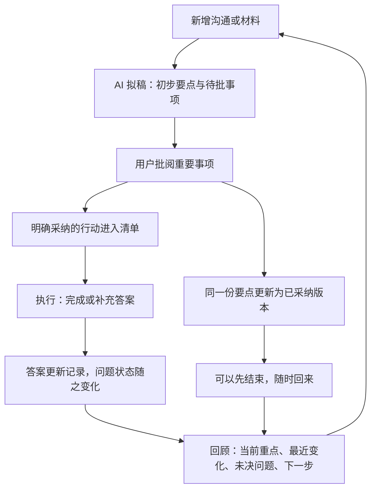

# Notique 工作流 V2：拟折、批阅、成稿、跟进、回顾

状态：产品与实现方案，尚未上线。本轮产品复核见 [产品复核记录](WORKFLOW_V2_PRODUCT_REVIEW.md)，具体实施以前后端技术方案和共同契约为准。以本文件取代之前“只把待确认改为异常处理”的提案。当前优先级：流程完整性与用户价值 → 内容正确性 → 速度和费用 → 视觉适配。Plaud 为排除项；内部步骤之间不需要 MCP。

## 1. 产品边界与目标

面向重要沟通后的整理与跟进：销售、房仲、项目会议、咨询及个人事务共用一套流程。房仲保留为首个深度验证场景，不增加必填行业表单。

核心价值：AI 整理出少量值得判断的事项，用户通过批阅形成自己的要点与行动，新增答案持续更新记录。阅读即可结束，采纳几个重点也可结束；只有需要跟进的事项才进入执行闭环。

“完整优化”的验收范围是：七个已识别断点全部有处理路径并通过端到端操作验证。它不是对任意用户、任意资料都保证零错误，也不是未经测试的性能或成本承诺。

## 2. 用户看到的循环

用户不需要按顺序点完所有入口。批阅始终是重要决定的入口，系统不把每个提取句子都变成必做作业。

## 3. 每一步的输入、操作和出口

| 阶段 | 输入 | 系统产出与职责 | 用户动作 | 完成/退出条件 |
| --- | --- | --- | --- | --- |
| 收材料 | 录音、文字、图片；用户选定的事项 | 保存原始材料；记录归属；提供可恢复的处理进度 | 上传或录入；必要时纠正归属 | 保存成功即可离开；失败明确可重试 |
| AI 拟稿 | 原始内容、相关既有记录 | 生成带出处的重点、问题、行动建议；合并重复、按影响排序 | 先读结果，也可直接离开 | 可用部分先显示；未完成部分明确标记，不伪装全量结果 |
| 批折子 | 一项清晰的业务事项及依据 | 显示需要作何决定、为什么值得处理、处理后去向 | 确认记录/修改/不采纳；行动使用“加入行动”；也可稍后处理 | 一次处理即保存，不要求清空队列 |
| 自动成稿 | 有版本的批阅结果 | 更新同一份 bullet points、相关概要和事项记录 | 无需复制、重新整理或再次确认同一内容 | 最新版本可见；未完成更新明确显示状态 |
| 跟进 | 已采纳行动 | 展示待办、支持完成和撤销；允许补充结果或关联新材料 | 完成；有答案时补充答案，无答案可标记已执行但未解决 | 完成行为与解决问题分别保存 |
| 回流 | 用户补充的答案或新沟通 | 将新信息关联到问题与依据；识别替代、补充和冲突 | 仅处理影响已采纳内容的新决定 | 无冲突信息可形成草稿；覆盖已采纳信息前需用户明确决定 |
| 再次打开 | 当前记录与处理历史 | 默认给出当前重点、最近变化、未决问题、下一步 | 继续处理或新增沟通 | 不必重读全部历史即可继续 |

## 4. 折子的单位与决策语义

折子是一项值得判断的事项，内部可以关联数条信息与原文。第一层只呈现重要事项，完整列表可展开，不硬截断遗漏剩余内容。排序考虑对目标和下一步的影响、与已采纳信息的冲突、新变化及尚缺答案；排序建议不等于模型置信度。

- **值得记住**：事实、目标、限制、偏好和已表达的决定。主操作“确认记录”；保持原文的不确定表达。仅代表记录准确、用户采纳，不代表现实情况已独立核实。
- **需要弄清**：区分提取错误、原文含糊、现实情况未知。修改提取错误；不知道答案时保留待问问题；用户新提供的答案标为用户补充，不能伪装为录音原话。
- **接下来做**：区分原文中的明确约定与 AI 建议。主操作“加入行动”；采纳信息不自动授权执行行动。

“稍后处理”不等于拒绝或核实通过；“不采纳”进入可追溯历史，不应重分析后反复出现。修改后保存为用户已采纳版本，不再要求重复点击确认。缺少出处的 AI 内容不允许用直接确认绕过原有证据规则；需要补充依据或按明确的用户补充路径记录。

## 5. 页面结构

本次沟通默认使用同一份记录，包含**重点 / 需要你拍板 / 跟进**三个区域。原文和音频按需展开，集中批阅与全部行动为辅助视图。待拍板数量按业务影响筛选，与普通草稿数量分开。

- 本次重点：完整记录逐项区分 AI 草稿和已采纳，确认少量内容后其余草稿仍在。修改只替换对应版本，主概要保持完整范围。
- 需要你拍板：在对应内容旁呈现少量重要决定，处理后提示已更新重点或已加入跟进。同一约定共用一张决策卡，已处理内容可追溯。
- 行动：只把用户明确采纳的任务放进待办。未采纳建议在这里至多作同一事项的入口，不复制第二份任务。
- 事项首页：当前重点 / 最近变化 / 未决问题 / 下一步。已有会前简报能力在此承接，不要求先完成全量批阅。

主入口复制记录包含逐项标明的草稿与已采纳内容。仅已确认是次级导出范围。从零次批阅开始即可带走完整可用记录，结果保留覆盖范围与未决问题。

## 6. 一个具体闭环（合成示例）

录音：“方案大致定了，费用还得问供应商。”

1. AI 初稿保留方案信息，列出未决问题“最终费用未确定”，提出“向供应商确认费用”。
2. 用户确认方案记录，已采纳要点立即更新；另行把确认费用加入行动。
3. 用户联系了供应商，可勾选已执行；如果尚未拿到报价，费用问题仍保持未解决。
4. 收到报价后在费用问题旁补答案，一次保存更新费用要点、概要与问题状态。多个目标或已有答案时才展开选择。
5. 下次打开直接看见最新费用、已解决问题和剩余行动。历史原话与上次处理保留。

## 7. 前端、后端与模型怎么分工

| 执行方 | 负责 | 不应负责 |
| --- | --- | --- |
| 前端 | 展示可用结果、展开依据、本地筛选排序、草稿编辑、播放定位、保存状态与操作反馈 | 自己判断信息已核实；生成另一份持久化事实；依赖页面停留才继续跑后台工作 |
| 后端普通程序 | 原始资料保存、权限、任务调度、版本、精确依赖关系、状态转换、去重、原文定位、更新失效、重试、缓存、列表及简报组装 | 用关键词重叠冒充语义核实；静默覆盖用户判断 |
| AI | 理解原文、提取带限定条件的信息、判断语义关系和冲突、提出有依据的下一步；需要时组织概要语言 | 完成打勾、计数、排序规则、拼装已确定字段、每次切标签重新读全文 |
| 用户 | 决定采纳什么、修正理解、选择行动、补充现实答案 | 替模型逐句做无差别校对；反复确认已作出的同一个决定 |

把工作移到前端并不等于节省 token。关键是把确定性工作从模型移到普通程序，把需要理解的内容保留给模型；跨设备状态和可靠后台任务仍由服务端负责。

## 8. 分析和更新任务的调整

现状：阅读视图各自生成，事实识别另有任务；概要与人工更正未建立精确的逐条依赖。

目标主路径：原文 → 结构化信息提取 → 引用及语义检查 → 保存统一信息 → 组装要点与待批事项 → 按需生成有引用的概要。

- 逐字稿可读后先让用户阅读；长资料可分块并行提取，之后跨块合并、去重和检查冲突。未合并完成前显示覆盖范围，不能声称分析完成。
- 不让所有阅读视图默认各读一次全文。要点和待批事项尽量共享结构化信息；章节先用已知时间与说话人做基础导航，语义章节/发言总结按需补充。只有对用户确有独立价值的生成才保留。
- 语义判断保留对应原文及必要上下文；不能只把上一步摘要当事实来源。数值、主体、限定条件以及跨段遗漏用样本验证，不用省 token 为由取消必要检查。
- 短资料可一次提取多类信息；长资料分块，避免强行合并成一个超长调用引起截断与整份重试。
- 用户确认、不采纳、完成行动：直接保存状态，不调用模型。用户修改：立即更新直接依赖的信息，只对确需理解或改写的受影响部分调用模型。
- 多条连续修改先立即逐条保存；相关概要更新可合并为一次任务，减少重复生成。旧任务完成时检查输入版本，过期结果不能覆盖新版本。
- 读取、刷新、切标签和重新打开不得隐式新建分析任务。显式生成或受控后台任务有去重键，失败只重试失败阶段。
- 用户已采纳版本与 AI 候选分开保存；重分析不覆盖用户修正，也不复活已舍弃建议。

并行可能缩短等待但不必然省 token；分阶段共享可能减少重复阅读但增加依赖等待。最终取舍看首次可用结果时间、完整处理时间、费用及准确性共同表现，不预先承诺降本比例。

## 9. 一致性及历史兼容

每条信息有稳定 ID、来源引用、状态和版本；概要句、要点和行动记录具体依赖的信息 ID/版本。相同原文段落不代表同一语义事实。折子只是相关信息的展示组合，拆分/合并不能丢失底层判断历史。

修改时先事务保存，再派发受影响的更新。正文未更新前标记正在更新/已过期；失败保留可恢复任务及明确重试，不把旧结果称为最新。人工增加事实保留作者和来源，不篡改原始材料。

已采纳行动的依据变化时提示调整，不静默修改用户已经决定或已经执行的任务。行动已执行不自动证明对应问题已解决，问题解决需要实际答案及适当确认。

旧记录继续可读，保留历史确认和行动。已有概要不能仅靠原文段落交集自动标为已确认；没有可靠逐条关联时标为旧版 AI 概要，可在明确的重新整理操作中补建关联。禁止为迁移静默重跑全部历史资料。

## 10. 七个断点对应验收

| 问题 | 必须实际观察到的结果 |
| --- | --- |
| 不知道先看什么 | 首屏给出简短要点与优先待批事项，余项可查看；用户能说出当前可做什么 |
| 不知道批准什么 | 确认记录、加入行动的后果不同且明确；含糊信息不会因确认变成确定事实 |
| 修改后概要仍旧 | 改一条信息，依赖正文更新或明确过期；包含刷新、重开、并发及失败场景 |
| 重复处理 | 从任一入口处理一次，其余入口同步；不会新增重复待办 |
| 被迫全量审核 | 只采纳部分即可退出并再次找到结果；未处理内容不伪装为已确认 |
| 完成无答案回流 | 已执行但无答案时问题仍开着；补充答案后相关内容和问题状态更新 |
| 下次无法继续 | 重新打开能看到当前重点、变化、未决问题和下一步，不依赖浏览器临时状态 |

必须用独立合成资料实际点通三条路径：只整理就离开；纠错并重开；采纳行动、补充结果、再加入新沟通。每个问题标为“代码发现 / 实操复现 / 产品假设”，工程测试通过不等于用户体验验证通过。

性能对照使用同一批长短资料，记录首次可用结果时间、全部完成时间、各阶段 token/实际费用、重试次数、遗漏与错误、用户操作量。流程或正确性倒退时不接受性能改动。

## 11. 实施顺序

1. 信息 ID、版本和结果依赖，先打通“批阅 → 要点/概要更新”。
2. 同页记录、就地拍板、原话选录、部分采纳退出、行动去重及统一回顾入口。
3. 行动结果补充与问题回流，实际走通完整循环。
4. 在上述路径上调整模型任务共享、按需生成、局部重算，做费用/速度/质量对照。
5. 随新结构逐组件接入官网样式及交互，清除旧覆盖；不把颜色替换当成流程验收。MCP 后续输出这份一致的信息，不绕开它另建一套答案。
